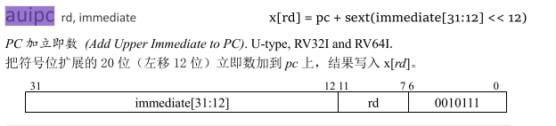
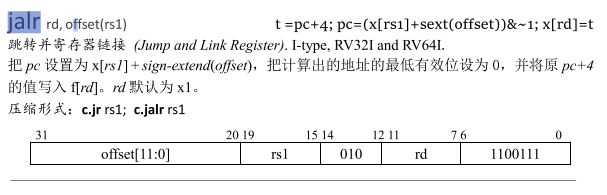
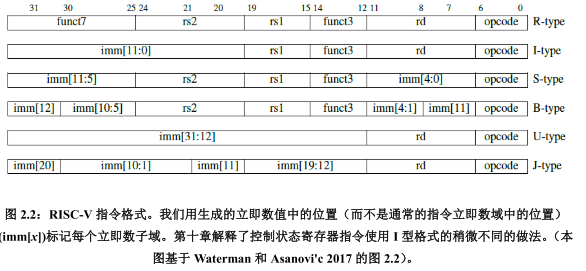
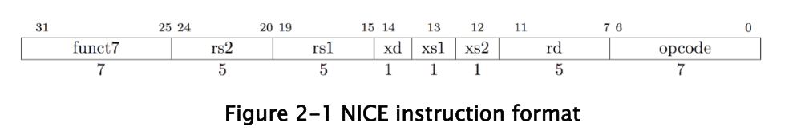
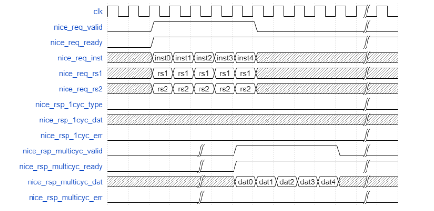

20201214工作日志

代办：

1.nice if原理使用方法

2.启动的过程

3.PC    总线

4.ICB

5.RISC-V指令集

### 1.ux607启动过程：

疑问：

1.subsys_main.v中axi1to5:o1,o2,o3的地址是啥？

注意事项：

1.mrom.v中当i=1的指令应该就是寻址返回ram；

2.

3.ROM中指令编译：

7fff_f297:   pc=0x0000_1000;

​					x[rd]=x[5]=pc+sext(0x7fff_f<<12)=0x8000_0000;  (ILM start address)

​					pc=pc+4;

0002_8067: 	pc=0x0000_1004;

​						 t=pc+4;

​						 pc=(x[rs1]+sext(offset))&~1=0x8000_0000; (pc指向ILM start address)

​						 x[0]=t;(x[0]为零寄存器，值不变)

4.程序跳转到ILM开始执行.S汇编的二进制程序；

#### 2.PC

#### 3.与存储相关的总线

疑问：

1.CORE中的BIU模块不可见，AXI与AHB相关状态机等代码不可见；

#### 4.RISC-V指令集

疑问：

1. 向量架构与RVV扩展？

1.opcode

2.分类:

用于寄存器-寄存器操作的R类型指令，用于短立即数和访存 load 操作的 I 型指令，用于访存 store 操作的 S 型指令，用于条件跳转操 作的B 类型指令，用于长立即数的U型指令和用于无条件跳转的 J 型指令

3.指令格式

R:7-5-5-3-5-7

I:12-5-3-5-7

S:7-5-5-3-5-7

B:1-6-5-5-3-4-1-7

U:20-5-7

J:1-10-1-8-5-7

4.RISC-V寄存器：

5.向 PC 高位加 上立即数（auipc）让我们仅用两条指令，便可以基于当前PC 以任意偏移量转移控制流或 者访问数据。将 auipc 中的 20 位立即数与 jalr（参见下面）中 12 位立即数的组合，我们 可以将执行流转移到任何 32 位PC 相对地址。而 auipc 加上普通加载或存储指令中的 12 位立即数偏移量，使我们可以访问任何 32 位PC 相对地址的数据。

6.RISC-V的8种可选的扩展

​	a.  "B"标准扩展：位扩展     

​	b.  "E"标准扩展：嵌入式

​	c.   "H"特权态架构扩展：支持管理程序

​	d.   "J"标准扩展：动态翻译语言

​	e.    "L"标准扩展：十进制浮点

​	f.     "N"标准扩展：用户态中断

​	g.    "P"标准扩展：封装的单指令多数据（Pached-SIMD）指令

​			P 扩展细分了现有的寄存器架构，提供更小数据类型上的并行计算。封装的单指令多数据指令代	表了一种合理复用现有宽数据通路的设计。不过，如果有额外的资源来进行并行计 算，第 8 章的向	量架构通常是更好的选择，设计者更应使用RVV扩展。

​	h.     "Q"标准扩展：四精度浮点

### 5.NICE原理与使用方法

疑问：

1. 现有的core中没有nice相关的接口，是不是因为config的时候没有配上的原因？

2. mstatus.xs在哪？（已解决)

   core中也找到了mstatus寄存器，但是域xs具体bit位还未找到

3. nice_rsp_multicyc_dat，nice_rsp_1cyc_dat传输的数据是什么数据？

   应该就是需要写到寄存器rd中的值。

4. core中ux607_exu_excp模块是不是控制着与异常相关的信号？

   

5. nice_core中具体可以实现的功能还不明确；

6. ./core_gen 中不支持NICE CONFIGURE

7. NICE_Extension文档中，只说明了当master core收到nice_rsp_multicyc_err时的处理情况，当收到onecyc_err时呢？

1.RISC-V base opcode map

2.NICE  instruction format

 	xd置位后，NICE指令的结果将写到rd寄存器；

​	xs1,xs2置位后，NICE指令将rs1,rs2寄存器中的值读入；

​	funct7用于指令编码，扩展指令；Bit31置位后支持64位长度的指令；

3.nice接口信号

 	NICE global signals:

​	//下面三套总线是MCOER向NICE_CORE传输指令信息（request channel)与NICE_CORE向MCORE反馈结果

​	（response channel)

​	NICE request channel signals: 主要包含指令的具体信息，ux607_64下nice_req_rs1_1信号不需要；

​	NICE one-cycle response channel signals:

​	NICE multi-cycle response channel signals:

​	

​	NICE memory request channel signals:

​	NICE memory response channel signals:

4.NICE transfer

​    a.传输过程必须保证mstatus.xs置1；

​	后续可以通过csrci和csrsi等指令进行控制；

​	b.在nice_req_valid和nice_req_ready握手前，所有信号必须处于保持状态；

​	c.NICE的response是one-cycle还是multi-cycle由NICE-CORE决定；

5.One-cycle Response

​	此时握手后（是不是非阻塞模式）req_ready不会拉低，当有多个连续需要处理的指令时，valid持续置位保持握手即可；

6.Multi-cycle Response

​	当有大量数据计算或者需要去MCORE读memory数据时候，会需要多周期；

​	多周期反馈存在两种模式：阻塞模式和非阻塞模式

​	a.阻塞模式

​    阻塞模式下握手后req_ready信号拉低，待一次操作完成后再拉高；

b.非阻塞模式

​	

因为Master core仅支持最多四个未完成操作，当存在延迟后，当有第五个未完成操作时valid信号拉低，不在向

nice_core发送事务；

7.NICE 访问内存（利用ICB总线）

​    在指令解码过程中可能需要访问内存内容，此时进入Multi-cycle response过程，握手成功一个周期后nice_mem_holdup信号拉高直到内存访问结束，所以在拉高过程中可以执行多个访问内存操作；

​	MC向NC发送nice_req时，如果需要访问内存，nice_req_mmode需要拉高；

​	NC向MC发送内存访问请求时，nice_icb_cmd_mmode需要拉高；

​	

8.NICE response error

当发生多周期传输异常的时候，结果将不会写回到寄存器中，mcause.EXCCODE值置为5，mdcause.mdcause值置为3（配合mcause.EXCCODE将发生的异常细化）;

9.NICE demo introduction

