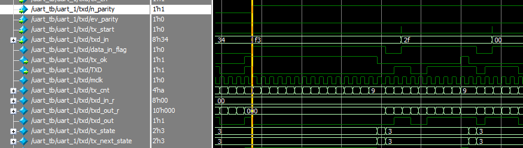

# UART   VERIFICATION

目录

一、测试方法

二、测试功能点

三、测试用例及结果

### 一、测试方法

通过对uart_top中icb总线的操作实现uart的控制、发送与接收。

### 二、测试功能点

1.波特率在4800bps、9600bps及115200bps之间可调；

2.波特率误差在允许范围内（传输10bit数据时间误差小于1.87%，传输8bit数据误差小于5.25%）

3.奇偶校验可选（可开启或关闭，奇偶可选）；

4.uart模块与子模块（波特率产生、发送与接收模块）使能可控；

5.数据发送接收正常；

###  三、测试用例与结果

**测试用例总录**

1.case_1:16Mhz时钟下测试115200bps下数据的发送与接收（奇校验、偶校验、无校验）；

2.case_2:16Mhz时钟下测试9600bps下数据的发送与接收（奇校验、偶校验、无校验）；

3.case_3:16Mhz时钟下测试4800bps下数据的发送与接收（奇校验、偶校验、无校验）；

4.case_1:144Mhz时钟下测试115200bps下数据的发送与接收（奇校验、偶校验、无校验）；

5.case_2:144Mhz时钟下测试9600bps下数据的发送与接收（奇校验、偶校验、无校验）；

6.case_3:144Mhz时钟下测试4800bps下数据的发送与接收（奇校验、偶校验、无校验）；

7.case_4:16Mhz时钟下测试115200bps下数据的接收（偶校验）；

**测试用例预期与结果对比**

预期：各类测试用例均采用自动比较来验证结果，在testbench中将data_in数组中的数据打入port_rxd(测试接收)或者通过icb总线写入data_reg寄存器（测试发送），利用data_out收集data_reg寄存器的数据，与data_in进行比较，判断接收与发送功能是否准确；

结果：通过打印信息和波形观察，结果正确符合预期。

**波特率误差分析**

16Mhz时钟下：

|  波特率   | divisor | 预期周期 | 实际波特率/周期  | baud误差 |
| :-------: | :-----: | :------: | :--------------: | :------: |
| 115200bps |  16'h8  |  8681ns  | 111111bps/9000ns |   3.5%   |
|  9600bps  | 16'h67  | 104167ns |  9615/104001ns   |  0.15%   |
|  4800bps  | 16'hcf  | 208333ns | 4807bps/208000ns |  0.14%   |

144Mhz时钟下：

|  波特率   | divisor | 预期周期 | 实际波特率/周期  | baud误差 |
| :-------: | :-----: | :------: | :--------------: | :------: |
| 115200bps | 16'h4d  |  8681ns  | 115384bps/8661ns |  -0.15%  |
|  9600bps  | 16'h3a9 | 104167ns | 9601bps/104156ns |  0.01%   |
|  4800bps  | 16'h752 | 208333ns | 4802bps/208200ns |  0.04%   |

**详细说明**：

##### 1.case_1:16Mhz时钟下测试115200bps下数据的发送与接收（奇校验、偶校验、无校验）；

步骤：

**测试偶校验：**

a.将port_rxd与port_txd利用force连接；

b.配置uart_csr寄存器(32'h8_0201)；

​	baudrate：2‘b10

​	divisor:16'h8 (9分频)

c.配置uart_ctrl寄存器(32'h1_0111)；

​	baud_en：1’b1 	 tx_en:1'b1 		rx_en:1'b1

​	n_parity:1'b0		ev_parity:1'b1

d.将data_in数组中256个数据依次写入寄存器data_reg,并读寄存器uart_csr，判断rx_ok是否ok,若ok则读取data_reg寄存器的值到data_out，等到rx_ok为零，写入下一个数据；

f.对比data_in与data_out数组的数据；

**测试奇校验：**

初始化data_out,配置uart_csr寄存器(32'h0111),其余步骤与上述步骤相同；

**测试无校验：**

初始化data_out,配置uart_csr寄存器(32'h1111),其余步骤与上述步骤相同；

##### 2.case_2:16Mhz时钟下测试9600bps下数据的发送与接收（奇校验、偶校验、无校验）；

步骤：

**测试偶校验：**

a.将port_rxd与port_txd利用force连接；

b.配置uart_csr寄存器(32'h67_0201)；

​	baudrate：2‘b01

​	divisor:16'h67(104分频)

c.配置uart_ctrl寄存器(32'h1_0111)；

​	baud_en：1’b1 	 tx_en:1'b1 		rx_en:1'b1

​	n_parity:1'b0		ev_parity:1'b1

d.将data_in数组中256个数据依次写入寄存器data_reg,并读寄存器uart_csr，判断rx_ok是否ok,若ok则读取data_reg寄存器的值到data_out，等到rx_ok为零，写入下一个数据；

f.对比data_in与data_out数组的数据；

**测试奇校验：**

初始化data_out,配置uart_csr寄存器(32'h0111),其余步骤与上述步骤相同；

**测试无校验：**

初始化data_out,配置uart_csr寄存器(32'h1111),其余步骤与上述步骤相同；

##### 3.case_3:16Mhz时钟下测试4800bps下数据的发送与接收（奇校验、偶校验、无校验）；

步骤：

**测试偶校验：**

a.将port_rxd与port_txd利用force连接；

b.配置uart_csr寄存器(32'hcf_0201)；

​	baudrate：2‘b01

​	divisor:16'hcf(208分频)

c.配置uart_ctrl寄存器(32'h1_0111)；

​	baud_en：1’b1 	 tx_en:1'b1 		rx_en:1'b1

​	n_parity:1'b0		ev_parity:1'b1

d.将data_in数组中256个数据依次写入寄存器data_reg,并读寄存器uart_csr，判断rx_ok是否ok,若ok则读取data_reg寄存器的值到data_out，等到rx_ok为零，写入下一个数据；

f.对比data_in与data_out数组的数据；

**测试奇校验：**

初始化data_out,配置uart_csr寄存器(32'h0111),其余步骤与上述步骤相同；

**测试无校验：**

初始化data_out,配置uart_csr寄存器(32'h1111),其余步骤与上述步骤相同；

**测试中遇到的问题：**

a.有无检验位切换问题：

在从有检验位到无校验位的切换中，出现了tx_ok多个周期没有拉低，导致txd输出数据有误；

原因分析：

在tx_ok还没有拉低的情况下，强行改写了n_parity导致TX无法进入idle模式，tx_cnt计数器继续计数至下一次判断条件到来才将tx_ok拉低，使得数据发送错误；

解决：切换n_parity时至少与上次操作结束留有一个baud_clk的时间裕度；

##### 4.case_1:144Mhz时钟下测试115200bps下数据的发送与接收（奇校验、偶校验、无校验）；

步骤：

**测试偶校验：**

a.将port_rxd与port_txd利用force连接；

b.配置uart_csr寄存器(32'h4d_0201)；

​	baudrate：2‘b10

​	divisor:16'h4d(78分频)

c.配置uart_ctrl寄存器(32'h1_0111)；

​	baud_en：1’b1 	 tx_en:1'b1 		rx_en:1'b1

​	n_parity:1'b0		ev_parity:1'b1

d.将data_in数组中256个数据依次写入寄存器data_reg,并读寄存器uart_csr，判断rx_ok是否ok,若ok则读取data_reg寄存器的值到data_out，等到rx_ok为零，写入下一个数据；

f.对比data_in与data_out数组的数据；

**测试奇校验：**

初始化data_out,配置uart_csr寄存器(32'h0111),其余步骤与上述步骤相同；

**测试无校验：**

初始化data_out,配置uart_csr寄存器(32'h1111),其余步骤与上述步骤相同；

##### 5.case_2:144Mhz时钟下测试9600bps下数据的发送与接收（奇校验、偶校验、无校验）；

步骤：

**测试偶校验：**

a.将port_rxd与port_txd利用force连接；

b.配置uart_csr寄存器(32'h3a9_0201)；

​	baudrate：2‘b01

​	divisor:16'h3a9(938分频)

c.配置uart_ctrl寄存器(32'h1_0111)；

​	baud_en：1’b1 	 tx_en:1'b1 		rx_en:1'b1

​	n_parity:1'b0		ev_parity:1'b1

d.将data_in数组中256个数据依次写入寄存器data_reg,并读寄存器uart_csr，判断rx_ok是否ok,若ok则读取data_reg寄存器的值到data_out，等到rx_ok为零，写入下一个数据；

f.对比data_in与data_out数组的数据；

**测试奇校验：**

初始化data_out,配置uart_csr寄存器(32'h0111),其余步骤与上述步骤相同；

**测试无校验：**

初始化data_out,配置uart_csr寄存器(32'h1111),其余步骤与上述步骤相同；

##### 6.case_3:144Mhz时钟下测试4800bps下数据的发送与接收（奇校验、偶校验、无校验）；

步骤：

**测试偶校验：**

a.将port_rxd与port_txd利用force连接；

b.配置uart_csr寄存器(32'h752_0201)；

​	baudrate：2‘b01

​	divisor:16'h752(1875分频)

c.配置uart_ctrl寄存器(32'h1_0111)；

​	baud_en：1’b1 	 tx_en:1'b1 		rx_en:1'b1

​	n_parity:1'b0		ev_parity:1'b1

d.将data_in数组中256个数据依次写入寄存器data_reg,并读寄存器uart_csr，判断rx_ok是否ok,若ok则读取data_reg寄存器的值到data_out，等到rx_ok为零，写入下一个数据；

f.对比data_in与data_out数组的数据；

**测试奇校验：**

初始化data_out,配置uart_csr寄存器(32'h0111),其余步骤与上述步骤相同；

**测试无校验：**

初始化data_out,配置uart_csr寄存器(32'h1111),其余步骤与上述步骤相同；

##### 7.case_4:16Mhz时钟下测试115200bps下数据的接收（偶校验）；

步骤：

**测试偶校验：**

a.配置uart_csr寄存器(32'h8_0201)；

​	baudrate：2‘b10

​	divisor:16'h8(9分频)

c.配置uart_ctrl寄存器(32'h1_0111)；

​	baud_en：1’b1 	 tx_en:1'b1 		rx_en:1'b1

​	n_parity:1'b0		ev_parity:1'b1

d.将data_in数组中256个数据按标准波特率写入RXD端口,并读寄存器uart_csr，判断rx_ok是否ok,若ok则读取data_reg寄存器的值到data_out，等到rx_ok为零，写入下一个数据；

f.对比data_in与data_out数组的数据；

**测试奇校验：**

初始化data_out,配置uart_csr寄存器(32'h0111),其余步骤与上述步骤相同；

**测试无校验：**

初始化data_out,配置uart_csr寄存器(32'h1111),其余步骤与上述步骤相同；

