20201208工作日志

待解决：

1.  总体结构；
2.  ux607 的Memory Map细节，地址划分，如何配置；
3. System Bus与PPI的细节：如何与core连接；

#### 1.总体结构：

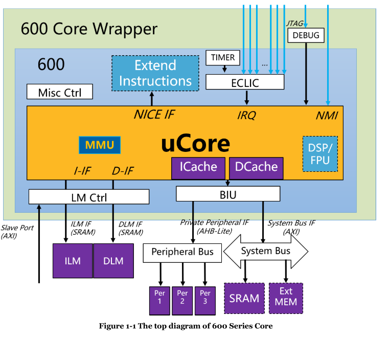

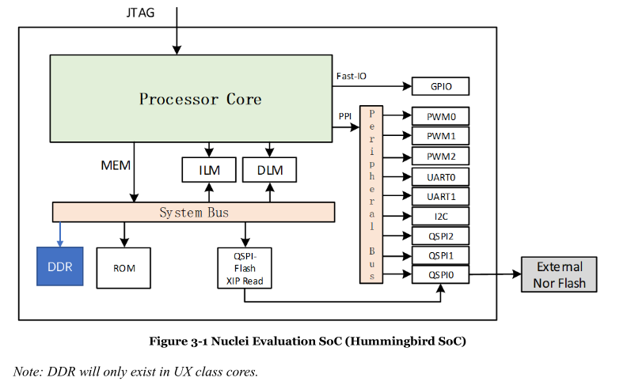

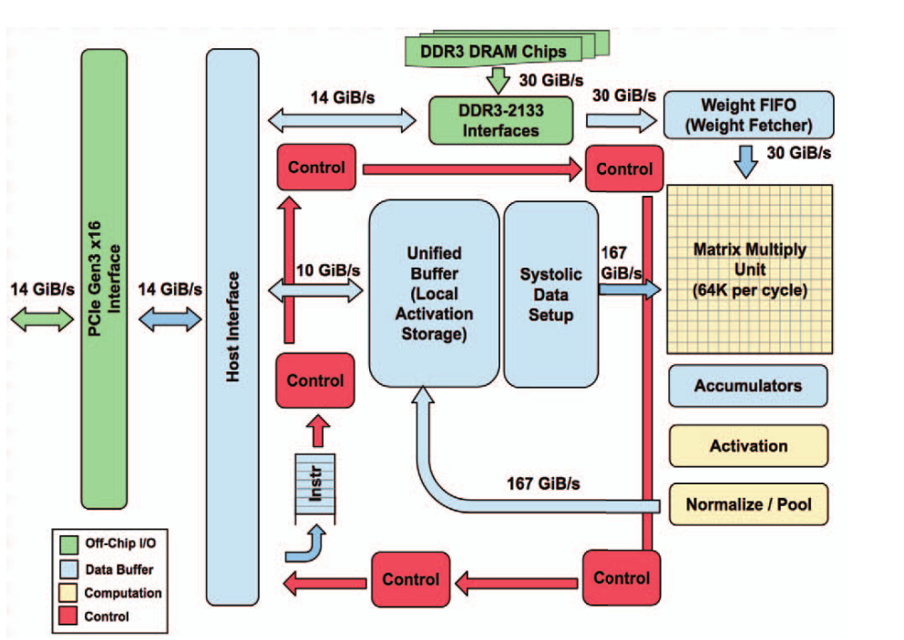

疑问:

1. There is just 1~2 instructions in ROM, after executed the instructions, Core will to jump to ILM (address at 0x8000_0000). That is to say, in SIMULATION environment, the Core will just jump to ILM after reset and start execution from ILM
3. 

注意事项：

1. ROM :4kb
2. Soc存储空间：ILM,DLM（空间可配置）、FLASH（外部，可通过QSPI通信）
3. QSPI通过GPIO与外界连接
4. NMI:often used to indicate system-level emergency errors (such as external hardware failures, etc.)
5. 打开宏定义DDR_CONTROLLER,可以添加DDR；
6. 

### 2.地址划分：

（详见Nuclei_Eval_Soc_Intro  5:Address Allocation of SoC)

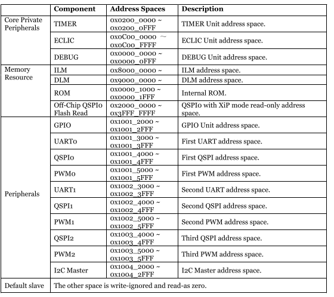

补充：

SRAM起始地址：0xa000_0000;

疑问:

1. peripheral：内部模块的寄存器详细说明文档未有；
2. 

地址配置注意事项：

1. CORE的不会去DLM, ECLIC, TIMER, FIO, or PPI取指令；

2. 如果配置了600_CFG _LSU_ACCESS_ILM，ILM和DLM的地址可重叠，反之不可以；

3. ILM和DLM的总地址不能与其他的模块地址重叠；

4. DEBUG TIMER ECLIC FIO PPI等模块的地址不能重叠；

5. 三个PWM：

   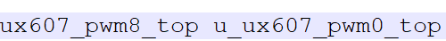

   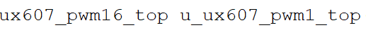

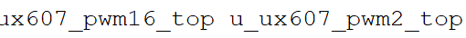

6. 

### 3.总线：

(详见Nuclei_600_Series_Databook 3: core interfaces)

PPI总线采用AHB/APB(可在ux607_define.v中配置）：

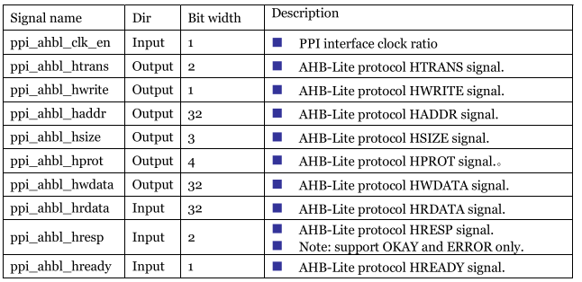

System Bus采用AXI：

即3.4.2 MEM Interface

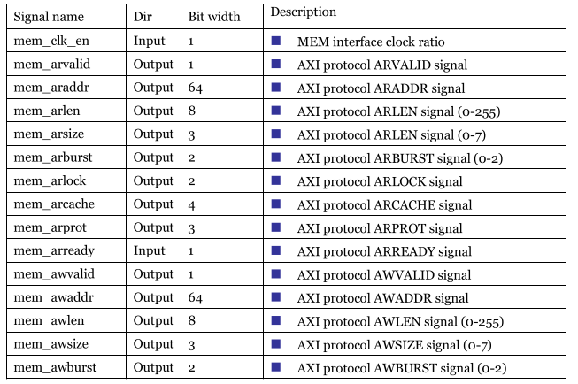

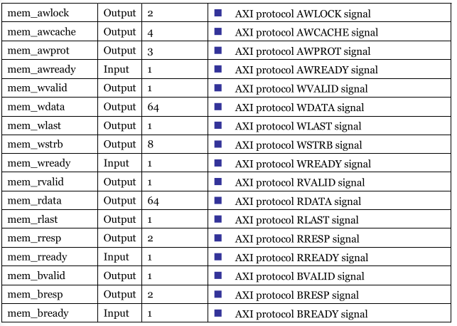

疑问：

	1.  AXI总线交易顺序：通过给AXI总线发送的交易分配一个ID标签。
	2.   将icb分发与直接将ahb分发对比？；

注意事项：

1. axi与ahb总线对具体模块操作时须经过axi2icb与ahbl2icb；

   以pwm为例：

   在ux607_subsys_main.v中line3000:ux607_subsys_perips例化，通过ahb总线与mian层通信；

   在ux607_subsys_perips.v中line482：ux607_gnrl_ahbl2icb例化，将ahb总线转化为icb总线，

   ​												line1605:ux607_icb1to16_bus例化，将icb总线分发为16条，其中pwm2的icb总现在Line1949;

   ​												line2854:ux607_pwm16_top例化将u_ux607_pwm2_top集成进入perips；

   在ux607_pwm16_top.v中Line99:ux607_pwm16例化将u_ux607_pwm16集成；此中ux607_pwm16接口中含有a,b,c,d组（a,c为输入；b,d为输出）如下接口（使用了a,d组）：

   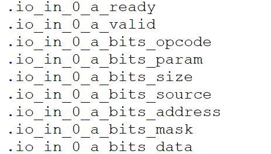

   在ux607_pwm16_core.v中主要实现PWM寄存器（cmp,feed,key）读写与具体功能；

2. PPI可通过配置define选择其他总线；

3. axi总线中还有总线异步，总线分发，总线仲裁

