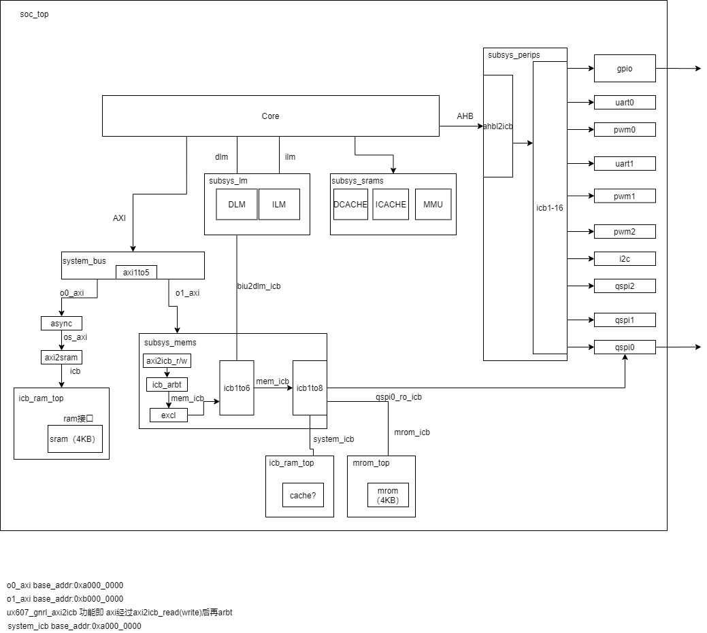
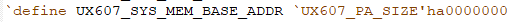
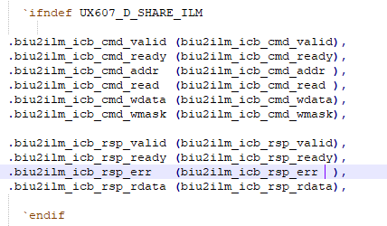
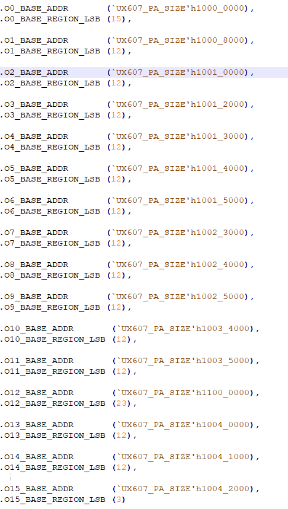

20201228工作日志

代办：

1. ux607总线框图
2. UART

### 1.UX607总线框图

疑问：

1.ux607_subsys_excl模块的作用是什么？

2.icb总线中icb_cmd_lock,icb_cmd_excl,icb_cmd_size的用途是什么，没有找到相关的说明；

3.cache mmu这些模块的资源都在core外面的subsys_srams中；

4.subsys_mems中`ifdef UX607_HAS_CACHE，例化icb_ram_top，并使用system_icb与其连接，有什么用?

system_icb基地址与o0_axi的基地址相同；

cache的基地址是什么？

1.axi2icb的总线转换通过先将axi转换为icb_read和icb_write，再利用icb_arbt冲裁后得到icb总线；此中的各个模块均在core中定义；

2.`define UX607_D_SHARE_ILM  如果没有define，可通过subsys_mems去访问ILM

c

3.·`define UX607_TMR_PRIVATE  如果没有define，可以通过subsys_mems访问timer；

4.`define UX607_HAS_DEBUG_PRIVATE

5.`define UX607_LM_ITF_TYPE_SRAM 

6.subsys_perips.v中icb1to16基地址:

