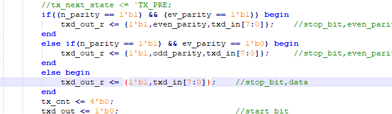
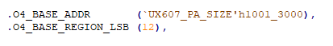

### 工作计划：

1.仿真UART波特率115200；

2.将UART集成进入现有系统；

3.开始利用C语言（指针）编写仿真case；

问题：

1.如果uart遇到毛刺怎么办，是不是需要把idle状态的tmp_data检测时间提前一点；

2.总线上的rdata和wdata在这个时钟周期作用后，是不是应该直接清掉？

3.baudrate生成过程中，当divisor改变，里面的各类计数器需要重新计数；

4.只读寄存器的硬件实现；

5.

6.TX在发送停止位时向数据寄存器写数据，能否保证数据的正常发送；

7.在ux607_subsys_perips.v 2650行集成gyj_uart_top；

将之前的uart0替换为gyj_uart_top

icb总线o4 ：uart0的基地址

