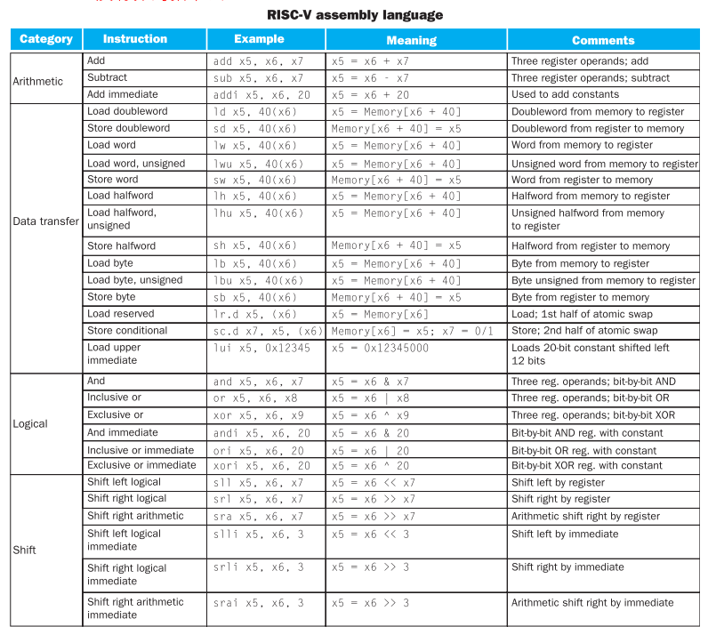
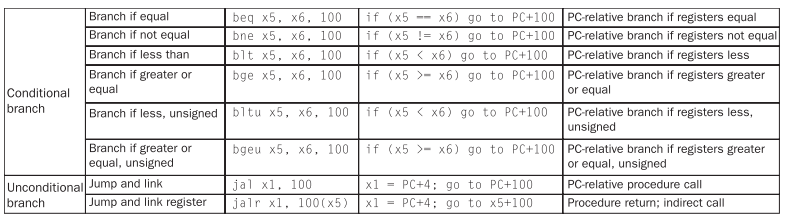
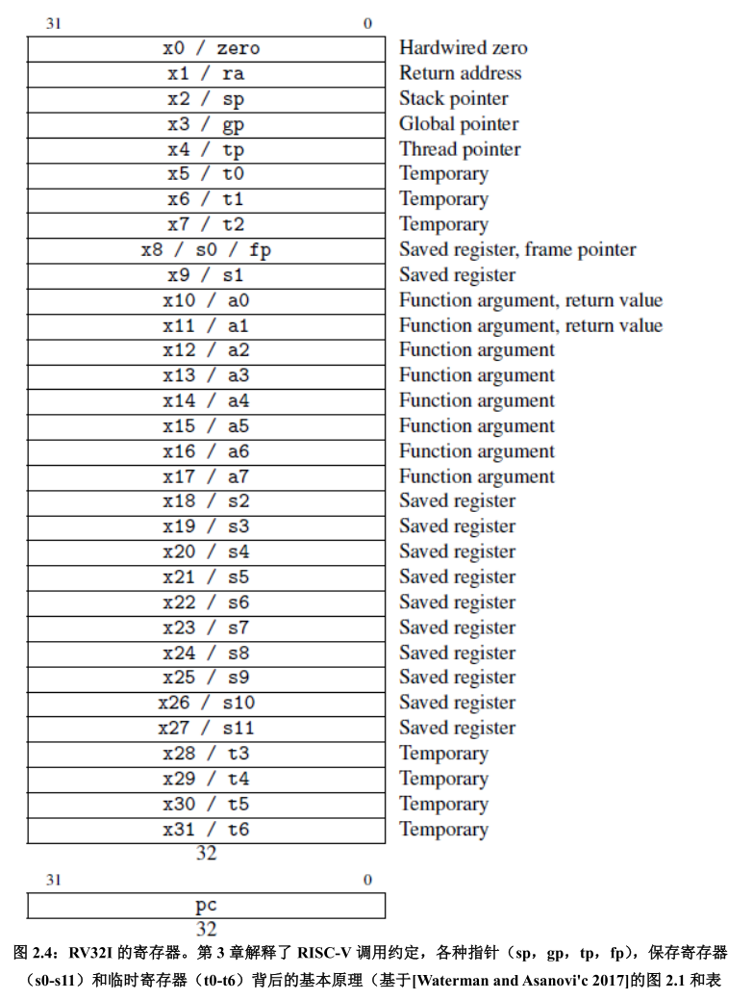
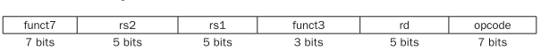
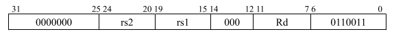
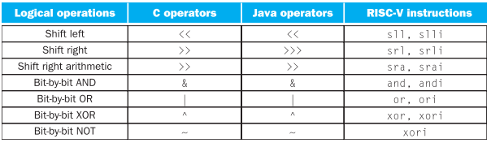

### ISA

#### 学习目标

主流指令集体系结构(ISA)：ISA的作用和发展、各类ISA的应用领域

RISC-V汇编语言：RISC-V中的操作数、指令在计算机内部的表示、存储程序、逻辑运算指令、决策指令 

硬件对过程的支持：指令和寄存器、叶过程、嵌套过程、栈与帧、内存空间布局 

执行程序：人机交互、翻译并执行程序、并行与同步

------

#### 内容简介

1.MIPS中的操作数

2.指令在计算机内部的表示

3.关于存储程序

4.逻辑运算指令

5.决策指令

------

#### 1.介绍

指令集：一个计算机的所有指令的集合。

**CISC与RISC的区别:**

CISC(Complex Instruction Set Computers，复杂指令集计算集)和RISC(Reduced Instruction Set Computers)是两大类主流的CPU指令集类型，其中CISC以Intel，AMD的X86 CPU为代表，而RISC以ARM，IBM Power为代表。RISC的设计初衷针对CISC CPU复杂的弊端，选择一些可以在单个CPU周期完成的指令，以降低CPU的复杂度，将复杂性交给编译器。举一个例子，CISC提供的乘法指令，调用时可完成内存a和内存b中的两个数相乘，结果存入内存a，需要多个CPU周期才可以完成；而RISC不提供“一站式”的乘法指令，需调用四条单CPU周期指令完成两数相乘：内存a加载到寄存器，内存b加载到寄存器，两个寄存器中数相乘，寄存器结果存入内存a。按照此思路，早期的设计出的RISC指令集，指令数是比CISC少些，单后来，很多RISC的指令集中指令数反超了CISC，因此，引用指令的复杂度而非数量来区分两种指令集。

当然，CISC也是要通过操作内存、寄存器、运算器来完成复杂指令的。它在实现时，是将复杂指令转换成了一个微程序，微程序在制造CPU时就已存储于微服务存储器。一个微程序包含若干条微指令（也称微码），执行复杂指令时，实际上是在执行一个微程序。这也带来两种指令集的一个差别，微程序的执行是不可被打断的，而RISC指令之间可以被打断，所以理论上RISC可更快响应中断。

在此，总结一下CISC和RISC的主要区别：

- CISC的指令能力强，单多数指令使用率低却增加了CPU的复杂度，指令是可变长格式；RISC的指令大部分为单周期指令，指令长度固定，操作寄存器，只有Load/Store操作内存;

- CISC支持多种寻址方式；RISC支持方式少;

- CISC通过微程序控制技术实现；RISC增加了通用寄存器，硬布线逻辑控制为主，是和采用流水线;

- CISC的研制周期长;

- RISC优化编译，有效支持高级语言;
  

#### 2.计算机硬件的操作

每条指令只执行一个操作（CISC虽然部分指令复杂，但总的来说还是一个操作），相同类型的指令含有相同的操作数和格式。例如加减等指令都是三个操作数，两个进行运算的数和一个保存结果的数；                  

**设计原则1：简单源于规整**

#### 3.MIPS中的操作数

##### 3.1 寄存器操作数

为什么没有非指令？为什么没有直接加载立即数的指令？

为什么有且仅有32个寄存器：

**设计原则2：越小越快；**

大量的寄存器将导致时钟周期变长，因为电信号传输更远的距离必然花费更多的时间，而且从31到32的寄存器，虽然只加了一个，但是机器语言中的指令格式寄存器域就需要多加一个bit；但是也不是真的就越少越好，如果寄存器不够用，必然需要使用存储器，但是访问存储器的时间将会远远超过寄存器的访问时间（寄存器的存储电路是由锁存器或触发器构成的，拥有非常高的读写速度和吞吐量），所以一个指令集架构必须要有足够的寄存器资源才可以高效的编译。

##### 3.2 存储器操作数

当程序中有复杂的数组和队列时，32个寄存器显然不够用了，这时候就需要使用存储器，编译器会将常用的变量放在寄存器中然后把剩下的数据放在存储器中，利用load和store指令在二者之间传送数据。

load与store操作的区别：load是从存储器到寄存器，需要一个源操作数寄存器保存基地址和一个目的操作数寄存器；store是从寄存器到存储器，需要两个源操作数寄存器，一个保存需要store的数据，一个保存基地址。

一个RISC-V的算数运算指令可以读并操作两个寄存器；但是数据传输指令只可以读一个操作数，并不可以操作。

##### 3.2立即数操作数

立即数从哪里来？——在程序在加载过程中就将立即数也加载到存储器中，当 包含该立即数的指令被执行，这个立即数就将被load到寄存器中。但是在实际编译过程中一般采用addi指令和零寄存器，addi x22,x0,4 来获取立即数，这样子还避免访问存储器，节约了资源。零寄存器还可以配合sub用来取反。——加速大概率事件

#### 4.有符号和无符号数

用二进制补码来表示有符号数，优点在于所有的负数的最高有效位都是1，硬件只需要监测第一位就可以知道这个数是正数还是负数。

 补码的运算：利用时钟的概念很好理解。

#### 5. 计算机中指令的表示

指令在计算机内部都是以若干高低信号的序列表示的，并且形式上和数的表示相同。实际上，指令的各个部分都可以看成一个独立的数，将这些数拼接起来就形成了指令。

R型：

opcode：指令的基本操作，成为操作码；

funct3和funct7：功能码，属于操作码的一部分；

rd：用于存放计算结果的目的寄存器；

rs1:第一个源寄存器；

rs2:第二个源寄存器；

例：add运算

当我们需要在指令中操作一个更大的地址范围或者更大的立即数时，寄存器域的5bit显然太小了，这就需要其他形式的指令格式，这与我们简洁源于规整的设计原则相违背，但是事实要求我们折中：

**设计原则三：好的设计需要适宜的折中**

I型：

S型：

store指令需要两个源操作数；

RISC-V中虽然既有add有也sub指令，但是只有addi指令没有subi指令,因为subi可以通过addi和补码形式来完成。

为什么指令集中的通用寄存器个数在16或者32个？

**重点：当今计算机两个构建准则**

- 指令用数字的形式表示；
- 程序和数据一样存储在存储器中，并且可以读写；

#### 6. 逻辑运算

与、或、异或（含各自的立即数操作）（没有非操作，可以通过其他异或指令表示）

左移右移

为什么没有非指令：简洁性，可以利用利用xori来表示，减少了指令的个数，而且对于这种单目操作符，如果使用还需要一个新的指令格式。

#### 7.决策指令

计算机和普通的计算器的区别就在于决策能力；

**条件分支**

beq和bne可以实现条件分支if-else的功能；

**循环**

beq , bne , bge , blt , bgeu , bltu

循环和条件分支中的决策指令在汇编语言中都是一样的；

**case/switch语句**

case/switch根据某个变量的值选择不同的条件分支，汇编实现的最简单方法就是借助一系列的条件判断，将switch转换为if-else的语句嵌套；

jalr指令可以实现这个操作；

#### 8.计算机硬件对过程的支持

过程：根据提供的参数执行特定任务的子程序。

**过程运行中，程序必须要遵循的六个步骤：**

- 将参数放在过程可以访问的位置
- 将控制权交给过程
- 获取过程需要的存储数据
- 执行过程
- 将结果放在调用程序可以访问的位置
- 将控制返回初始点

**所需寄存器：**

x10-17:八个参数寄存器，前两个作为返回值寄存器

x1:返回初始点的返回地址寄存器

**过程调用指令：**

jal:跳转到某一个地址，并且将下一个指令的地址保存到寄存器x1中；