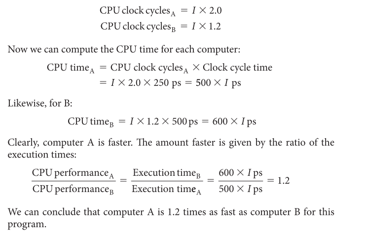

[TOC]

### 绪论

计算机的构成：

汇编指令（机器指令的注记符）和机器指令一一对应

#### 1.介绍

1.后PC时代是什么？

------

#### 2.八大设计思想

1.依摩尔定律而设计：因为集成电路发展迅速，所以我们在设计初就应该考虑到项目结束时工艺等技术水平；

2.抽象思想简化设计：设计中的细节会随着技术的发展而随时改变，使用抽象的方式去定性不同层次的设计有助于避免设计时间的延长；

3.加速大概率事件：加速大概率事件有助于提高设计的性能，而且通常情况下大概率事件还更容易被设计和优化；

4.并行提高性能：并行设计有助于提高性能；

5.流水线提高性能：向一处火灾运水，所有人并排将水流水线式的传递过去肯定比一个人跑来跑去送的更快，当然这也需要有很多的人；

6.预测法提高效率：通常情况下通过预测和假设直接开始工作比直到你确定了结果才开始更快；

7.内存的按需分配：越快越贵的内存在使用中占少数，用在cache等这些数据流中间级的缓存，越慢越便宜的内存在使用中占多数，比如用来存储数据的flash等；

8.冗余增加可靠性：设计不仅要快还要稳定可靠，通过增加冗余提高设计的可靠性；

------

#### 3.编译

应用软件程序都是使用高级语言实现的，但是我们的硬件只能识别0、1这些低级的机器语言，所以想让软件在硬件上实现就必须要有系统软件；系统软件包括**操作系统、编译器**、加载器、汇编器；

其中操作系统（主流操作系统有linux,ios,windows）的主要功能有：

- 处理输入输出操作
- 分配存储空间和内存
- 在多应用时提供保护

.c->.o的编译过程：

为什么不直接使用汇编或者机器语言而使用高级编程语言：

- 易读性
- 高效性
- 独立性（不需要考虑计算机本身）

------

#### 4.计算机内部

处理器从存储器中得到指令和数据，输入部件将数据写入存储器，输出部件从存储器中读取数据，控制器向数据通路，存储器，输入部件，输出部件发送命令信号；

硬件设备的四个主要功能：输入数据、输出数据、处理数据、存储数据

计算机组成的五大部分：输入、输出、数据通路、控制、内存

输入：麦克风、键盘、触摸屏

输出：扬声器、显示屏

处理：包括数据通路和控制，

双核系统必须使用仲裁器件来分配两个核心的资源使用，因此digital logic blocks可能就是这个作用；CPU应该集成在Processor Data Path中；512MB的内存位置未知；

核心面积 122mm^2

ARM核占12%   14.64mm^2

CPU+GPU 40%  47mm^2

存储：

易失性存储器-主存：SRAM DRAM只能在上电才能存储数据，读写快，用量小

非易失性存储器-二级存储器：磁盘，FLASH，在掉电也可以存储数据，读写慢一点，价格便宜

------

#### 5.性能

在挑选产品中，性能是极其重要的因素之一。在不同的应用场景，需要根据不同的性能标准作为判断条件：

**响应时间：** 也叫执行时间，是计算机完成某任务需要的总时间；

**吞吐率：** 也叫带宽，表示单位时间内完成的任务数量；多用户的服务器更关注吞吐率；

CPU性能及其因素
$$
一个程序的执行时间 = 一个程序的CPU时钟数 * 时钟周期时间
$$
或者
$$
一个程序的执行时间 = \frac{一个程序的CPU时钟数} {时钟频率}
$$

指令的性能
$$
CPU时钟数 = 程序的指令数*CPI
$$
eg : Suppose we have two implementations of the same instruction set architecture. Computer A has a clock cycle time of 250 ps and a CPI of 2.0 for some program, and computer B has a clock cycle time of 500 ps and a CPI of 1.2 for the same program. Which computer is faster for this program and by how much?

answer:
$$
{CPU_A}时钟数 = I*CPI = I*2.0 
$$

$$
{CPU_B}时钟数 = I*CPI = I*1.2
$$

经典的CPU性能公式
$$
CPU时间 = 指令数*CPI*时钟周期时间
$$
或者
$$
CPU时间 = \frac{指令数*CPI}{时钟频率}
$$
可以利用这三个影响性能的因素，选择合适的设计方案来提高性能

CPI的计算：
$$
CPI = \frac{CPU时钟数}{指令数} = \frac{\sum_{i=1}^{n}{CPI_i}*{C_i}}{\sum_{i=1}^{n}{C_i}}
$$
只用一个因素去评价或者改善性能都是不可取的，在评价性能的过程中必要用同时考察三个因素才可以确定执行时间；当时钟频率相同时，单纯的减少指令数，也可能导致CPI的增加，因为CPI会随着指令组合改变而改变；反之亦然；

------

#### 6.功耗墙

25间Intel x86 八代微处理器时钟频率和功耗的增加：

$$
功耗 \varpropto 1/2*负载电容*{电压^2}*开关频率
$$
虽然时钟频率增加了1000倍但是功耗只增加了30倍，因为每代的电压都减少了15%左右；

#### 7.巨变：单处理器到多处理器

2002年起，单核处理器的性能增长速率从1.5降到1.2，因为受到功耗，指令集并行程度和存储器延迟时间的限制；

2006年之后，所有的计算机都采用了多核结构，但是性能的增长速率并没有明显改变，因为多核结构追求的是更高的吞吐率，而不是单个程序在单个处理器上的响应时间；

由多核带来的一大问题就是并行性，从软件编程的角度来说，显示并行编程就更为重要了，因为这样可以让指令重叠执行，提高吞吐率；

显示并行编程的挑战：

- 以提高性能为目的，必然增加编程的难度
- 任务划分均匀，最好同时完成；减小调度开销，避免浪费并行优势

#### 8.谬误与陷阱

**陷阱：**在改进计算的某个方面时期望总性能的提高与改进大小成正比。

Amdahl定律：对于特定需要改进的性能的提升可能受到由所改进的性能的数量所限制；

eg：一个程序在一台电脑上运行时间为100s，其中有80s是运行乘法，那我们是永远不可能通过改进乘法来讲程序的运行速度提高5倍。

**谬误：**利用率低的计算机功耗低。

**谬误：**面向性能的设计和面向能量功率的设计具有不相关的目标。

能耗是功耗和时间的乘积，提高性能，也可以间接的降低功耗；而且计算机除了处理器还有其他很多组件，无时无刻不在消耗能量，缩短运行时间也可以减小整个系统的能耗。

**陷阱：**用性能公式的一个子集去度量性能。

MIPS:每秒百万条指令
$$
MIPS = \frac{指令数}{执行时间*{10^6}}
	 = \frac{指令数}{指令数*CPI/时钟频率*{10^6}}
	 = \frac{时钟频率}{CPI*{10^6}}
$$

#### 9.本章小结

- 不可以使用独立的因子去确定性能，只有综合考虑才是可靠的性能度量指标

- 两个计算机设计新思想：
  - 提高并行性，例如使用多处理器
  - 开发存储器层级结构的局部性，例如使用cache

- 能耗效率已经取代面积成为最重要的资源
- 计算机设计除了价格、性能和功耗，还有其他的度量因素：可靠性、成本和可扩展性

