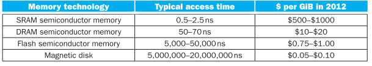
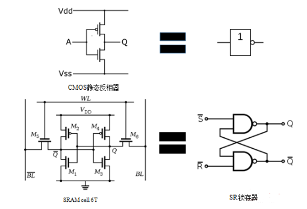
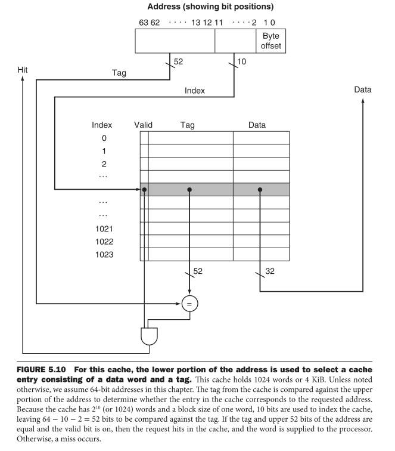
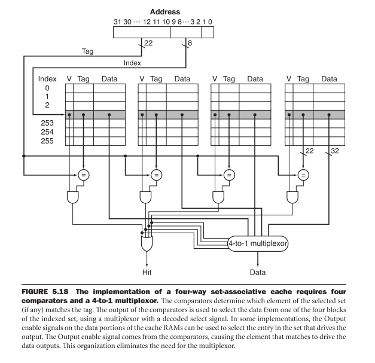
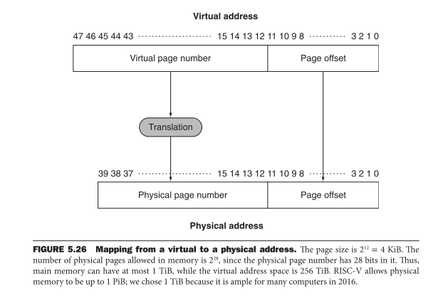

### 存储层次的开发

#### 1. 简介

两个重要的局部性原理：

时间局部性：最近被访问的数据在接下来很有可能还会被访问；

空间局部性：某个数据被访问后，他周围的数据还有会很快被访问；

存储器层次结构：一种多存储器层次组成的结构，存储器的容量和访问速度随着离处理器距离的增加而增加；

一个存储器层次结构可以由多层构成，但是数据每次只会在相邻的两个层次间传输；

#### 2. 存储器层次结构

四种技术：SRAM,DRAM,FLASH,磁盘

SRAM:一种组织成存储阵列结构的简单集成电路，一个基本存储单元通常与6-8个晶体管组成。

SRAM基本单元由两个CMOS反相器组成。两个反相器的输入、输出交叉连接，即第一个反相器的输出连接第二个反相器的输入，第二个反相器的输出连接第一个反相器的输入。这实现了两个反相器的输出状态的锁定、保存，即存储了1个位元的状态。

DRAM：使用电容保存电荷的方式来存储数据，通过一个晶体管实现对该电容的访问；比SRAM密度高得多，但是不能长久的存储数据，需要周期性的刷新电容（称为动态的原因）。刷新方式常见三种：

- 集中刷新
- 分散刷新
- 异步刷新

[DRAM 原理 1 ：DRAM Storage Cell](http://www.wowotech.net/basic_tech/307.html)

[DRAM 原理 2 ：DRAM Memory Organization](http://www.wowotech.net/basic_tech/309.html)

[DRAM 原理 3 ：DRAM Device](http://www.wowotech.net/basic_tech/321.html)

[DRAM 原理 4 ：DRAM Timing (wowotech.net)](http://www.wowotech.net/basic_tech/330.html)

[DRAM 原理 5 ：DRAM Devices Organization](http://www.wowotech.net/basic_tech/343.html)

FLASH: 一种电可擦除可编程只读存储器，采用损耗均衡技术（控制器将写入很多次的块映射到写入次数较少的块中）。优点在于可以在不加电的情况下长期保持存储的信息，既有ROM的特点，又有很高的存储速度，而且易于擦除和重写，功耗很小。

[嵌入式系统存储（RAM、ROM、Flash）_嵌入式-CSDN博客_嵌入式flash](https://blog.csdn.net/weixin_42653531/article/details/90745042)

[NAND闪存与NOR闪存的工作原理详解_sunflowerfsw的博客-CSDN博客_nand nor](https://blog.csdn.net/sunflowerfsw/article/details/52278792)

磁盘：

#### 3. Caches的基本原理

##### 3.1 直接映射：

- 假设Cache每行存储32个bit，即4个bytes，则地址的低两位作为byte offset来对齐地址；

- 根据Cache的索引大小选择相应的地址段作为索引，比如cache索引1024，则将地址的[11:2]作为索引，指向0~1023；
- 地址的其余位作为标签，当地址对应的memory内容被读到cache中data段，地址的[63,12]也被写入tag段，同时valid置位；

##### 3.2 cache缺失处理

如果cache命中，计算机继续使用该数据，没有其他的额外开销；但是当未命中时，cache就需要增加一些额外的工作，处理过程主要由两个部分完成：处理器控制单元，以及一个初始化主存访问和重新填充cache的独立控制器；

出现缺失时，乱序执行的处理器比顺序执行的处理器处理方法要复杂的多，这里介绍顺序执行的情况：

- PC-4送到存储器中；
- 通知主存执行一次读操作，并等待访问完成；
- 写cache（data、tag、valid)
- 重启指令执行第一步，重新取值；

##### 3.3 写操作处理

写直达：避免内存与cache的内容不一致，直接同时向memory和cache中写数据；使用写直达的机制每次写操作都要把数据写入主存，花费大量的时间。

写缓冲：将数据写入cache和缓冲器后CPU可以继续执行其他的指令，然后缓冲器向mem中写入，在缓冲器满了的时候，CPU必须停顿下来，直接导致当写操作产生速度超过mem写入的速度，写缓冲就不起作用了；

写回：将数据写入cache，知道这块数据要被替代时才写入mem；

##### 3.4 总结

为了利用空间局部性，cache中一般使用较大的块来降低缺失率，减少与存储相关的tag和valid，从而提高cache的效率。增加块的大小会降低缺失率，同时也会增加缺失的代价（因为缺失后，需要去主存访问更多内容来写入cache）；为了避免性能损失，可以通过增加主存的带宽来更高效的传输，例如增加DRAM外部带宽常用的办法包括：增加存储器位宽和交叉存取。

#### 4.  Cache性能的评估和提升

Cache的容量增加可以降低缺失率，但是不仅仅增加了成本，而且cache的访问时间也会增加，正如图书馆的书桌如果面积太大了，我们在上面找书必然会增花费更多的时间。下面介绍两种技术来提高cache性能（降低缺失率和缺失代价）：

- 通过减少存储器中不同数据块争用同一位置的概率来降低缺失率；
- 通过在存储器层次结构中额外加上一层来减少缺失代价；

##### 4.1 通过灵活放置块来减少cache缺失

直接映射法中主存中没个地址仅对应cache中某一个确定的位置，这样就会导致主存多个地址同时对应cache中同一个位置，缺失率就会很高，另一种极端方式是**全相联**，主存中的块可以与cache中任意一个位置相关联；

介于二者之间的折衷方式就是**组相联**，每个块在cache中相关的位置数固定，提高相联度的优点就是可以降低缺失率，但是最大的缺点就是增加了命中时间，且随着组数的增加，更到的相联度对缺失率的改善就小了。

为什么组相联可以降低缺失率：相联度低，刚写入cache的数据有较大可能被覆盖，根据时间局部性原理，这就使得缺失率增加；但是增加了相联度，刚写入的数据不容易被覆盖，这就降低了缺失率。

##### 4.2 替换块的选择

在组相联的cache中，我们将在选中的组中挑选被替换的块，这就涉及到了替换的策略：

- 最近最少使用（LRU)：通过跟踪每一块的相对使用情况；

##### 4.3 使用多级cache结构减少缺失代价

两次cache的结构使得一级cache致力于减少命中时间获得较短的时钟周期或者较少的流水级；二级cache则主要针对于改善缺失率以减少长时间的访存代价；一级cache容量通常很小，降低命中时间和缺失代价，二级cache的访问时间不是关键，因此二级cache的容量一般比单级cache的容量还要大得多，块容量也比单级cache中的要大，还经常使用比一级cache更高的相联度来减少缺失率。

#### 5. 可信存储器层次

为了提高MTTF，可以提高器件的质量，也可以设计在器件失效的情况下继续工作的系统：

- 故意避障技术
- 故障容忍技术
- 故障预报技术

#### 6. 虚拟机

#### 7. 虚拟存储器

（memory map）

虚拟存储器：主存也可以为磁盘实现的辅助存储器充当cache，允许云计算在多个虚拟机之间有效而安全的共享存储器。

虚拟存储器实现了程序地址到物理地址的转换，加强了各个程序地址空间之间的保护。

在虚拟存储器中块被称为页，访问缺失则被成为缺页。处理器产生一个虚拟地址，再结合软硬件转换成一个物理地址，然后就可以被用来访问主存了。

物理页号构成物理地址的高位部分，页偏移是不变的，构成物理地址的低位部分。页偏移域的位数决定了页的大小，虚拟地址可寻址的页数与物理地址可寻址的页数可以不同（虚拟地址可寻址页数更多是描述一个没有容量限制的虚拟存储器的假象的基础）。

##### 7.1 页的存放与查找

页表：使用一个索引存储器的表来定位页，这个结构被存放在存储器中。页表使用虚拟地址的页号作为索引，以找到相应的物理页号。页表类似于图书馆中书名和藏书位置之间的映射。为了指出页表在存储器中的位置，硬件包含了一个指向页表首地址的寄存器，称为页表寄存器。

