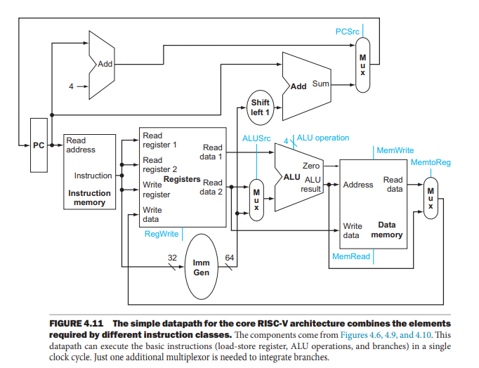
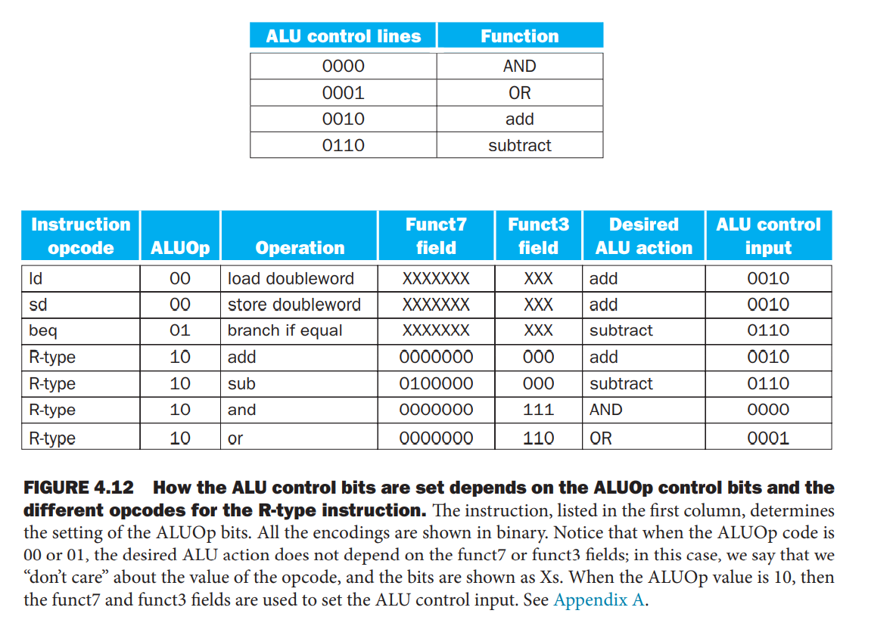
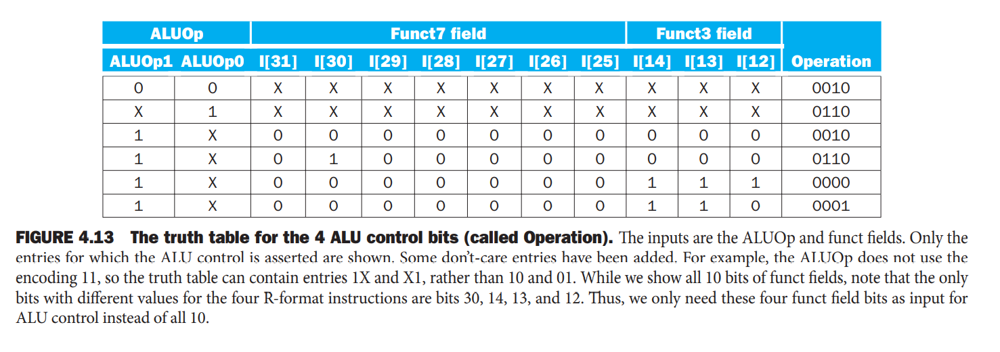
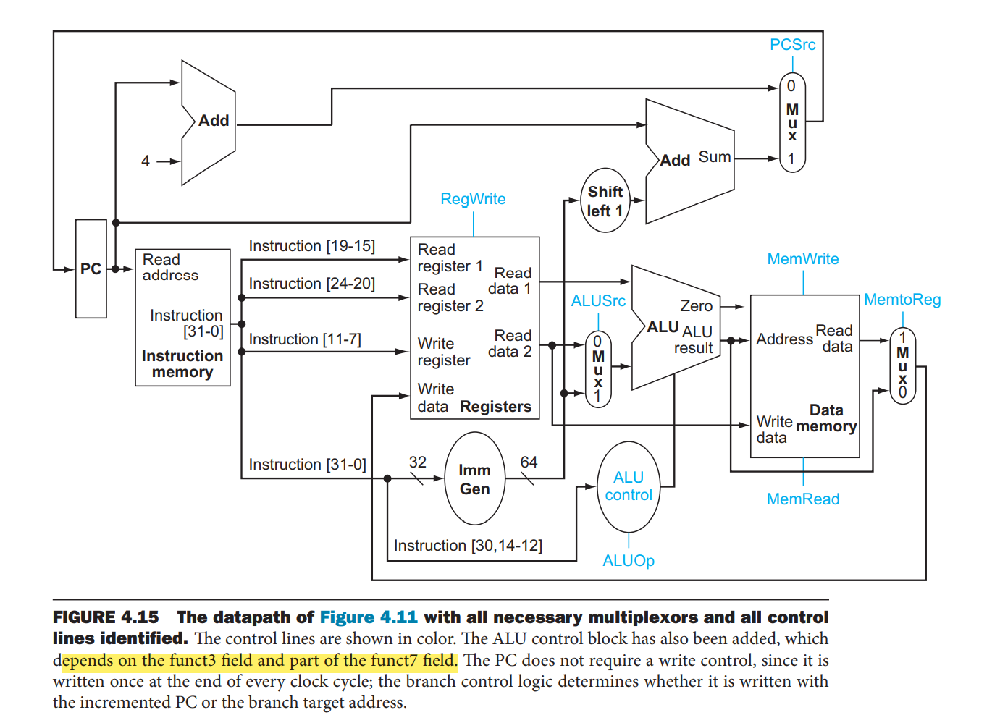
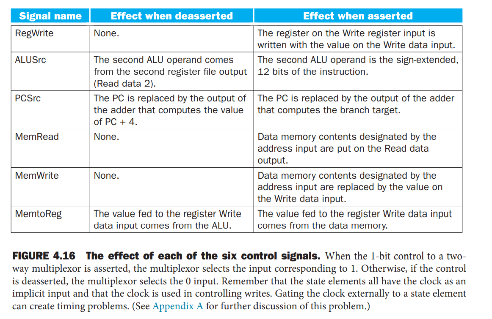
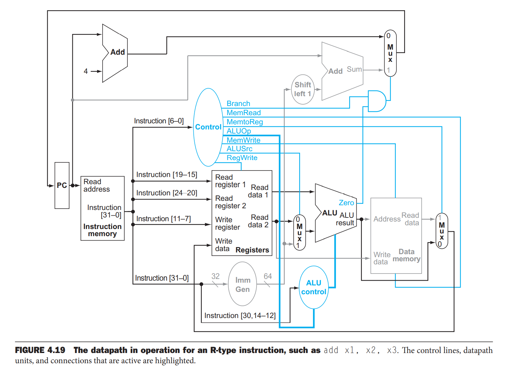
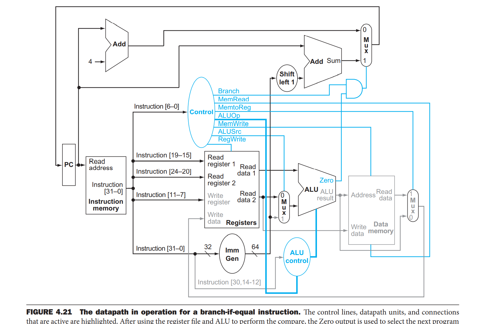
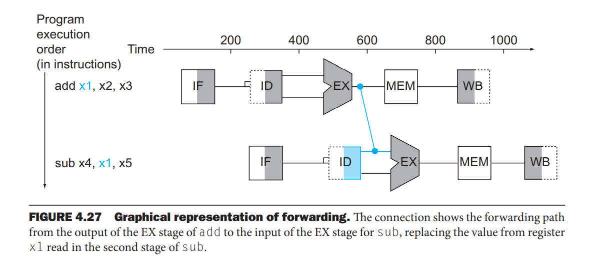
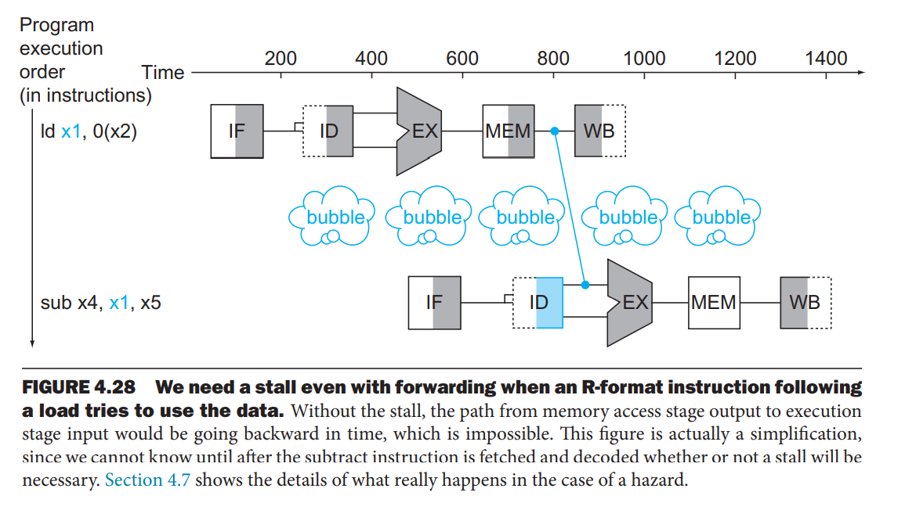
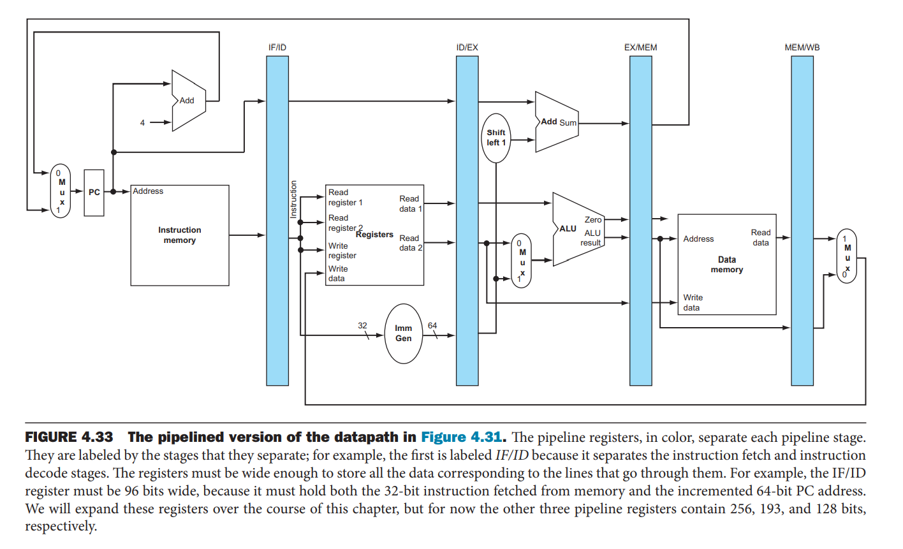

[TOC]

------

### CPU

#### 1.引言

CPU实现的本质就是指令集的实现。

#### 2.建立数据通路

数据通路部件：用来操作或保存处理器中数据的单元。

程序计数器：存放下一条将要被执行指令的地址的寄存器。

上述结构可实现R型指令（包含算术逻辑指令和分支指令等）：

下一条PC值可由当前PC+4或者分支跳转的目标地址决定；

通过PC指向Memory中的地址取出指令进行译码；

R型指令一般需要两个寄存器值，这些寄存器储存在regfile中，访问regfile分读写两种：

- 读操作：需要寄存器号和结果的输出指示；
- 写操作：需要寄存器号和要写的数据；

指令译码分两种：

- 算术逻辑指令：将regfile的结果或者生成的立即数送入ALU中进行处理；
- 分支跳转指令：进行计算分支目标地址和比较操作数；

#### 3.简单的实现机制

##### 3.1 ALU控制

ALU的控制输入信号主要有ALUop,funct3,funct7（指令的操作码：opcode,funct3,funct7的作用在此处得到体现）：

- ALUOp为00时表示load,store指令，目标ALU操作为add；
- ALUOp为01时表示beq,目标ALU操作为sub；
- ALUOp为10时表示R型指令，具体的ALU操作通过funct3和funct7控制；

利用真值表得到ALUop,funct3,funct7与ALU控制输入的布尔代数关系，利用该关系设计ALU的控制单元：

通过真值表的分析，operation只和ALUOp,指令的bits30,14,13,12有关。

图4.15是主要数据通路加上必要的数据选择器和控制信号的结构，其中控制信号线有六点单笔特控制信号和两笔特的ALUOp信号，除PCSrc外其他的控制信号均由指令[6:0]直接决定，PCSrc线通过将Control中的Branch和ALU的Zero线（判断是否执行Branch)相与得到。

各个控制信号线的作用如下表：

且由表4.16可知当实现某些功能，某些信号的值并非必须确定的可以为x态

##### 3.2 主控单元的设计

由上可知，设计的简单系统中的控制信号基本上都可以通过inst[6:0]直接或者间接决定；

**add  x1,x2,x3**

有了这个结构，我们以add,x1,x2,x3为例说明一下数据在数据通路中的运行，虽然这个过程在一个时钟就可以完成，但是我们分为四步执行：

- 取值，PC递增
- 从regfile中读寄存器x2,x3的值；配置控制信号线
- 通过opcode产生ALU功能并计算数据
- ALU结果写入regfile中x1寄存器

**ld x1 , offset(x2)**

- 取值，PC递增
- 读寄存器x2的值
- ALU计算寄存器值和偏移地址的和
- ALU计算结果被用作memory的地址
- data memory的值被写入寄存器x1

**beq x1, x2, offset**

- 取值，PC递增
- 读取寄存器x1,x2值
- ALU将两个寄存器值相减；PC值加上偏移地址的符号扩展值
- 根据Zero线的状态判断PC值

##### 3.3 为什么不使用单周期实现方式

单周期设计中，时钟周期对所有指令等长，这样时钟周期由执行时间最长额指令决定（木桶效应），这个指令肯定是取数指令，因为他依次使用了5个功能单元：指令寄存器，寄存器堆，ALU，数据存储器，寄存器堆。

因为时钟周期必要满足所有指令的最坏的情况，之前提到的加速大概率事件的设计思想来优化设计的做法在此时就不再适用，我们不能使用缩短常用指令执行时间来而不改善最坏情况的办法来实现优化。故需要引入流水线，流水线通过重叠多条指令的执行来提高效率。

#### 4.流水线设计

流水线在日常生活中随处可见，餐馆的厨房里一个出菜的过程就是流水线：下单，报菜单，配菜，炒菜，出锅上菜。这里面就需要厨房的工作人员相互配合才能完成的更快更好，如果只是单个人做所有的事情，虽然也是可以完成的，但是效率显然易见是很低的。流水线的级数就是我们将出菜的这个过程分成几个部分。
$$
指令执行时间_{流水线} = \frac{指令执行时间_{非流水线}}{流水线级数}
$$

##### 4.1 面向流水线的指令集设计

- 所有指令长度相同
- MIPS只有很少的指令格式
- 存储器操作数仅出现在存取指令中

##### 4.2 流水线冒险

**结构冒险：**硬件不支持多条指令在同一周期执行。例如如果配菜和炒菜是一个师傅来完成的话，这两步就不能实现流水线操作。

**数据冒险：**发生在由于一条指令必须等待另一条指令的完成而造成流水线暂停的情况。例如我们的前一道菜是红烧牛肉，后一个客户想要一道红烧牛肉面（需要用到前面的红烧牛肉），那我们红烧牛肉做好之后不用等他装盘就可以把牛肉拿过来做牛肉面。

解决办法：从内部资源中直接提前得到缺少的运算项的过程——前推或者旁路

**控制冒险：**也成为分支冒险，决策依赖于一条指令的结果，而其他指令正在执行中。例如现在来了一位挑剔的客户，点了几道菜，但是需要在第一道菜尝完之后觉得好吃再同意做后面几道菜。

解决办法：分支预测

#### 5. 流水线数据通路及其控制

数据通路可分为五级：

- IF：取指令
- ID：指令译码，读寄存器堆
- EX：执行或者计算地址
- MEM：数据存储器访问
- WB：写回

数据流通常都是自左至右的，但是也有两种例外：

- 写回阶段，数据写回数据通路中间的regfile——可能导致数据冒险
- PC的下一个值需要在自增的PC和MEM级的分支地址间进行选择——可能导致控制冒险

流水线各个阶段之间通常使用寄存器来保存数据，正如做菜的过程中我们的菜品总需要一个容器。但是WB阶段的后面是不需要寄存器来保存数据的，因为每条指令的更新机器中寄存器，存储器或者PC的状态，所以在WB后加一个寄存器保存信息就冗余了，在完成一条指令后，需要他的相关信息只需要去相应的存储空间读取即可。

当发生异常时，这些流水线寄存器都将会被清空。

