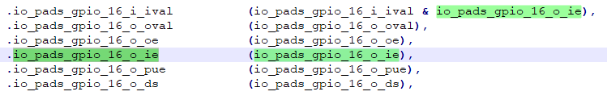
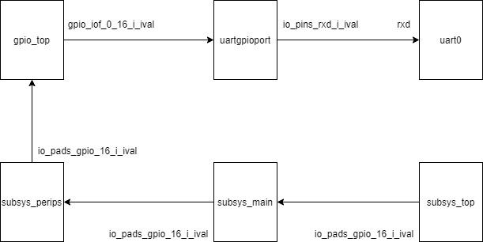
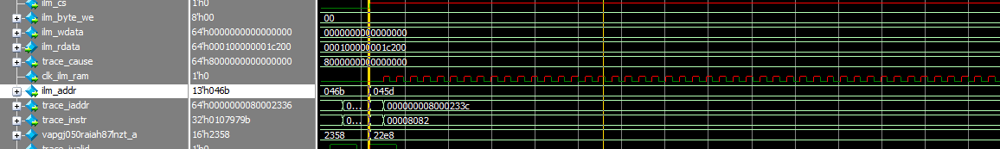
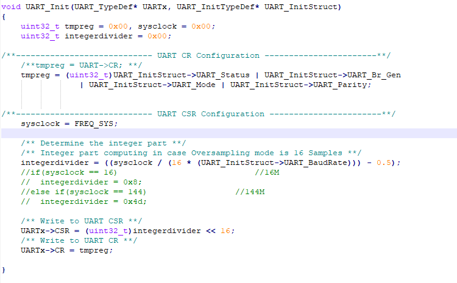
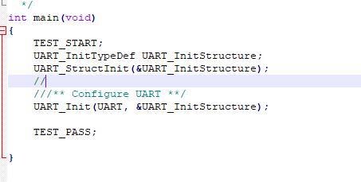

[TOC]


### uart集成与仿真

1.将所写的main.c函数编译出*.verilog的二进制文件；

2.将uart集成进入ux607系统，修改其中的bug；

3.搭建仿真环境，将tb_uart.v集成进入ux607的testbench中：

- tb_define.v中添加宏定义UART0_TOP
- uart0集成在icb总线的o4接口上；


### question:

1.soc_top.v line423:下一层的输入，是这一层的输入和输出的&：



o_ie信号在gpio_top中没有从iof传到pads中，导致i_ival在soc_top之后都为1‘b0；

```verilog
force `SOC_GPIO_TOP.io_port_pins_16_o_ie = 1'b1;
```

2.uart0的rxd端口连接：




### debug:

1.当如下配置变量integerdivider会出现下面情况：

```c
integerdivider = (sysclock / (16 * (UART_InitStruct->UART_BaudRate))) - 1;  
```



此时两次相连的总线操作需要372ns；其中的dump文件描述如下：
<details>
<summary>dump文件展开查看</summary>
<pre><code>
000000008000230c <UART_Init>:
/**---------------------------- UART CSR Configuration -----------------------**/
    sysclock = FREQ_SYS;
	/** Determine the integer part **/
	/** Integer part computing in case Oversampling mode is 16 Samples **/
	integerdivider = (sysclock / (16 * (UART_InitStruct->UART_BaudRate))) - 1;    
	8000230c:	419c                	lw	a5,0(a1)
	tmpreg = (uint32_t)UART_InitStruct->UART_Status | UART_InitStruct->UART_Br_Gen 
	8000230e:	00c5a803          	lw	a6,12(a1)
				| UART_InitStruct->UART_Mode | UART_InitStruct->UART_Parity;
	80002312:	4990                	lw	a2,16(a1)
	integerdivider = (sysclock / (16 * (UART_InitStruct->UART_BaudRate))) - 1;    
	80002314:	0047971b          	slliw	a4,a5,0x4
	80002318:	00f427b7          	lui	a5,0xf42
	8000231c:	4007879b          	addiw	a5,a5,1024
	80002320:	02e7d7bb          	divuw	a5,a5,a4
	tmpreg = (uint32_t)UART_InitStruct->UART_Status | UART_InitStruct->UART_Br_Gen 
	80002324:	4598                	lw	a4,8(a1)
	80002326:	41d4                	lw	a3,4(a1)
	80002328:	01076733          	or	a4,a4,a6
				| UART_InitStruct->UART_Mode | UART_InitStruct->UART_Parity;
	8000232c:	8f51                	or	a4,a4,a2
	tmpreg = (uint32_t)UART_InitStruct->UART_Status | UART_InitStruct->UART_Br_Gen 
	8000232e:	8f55                	or	a4,a4,a3
	80002330:	2701                	sext.w	a4,a4
	UARTx->CR = tmpreg;
	80002332:	c158                	sw	a4,4(a0)
	integerdivider = (sysclock / (16 * (UART_InitStruct->UART_BaudRate))) - 1;    
	80002334:	37fd                	addiw	a5,a5,-1
	/** Write to UART CSR **/
	UARTx->CSR = (uint32_t)integerdivider << 16;
	80002336:	0107979b          	slliw	a5,a5,0x10
	8000233a:	c11c                	sw	a5,0(a0)
}
    8000233c:	8082                	ret
</code></pre>
</details> 

在pc执行到地址80002336处发生错误，导致i_ready产生x态，传播给ilm接口总线；

**出错原因为解决！！！**

且上述配置方法并不能达到四舍五入的效果；故需要修改：

```C
 integerdivider = (uint32_t)((sysclock / (16 * (UART_InitStruct->UART_BaudRate))) - 0.5);
```

dump文件较为复杂,不作展示：

此时没有x态，但是两次相连的总线操作之间间隔高达16944ns；查看dump文件之间发现有大量的jal操作

运行时间过长是由于加入了小数，导致程序中引入了大量的浮点数操作 __ floatunsidf，begin_signature，__ subdf3 ， __fixunsdfsi，

**解决方案未给出！！！**

方法一：使用枚举法将各种情况的divisor列举出来，使用if语句；


2.添加时间精度

在"ux607_i2c_master_defines.v"和”ux607_defines.v“中添加：

`timescale 1ns/1ps


3..ld文件中ilm地址不能随便修改，.data,.text都输入到正确的内存中；

由于改了.ld文件导致ilm访问出问题


4.添加tb_uart.v，将rxd端口默认拉高；


5.ILM地址深度8192，宽度为64，故存储空间一共有65536；

  **将ILM地址空间的最后一个字（0x8000fffc)预留出来，作为仿真结束的判断条件：**

- 如果0x8000_fffc对应内容为0x44444444即mian程序开始执行；
- 如果0x8000_fffc对应内容为0x44444444即仿真失败，
- 如果对应内容为0x88888888，即说明仿真成功，
- 如果对应内容为0x66666666，说明说明仿真结果需要在tb_uart.v中进行下一步判断；


6.ux607_uart.c中，当UART_Init函数中的两次写寄存器位置颠倒就会发生错误：先是ifu_o_ready出现x态，接着ilm总线一直处于x态；



解决：将结构体在main函数中内部说明：

