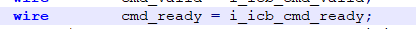
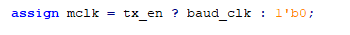
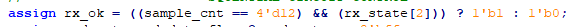
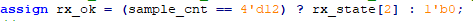
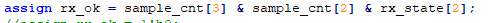
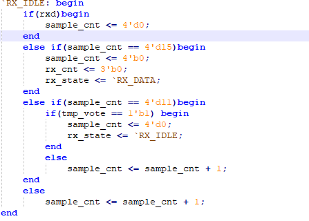
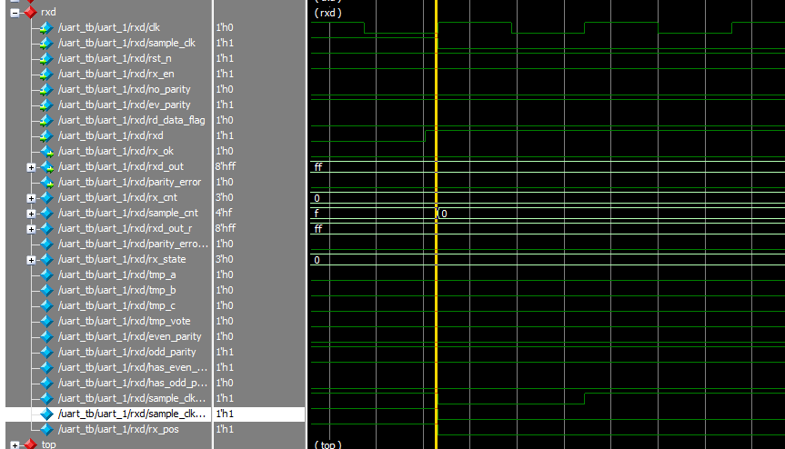
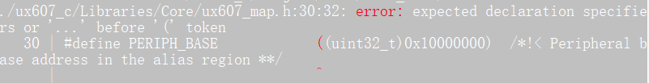

DEBUG 记录与心得

1. 每次写一个begin或者case等 都要在下面跟上end，防止后面忘记

2.  “ ： ”  一定要注意，如果写成中文的冒号，会引起编译错误

3.  `always @(posedge clk)`后面不需要 ';'

   `@(posedge clk);`作为时间延迟时，需要';'   

4. 当如下赋值时，仅可将右端赋值到左端；

    如i_icb_cmd_ready作为输出，此时即使cmd_ready有值，也不会赋值给i_icb_cmd_ready;

   

5. 注意两段式状态机的写法：

   
   
   修改意见：
   
   1.门控时钟比较危险，在设计中尽量少用，模块中设计使用主时钟来统一时钟；
   
   2.FPGA中多使用独热编码：
   
   独热编码即 One-Hot 编码，又称一位有效编码，其方法是使用N位状态寄存器来对N个状态进行编码，每个状态都由他独立的寄存器位，并且在任意时候，其中只有一位有效。虽然使用较多的触发器，但由于状态译码简单，可减少组合逻辑且速度较快， 这种编码方式还易于修改，增加状态或改变状态转换条件都可以在不影响状态机的其它部分的情况下很方便地实现。另外，它的速度独立于状态数量。与之相比，压缩状态编码在状态增加时速度会明显下降。
   
   二进制编码、格雷码编码使用最少的触发器，消耗较多的组合逻辑，而独热码编码反之。独热码编码的最大优势在于状态比较时仅仅需要比较一个位，从而一定程度上简化了译码逻辑。虽然在需要表示同样的状态数时，独热编码占用较多的位，也就是消耗较多的触发器，但这些额外触发器占用的面积可与译码电路省下来的面积相抵消。
   
   在CPLD中，由于器件拥有较多的地提供组合逻辑资源，所以CPLD多使用二进制编码或格雷码，而FPGA更多地提供触发器资源，所以在FPGA中多使用独热码编码。
   
   3.模块使能的写法：
   
   错误写法：
   
   
   
   在后续的always块中利用mclk的边沿触发，对时钟树而言不利于后续的综合时钟优化；
   
   正确应该是以系统时钟边沿为触发条件，将使能作为判断条件；
   
   

4.将rx_ok直接利用组合逻辑来驱动而避免使用寄存器，可以省下一个bit的资源，其中sample_cnt计数到12已经是最优，因为只有两根线需要判断，但是下面的组合逻辑然后可以优化；

优化后：

​				

继续优化：

其中一个二选一MUX的基本结构如下：

可见一个数选的结构远比直接用与门复杂；

5.逻辑错误：

在准备采样sample_cnt==15时，因为此时第一个数据的高电平已经到来，所以会导致sample_cnt清零，但是rx_state没有改变；

C程序debug

1.在.h文件中声明了的宏定义，不要在后续函数的参数列表中出现，否则与其有关的宏定义都会报错：

2.宏定义的变量与结构体中的变量也不可以相同；