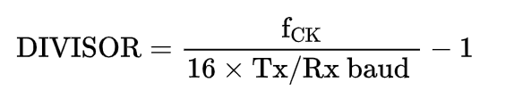

## UART   SPEC

**目录**

一、概述

二、功能特性

三、寄存器说明

四、使用说明

### 一、概述

​	UART的全称是通用异步收发器（Universal Asynchronous Receiver/Transmitter），是实现设备之间低速数据通信的标准协议。“异步”指不需要额外的时钟线进行数据的同步传输，是一种串行总线口，只需占用两根线就可以完成数据的收发（一根接收数据，一根发送数据），常用的标准通信波特有9600bps、115200bps 等。

​	UART一帧由起始位、数据位、校验位和停止位组成。数据逐位传输，示意图如下图所示。

------

### 二、功能特性

#### 1.功能特性

1. UART收发；

2. 支持8位数据、0-1校验位、1位起始位和1位停止位；

3. LSB传输模式

4. 波特率（buadrate）可调；

5. 支持接收数据完成、发送数据完成中断，中断可屏蔽；

     

#### 2.波特率（Buadrate)

​	由于UART没有同步时钟线，收/发双方如果需要进行正确的数据传输，则要在收/发双 方定义一致的位时钟，位时钟可以理解为UART总线一个位所占用的时间，即“波特率”。 在定义上，收/发双方的波特率可以是随意的，只需要保持一致，如双方都是 1000bps，但是这不能兼容现有常用的设备，兼容性差。所以在工程应用中，常用一些特定的波特率真，如 4800bps、9600bps 或 115200bps 等。

​	本次UART设计采用4800bps、9600bps可调；

#### 3.示例

1.常用帧示例

​	如下图所示为8位数据位、无校验位、1位停止位的帧格式示意图，一帧共有10位。发送数据位0xa5。

2.偶校验

​	如下图所示为8位数据位、偶校验、一位停止位的帧格式示意图，一帧共有11位。发送数据为0xa5,偶检验结果为“0”。

3.奇校验

​	如下图所示为8位数据位、奇校验、1位停止位的帧格式示意图，一帧共有11位。发送数据为0xa5，则奇校验结果为“1”。

#### 4.功能框图

### 三、寄存器说明

基地址：0x1000_6000;

#### 1.状态寄存器（uart_csr）

偏移地址：0x0000_0000;

默认值：	

​		位				域名				类型			说明

- bit0			tx_ok 				R 		为高时标志此时UART完成一组数据的发送，默认为高；

- bit4            rx_ok                 R         为高时标志此时UART完成一组数据的接收，默认为低；

- bit16-31    divisor              R/W     标志此时uart_clk需要分频多少才能得到采样时钟，得到采样时

  ​                                                         钟，得到采样时钟后再进行十六分频即可得到波特率时钟；

  其余位为reserved位；

#### 2.控制寄存器（uart_ctrl)

偏移地址：0x0000_0004

默认值：	

​		位				域名				类型			说明

- bit0			baud_en		  R/W		baudrate_generator模块的使能信号，为高时标志可以产生

  ​                                                           采样时钟sample_clk,和波特率时钟baud_clk;

- bit4			tx_en			 R/W		  为高时标志tx模块可以工作；

- bit8	 	   rx_en			 R/W		  为高时标志rx模块可以工作；

- bit12          no_parity      R/W          为高时传输不含校验位；

- bit16          ev_parity       R/W          为高是表示采用偶校验，为低时表示采用奇校验（仅在  n_parity为低时有效）

- bit20          parity_error   R/W          为高时表示传输过程出现校验错误；                          

#### 3.数据寄存器（data_reg)

偏移地址:	0x0000_0008

默认值：	0xfffff_fffff

​		位				域名				类型			说明

- bit0-31		data_reg			R/W		当此寄存器写入新数据，tx_ok拉低，标志uart有一组新数据

  ​                                                             需要发送；当总线读该寄存器，uart_rx将收到的数据load进

​                                                                      入该寄存器； 

### 四、使用说明

1.divisor的计算

UART适用于各个频率下的时钟，软件写入相应的divisor分频倍数，即可获得相对应的波特率时钟，以下为divisor的计算公式：

​								                         

例如：当系统时钟为16Mhz,波特率为115200bps，计算可得divisor = 7.68,四舍五入后取8；

2.波特率误差

**UART传输10bit数据的时间误差应小于1.87%**

**UART传输8bit数据的时间误差应小于5.25%**

以8bit数据，波特率115200bps为例计算：

波特率115200，则时钟周期8681ns；所以

9 * 8681<9.5x<10 * 8681 		=> 		8224<x<9137

例一：

主时钟：16Mhz

divisor:0x8

周期：9000ns（满足误差范围）

波特率：111111bps

误差：（115200-111111）/115200 = 3.5%

例二：

主时钟：144Mhz

divisor:0x4d

周期：8661.12ns

波特率：115384bps

误差：（115200-115384）/115200 = -0.15%