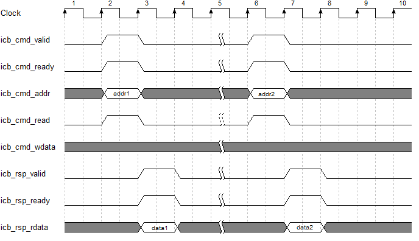
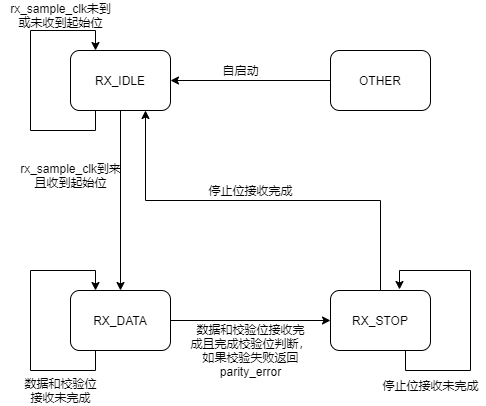

[toc]
## UART设计定义书


### 一、概述

​	UART的全称是通用异步收发器（Universal Asynchronous Receiver/Transmitter），是实现设备之间低速数据通信的标准协议。“异步”指不需要额外的时钟线进行数据的同步传输，是一种串行总线口，只需占用两根线就可以完成数据的收发（一根接收数据，一根发送数据），常用的标准通信波特有9600bps、115200bps 等。

​	UART一帧由起始位、数据位、校验位和停止位组成。数据逐位传输，示意图如下图所示。


------


### 二、功能特性

#### 1.功能特性

1. UART收发；

2. 支持8位数据、0-1校验位、1位起始位和1位停止位；

3. LSB传输模式

4. 波特率（buadrate）可调；

5. 支持接收数据完成、发送数据完成中断，中断可屏蔽；


#### 2.波特率（Buadrate)

​	由于UART没有同步时钟线，收/发双方如果需要进行正确的数据传输，则要在收/发双方定义一致的位时钟，位时钟可以理解为UART总线一个位所占用的时间，即“波特率”。 在定义上，收/发双方的波特率可以是随意的，只需要保持一致，如双方都是 1000bps，但是这不能兼容现有常用的设备，兼容性差。所以在工程应用中，常用一些特定的波特率真，如 4800bps、9600bps 或 115200bps 等。

​	本次UART设计采用4800bps、9600bps、115200bps可调；


#### 3.传输示例

1.常用帧示例

​	如下图所示为8位数据位、无校验位、1位停止位的帧格式示意图，一帧共有10位。发送数据位0xa5。


2.偶校验

​	如下图所示为8位数据位、偶校验、一位停止位的帧格式示意图，一帧共有11位。发送数据为0xa5,偶检验结果为“0”。


3.奇校验

​	如下图所示为8位数据位、奇校验、1位停止位的帧格式示意图，一帧共有11位。发送数据为0xa5，则奇校验结果为“1”。


#### 4.功能框图


- 门控时钟--CLK_GATE

  ​	这个模块用于为UART的提供门控时钟，其中门控使能收到uart_ctrl寄存器中的bit9控制，当门控使能拉低时，uart模块除BUS_CTRL模块外其余模块均无时钟输入。

- 控制模块--BUS_CTRL

  ​	这个模块通过ICB总线实现UART与MASTER之间的通信，包含了UART模块的状态信号、控制信号与数据，可以通过ICB总线实现对UART中各个模块的使能控制，状态读取与数据通信。

- 波特率发生器--BR_GEN

  ​	这个模块通过控制模块的传输过来的模块时能信号和divisor（将系统时钟分频得到rx采样时钟的分频数），将系统门控时钟分频产生tx_data_sample （baudrate时钟的上升沿）与rx_data_sample（rx采样时钟的上升沿）信号，其中rx_data_sample信号频率是tx_data_sample信号频率的16倍，即如果波特率是9600bps时，

  tx_data_sample信号频率为9600Hz X 16 = 153600Hz。

- 发送器--UART_TX

  ​	在模块使能打开的情况下，接收器时刻监测是否有数据通过总线写入数据寄存器，如果有则将数据寄存器的数据load到移位寄存器中，并开始按照配置的帧格式开始发送数据，数据从TXD线输出，当这一帧数据发送完成，模块将反馈一个完成状态tx_ok回BUS_CTRL模块的uart_csr寄存器，此时可以通过总线读取到此完成状态并开始下一byte的数据写入和发送。

- 接收器--UART_RX

  ​	在模块使能打开的情况下，接收器时刻检测RXD线的电平，当检测到起始位，接收器启动接收状态机和奇偶校验状态机，当数据收集和校验成功下，接收器开始检测RXD线的停止位，当检测到停止位，接收器将反馈一个完成状态rx_ok回BUS_CTRL模块的uart_csr寄存器，此时可以通过总线读取到此完成状态。其中接收器的采样频率是发送器接收频率的16倍频，表示完成一个bit数据接收需要16个baudrate时钟，收集其中三个时刻的电平并作多数表决作为此bit的电平值。

- UART顶层设计--UART_TOP

  ​	UART的顶层设计主要是完成以上五个模块的端口信号连接，统一使用一个复位信号。


#### 5.模块设计

##### 5.1  门控时钟--CLK_GATE

​		门控时钟电路图如下，其中clk_gate_en使能信号受到BUS_CTRL中uart_ctrl寄存器的bit9控制。

​		                                                      


##### 5.2  控制模块--BUS_CTRL

​		控制模块框图如下，主要包括一下三个部分：icb协议、读寄存器和写寄存器；


模块端口信号如下：

```verilog
module uart_ctrl(
	//clock and reset
    input   						clk,
	input   						rst_n,
	
    //icb_bus
	input                      		i_icb_cmd_valid,
	output                     		i_icb_cmd_ready,
	input  	[`UX607_PA_SIZE-1:0]	i_icb_cmd_addr, 
	input                      		i_icb_cmd_read, 
	input  	[`UX607_PA_SIZE-1:0]	i_icb_cmd_wdata,
  
	output                    		i_icb_rsp_valid,
	input                      		i_icb_rsp_ready,
	output 	[`UX607_PA_SIZE-1:0]	i_icb_rsp_rdata,

	//status signals and control signals for other module
    input 							tx_ok,
	input 							rx_ok,
	input							parity_error,
	input 	[7:0]					data_reg_rd,
	output 	[7:0]					data_reg_wr,
	output	[31:0]					uart_csr_o,
	output	[31:0]					uart_ctrl_o,
	
	output  						io_interrupts_0_0,
	output  						rd_data_flag,
	output  						wr_data_flag
);
```


其中icb_bus总线信号负责与外界通信，其余状态信号负责与UART内部各模块之间交互；

​		 **状态与控制信号说明：**

- tx_ok与rx_ok分别是发送器与接收器完成一帧数据收发的状态信号；

- parity_error信号表示数据接收过程中发生校验错误；

- 当读data_reg时，标志信号rd_data_flalg将置位，UART_RX将接收的数据通过data_reg_rd端口写入DATA_REG；     

- 当写data_reg时，标志信号wr_data_flag将置位，UART_TX将准备发送数据，等到baudrate时钟到来，DATA_REG数据将通过data_reg_wr写入移位寄存器；

- uart_csr_o与uart_ctrl_o分别为状态寄存器uart_csr与控制寄存器的输出信号，通过总线操作寄存器，实现对其余模块的状态读取和控制；

  **icb总线信号说明：**

  其中icb总线设计主要是为了便于集成进入ux607环境，主要包含下面两个通道：

- 命令通道（Command Channel)：主要用于主设备向从设备发起读写请求；
- 返回通道（Response Channel)：主要用于从设备向主设备返回读写结果；

​       ICB总线协议时序分为多种，本次设计中读写操作均采用了下一周期返回结果，下面给出相关的时序图。

- 读操作时序图：

  如下图所示：主设备向从设备通过 ICB的Command Channel 发送读操作请求（icb_cmd_read 为 高），从设备立即接收该请求（icb_cmd_ready 为高）。从设备在下一个周期返回读结果，主设备立即接收该结果（icb_rsp_ready 为高）。



- 写操作时序图：

  如下图所示：主设备向从设备通过 ICB的Command Channel 发送写操作请求（icb_cmd_read 为 低），从设备立即接收该请求（icb_cmd_ready 为高）。从设备在下一个周期返回读结果，主设备立即接收该结果（icb_rsp_ready 为高）。


##### 5.3  波特率发生器--BR_GEN

​		波特率发生器功能较简单，主要采用两个分频电路产生UART_RX采样时钟和UART_TX采样时钟，然后通过上升沿采集电路采集两个时钟的上升沿信号并分别输出给UART_RX与UART_TX模块，作为他们是否数据处理的条件之一；

模块端口信号如下：		

```verilog
module baudrate_generator( 
	input 			clk,
	input 			rst_n,
	input 			baud_en,
	input 	[15:0]	divisor,
	
	output 			tx_data_sample,
	output  		rx_data_sample
);
```
​		**端口信号说明：**

- baud_en为该模块的使能信号，由BUS_CTRL模块提供；

- divisor为UART_RX信号的分频计数值，即通过这个分频值所得到的时钟频率是波特率的16倍，由BUS_CTRL模块提供；

- tx_data_sample、rx_data_sample信号分别是UART_TX与UART_RX数据采样时钟的上升沿信号，将送往tx与rx模块；

  

##### 5.4  发送器--UART_TX

​		发送器采用系统门控时钟作为时序电路的采样时钟，当检测到tx_start信号（即BUS_CTRL中的wr_data_flag信号)，内部标志信号tx_on_flag置位；此时开始等待波特率时钟到来，当tx_data_sample上升沿到来时，状态机跳转至数据发送状态，当数据发送完成根据配置选择进入校验位发送或者直接进入停止位发送，如果需要发送校验位，则等待检验位发送完成继续进入停止位发送。当停止位发送完成，向BUS_CTRL模块反馈tx_ok信号，进入IDLE状态并等待下一个帧数据的到来。

模块端口信号如下：

```verilog
module UART_TX(
	input 			clk,
	input 			tx_data_sample,
	input			rst_n,
	input 			tx_en,
	input 			no_parity,
	input			ev_parity,
	input 			tx_start,
	input [7:0]		txd_in,	

	output 			tx_ok,
	output			txd
);
```
​		**端口信号说明：**

- tx_data_sample为波特率时钟上升沿信号，由BR_GEN提供；

- tx_en为该模块的使能信号，由BUS_CTRL模块提供；
- no_parity，ev_parity信号是奇偶校验的相关信号，由BUS_CTRL模块中uart_ctrl寄存器提供；
- tx_start为每一帧数据发送的启动信号，当icb总线向data_reg写数据时，该信号置位；
- txd_in信号为数据输入端口，当满足状态机从IDLE向START跳转条件时，data_reg寄存器的数据通过该端口load进入移位寄存器；
- tx_ok表示一帧数据发送完成的反馈信号，反馈回BUS_CTRL模块中的uart_csr寄存器，可通过icb总线读取；
- txd为UART_TX的数据发送端口；


​		**发送器状态机设计：**


##### 5.5  接收器--UART_RX

​		发送器采用系统门控时钟作为时序电路的采样时钟，等到rx_data_sample信号的上升沿到来后采样一次RXD线，当RXD线出现一次下降沿，即接收到起始位，则开始接收数据。byte数据采样依旧使用多数表决电路进行采样。数据接收完成后，如果有配置有校验位，则开始接收校验位并进行校验位的判断，如失败则返回IDLE状态继续等待下一个起始位的到来且返回一个parity_error；如果没有配置校验位，则直接进入停止位接收，当停止位接收完成后，返回IDLE状态，并且反馈tx_ok给BUS_CTRL中的uart_csr寄存器，此时可以通过总线读取data_reg获取接收的数据；

模块端口信号说明：

```verilog
module UART_RX(
	input 			clk,
	input 			rx_data_sample,
	input 			rst_n,
	input 			rx_en,
	input 			no_parity, 			
	input			ev_parity,
	input			rd_data_flag,
	input 			rxd,	
	
	output 			rx_ok,
	output [7:0]	rxd_out,
	output			parity_error
);
```

​		**端口信号说明：**

- rx_data_sample为接收器采样时钟上升沿信号，由BR_GEN提供；

- rx_en为该模块的使能信号，由BUS_CTRL模块提供；

- no_parity，ev_parity信号是奇偶校验的相关信号，由BUS_CTRL模块中uart_ctrl寄存器提供；

- rd_data_flag为icb总线向DATA_REG读数据的标志信号，该信号置位时，电路将采样值load到data_reg寄存器，并被总线读出；

- rxd为UART_RX的数据接收端口；

- rx_ok表示一帧数据接收完成的反馈信号，反馈回BUS_CTRL模块中的uart_csr寄存器，可通过icb总线读取；

- rxd_out信号为数据输出端口，当rd_data_flag置位时，移位寄存器的数据通过该端口load进入DATA_REG寄存器；

  

​		**多数表决电路：**


​		为了确保接收数据的准确性，所以需要对RXD的输入进行滤波处理。处理的方法就是在以为数据的采样过程中取三个电平值，进行多数表决，多数为电平“1”则数据为“1”，多数为电平“0”则数据为“0”；

​		**停止位处理：**

​		       

​		停止位是一帧数据的最后一位，当接收器接收停止位说明这一帧数据接收完成，可以开始检测下一帧数据的起始位。

​		停止位的采样方式与其他数据一样都是通过多数表决电路采样，不同的是停止位在取完三个电平值作多数表决后立即结束停止位的接收，之后接收器马上开始监视RXD线电平的下降沿，开始检测下一帧的起始位。


​		**接收器状态机设计：**



​		

------


### 三、寄存器说明


基地址：0x1000_6000;

#### 1.状态寄存器（uart_csr）

偏移地址：0x0000_0000;

默认值：	0x0008_0000

|    位    |  域名   | 类型 | 说明                                                         |
| :------: | :-----: | :--: | :----------------------------------------------------------- |
|   bit0   |  tx_ok  |  R   | 为高时标志此时UART完成一组数据的发送，默认为低；             |
|   bit4   |  rx_ok  |  R   | 为高时标志此时UART完成一组数据的接收，默认为低；             |
| bit16-31 | divisor | R/W  | 标志此时CLK_GATE需要分频多少才能得到rx采样时钟，得到rx采样时钟后再进行十六分频即可得到波特率时钟； |


#### 2.控制寄存器（uart_ctrl)

偏移地址：0x0000_0004

默认值：	0x0001_0311

|  位   |    域名     | 类型 | 说明                                                         |
| :---: | :---------: | :--: | ------------------------------------------------------------ |
| bit0  |   baud_en   | R/W  | baudrate_generator模块的使能信号，为高时标志可以产生采样时钟sample_clk,和波特率时钟baud_clk，默认为高; |
| bit4  |    tx_en    | R/W  | 为高时标志tx模块使能打开，为低时标志tx模块使能关闭，默认为高； |
| bit8  |    rx_en    | R/W  | 为高时标志rx模块使能打开，为低时标志rx模块使能关闭，默认为高; |
| bit9  | clk_gate_en | R/W  | 为高时整个UART模块的时钟信号有效，拉低时整个UART除ctrl模块外其他模块均无时钟输入，默认为高； |
| bit12 |  n_parity   | R/W  | 为高时传输不含校验位，为低时传输含校验位，默认为低；         |
| bit16 |  ev_parity  | R/W  | 为高是表示采用偶校验，为低时表示采用奇校验（仅n_parity为低时有效），默认为高; |

​                         

#### 3.数据寄存器（data_reg)

偏移地址:	0x0000_0008

默认值：	0xff

|   位   |   域名   | 类型 | 说明                                                         |
| :----: | :------: | :--: | :----------------------------------------------------------- |
| bit0-7 | data_reg | R/W  | 当此寄存器写入新数据，wr_data_flag置位，标志uart有一组新数据需要发送，等到tx_ok拉高时，表示此时这一帧数据已经发送完成，可以开始下一帧数据的发送；当总线读到uart_csr寄存器中的rk_ok状态位置位时表示一帧数据接收完成，此时读data_reg寄存器即可获取接受的数据，默认为8‘hff； |

------


### 四、使用说明

#### 1.divisor的计算

UART适用于各个频率下的时钟，软件写入相应的divisor分频倍数，即可获得相对应的波特率时钟，以下为divisor的计算公式：

$$
DIVISOR = \frac{f_{clk}}{16*Baudrate}-1
$$
例如：当系统时钟为16Mhz,波特率为115200bps，计算可得divisor = 7.68,四舍五入后取8；


#### 2.波特率误差

**UART传输10bit数据的时间误差应小于1.87%**

**UART传输8bit数据的时间误差应小于2.31%**

以8bit数据，波特率115200bps为例计算：


波特率115200，则时钟周期8681ns；所以

保证校验位正确：9 * 8681<9.5x<10 * 8681 		=> 		8224<x<9137

保证停止位正确：10 * 8681<10.75x<11 * 8681   => 		8075<x<8882


例一：

主时钟：16Mhz

divisor:0x8

周期：9000ns（满足误差范围）

波特率：111111bps

误差：（115200-111111）/115200 = 3.5%


例二：

主时钟：144Mhz

divisor:0x4d

周期：8661.12ns

波特率：115384bps

误差：（115200-115384）/115200 = -0.15%


#### 3.数据发送

​		首次发送数据，可以直接向data_reg寄存器中写入8 bit数据，即可开始发送；

​		后续数据发送，**必须**保证在总线上读到tx_ok置位（代表一次byte数据发送完成）后才可以写入下一组数据。


#### 3.数据接收

​		向RXD线发送数据，须保证起始位干净无毛刺，当接收器完成一帧数据接收并反馈一个rx_ok（可以通过总线检测到rx_ok状态），此时可以通过icb总线读data_reg寄存器来获取所接受的数据。