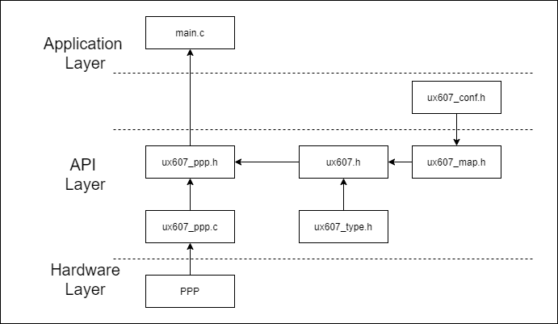

[TOC]


## UX607 C程序函数库


### 一、文档和库规范

本次C程序函数库按照以下章节所描述的规范描写。

#### 1.命名规范

PPP表示任一外设缩写，例如UART。

系统、源程序文件和头文件命名都以“ux607_”作为开头，例如：ux607_type.h。

常量仅被应用于一个文件的，定义于该文件中；被应用于多个文件的，在对应头文件中定义。所有常量都 由英文字母大写书写.

寄存器作为常量处理。他们的命名都由英文字母大写书写。在大多数情况下，他们采用与缩写规范与本用户手册一致。

外设函数的命名以该外设的缩写加下划线为开头。每个单词的第一个字母都由英文字母大写，例如： UART_SendData。 在函数名中，只允许存在一个下划线，用以分隔外设缩写和函数名的其它部分。


#### 2.编码规范

本章节描述了函数库的编码规则。

##### 2.1变量

固态函数库定义了 24 个变量类型，他们的类型和大小是固定的。在文件 ux607_type.h 中我们定义了这些变量：

```c
typedef int32_t  s32;
typedef int16_t s16;
typedef int8_t  s8;

typedef const int32_t sc32;  /*!< Read Only */
typedef const int16_t sc16;  /*!< Read Only */
typedef const int8_t sc8;   /*!< Read Only */

typedef __IO int32_t  vs32;
typedef __IO int16_t  vs16;
typedef __IO int8_t   vs8;

typedef __I int32_t vsc32;  /*!< Read Only */
typedef __I int16_t vsc16;  /*!< Read Only */
typedef __I int8_t vsc8;   /*!< Read Only */

typedef uint32_t  u32;
typedef uint16_t u16;
typedef uint8_t  u8;

typedef const uint32_t uc32;  /*!< Read Only */
typedef const uint16_t uc16;  /*!< Read Only */
typedef const uint8_t uc8;   /*!< Read Only */

typedef __IO uint32_t  vu32;
typedef __IO uint16_t vu16;
typedef __IO uint8_t  vu8;

typedef __I uint32_t vuc32;  /*!< Read Only */
typedef __I uint16_t vuc16;  /*!< Read Only */
typedef __I uint8_t vuc8;   /*!< Read Only */
```

##### 2.2布尔型

在文件ux607_type.h中，布尔型变量被定义如下：

```c
typedef enum {FALSE = 0, TRUE = !FALSE} bool;
```

##### 2.3标志位状态类型

在文件ux607_type.h中，我们定义标志位类型的两个可能值为“设置”与“重置”：

```C
typedef enum {RESET = 0, SET = !RESET} FlagStatus, ITStatus;
```

##### 2.4功能状态类型

在文件ux607_type.h中，我们定义功能位类型的两个可能值为“使能”与“失能”：

```C
typedef enum {DISABLE = 0, ENABLE = !DISABLE} FunctionalState;
```

##### 2.5错误状态类型

在文件ux607_type.h中，我们定义错误状态类型的两个可能值为“成功”与“出错”：

```C
typedef enum {ERROR = 0, SUCCESS = !ERROR} ErrorStatus;
```

##### 2.6外设

用户可以通过指向各个外设的指针访问各外设的控制寄存器。这些指针所指向的数据结构与各个外设的控制寄存器布局一一对应。

**外设控制寄存器结构**

文件ux607_map.h包含了所有外设控制寄存器的结构，下列为UART寄存器结构的声明：

```

```

**外设声明**

在文件ux607_map.h包含了所有外设的声明，下列为UART外设的声明：

```

```

------


### 二、函数库概述

#### 1.文件夹描述

函数库在文件夹ux607_c中，其中包含如下所示的子文件夹：


##### 1.1文件夹Libraries

- 子文件夹Core包含了函数库所需要的头文件：
  - ux607_type.h：所有其他文件使用的通用数据类型和枚举；
  - ux607_map.h：外设寄存器数据结构;
  - ux607.h：包含ux607_type.h 和 ux607_map.h文件，便于后续调用；

- 子文件夹Periph包含了外设需要的头文件和源文件：
  - 文件夹inc中外设源文件所需要的头文件：
    - ux607_ppp.h：每个外设对应一个头文件，包含了该外设使用的函数原型，数据结构和枚举；
  -  文件夹inc中外设的源文件：
    - ux607_ppp.c：每个外设对应一个源文件，包含了该外设使用的函数体；

##### 1.2文件夹Project

文件夹中针对每个外设单独建立一个子文件夹，在该子文件夹中包含该外设的各类测试案例，每个案例中主要有如下文件：

- main.c：测试case主函数体；
- readme.md: 测试case说明；
- ux607_conf.h:  参数配置文件，起到应用层和库之间的作用。可以在文件中利用define宏定义，选择本次测试用例所有外设的使用的情况。


#### 2.函数库文件描述

下表列举和说明了函数库使用的所有文件：

| 文件名       | 描述                                                         |
| ------------ | ------------------------------------------------------------ |
| ux607_type.h | 所有其他文件使用的通用数据类型和枚举，所有外设都使用该文件。 |
| ux607_map.h  | 通用声明文件，包含所有外设驱动使用的通用类型和常数。         |
| ux607.h      | 包含了ux607_type.h与ux607_map.h的全部内容，方便后续引用。    |
| ux607_ppp.h  | 每个外设对应一个头文件，包含了该外设使用的函数原型，数据结构和枚举。 |
| ux607_ppp.c  | 每个外设对应一个源文件，包含了该外设使用的函数体。           |
| main.c       | 测试case主函数体。                                           |
| readme.md    | 测试case说明。                                               |
| ux607_conf.h | 参数配置文件，  可以在文件中利用define宏定义，选择所有外设的使用的情况。 |

下图说明了函数库文件的体系结构：




#### 3.外设的初始化和设置

本节按步骤描述了如何初始化和设置任意外设，这里PPP代表任意外设。

1.在ux607_ppp.h文件中，定义一个结构PPP_InitTypeDef,其中包含初始化所需要的变量；

2.在main.c中，声明一个结构PPP_InitTypeDef，例如：

```c
PPP_InitTypeDef  PPP_InitStructure;
```

这里 PPP_InitStructure 是一个位于内存中的工作变量，用来初始化一个或者多个外设 PPP。

3.为变量 PPP_InitStructure 的各个结构成员填入允许的值。可以采用以下 2 种方式：

a）按照如下程序设置整个结构体 

```c
PPP_InitStructure.member1 = val1; 

PPP_InitStructure.member2 = val2; 

PPP_InitStructure.memberN = valN;
```

以上步骤可以合并在同一行里，用以优化代码大小：

```c
PPP_InitTypeDef PPP_InitStructure = { val1, val2,.., valN}
```

b)仅设置结构体中的部分成员：这种情况下，用户应当首先调用函数 PPP_SturcInit(..)来初始化变量PPP_InitStructure，然后再修改其中需要修改的成员。这样可以保证其他成员的值（多为缺省值）被正确填入。

```C
PPP_StructInit(&PPP_InitStructure); 

PP_InitStructure.memberX = valX; 

PPP_InitStructure.memberY = valY;
```

4.调用函数PPP_Init()来初始化外设PPP。

5.在这一步，外设PPP已经被初始化，可以调用PPP_Cmd（...）来使能它。

------


### 三、函数库

函数的描述按照一下格式进行：

| 函数名     | 外设函数的名称           |
| ---------- | ------------------------ |
| 函数原型   | 原形声明                 |
| 功能描述   | 简要解释函数是如何执行的 |
| 输入参数   | 输入参数描述             |
| 输出参数   | 输出参数描述             |
| 返回值     | 函数的返回值             |
| 先决条件   | 调用函数前应满足的要求   |
| 被调用函数 | 其他被该函数调用的库函数 |


#### 1.通用异步收发器（UART）

​		UART的全称是通用异步收发器（Universal Asynchronous Receiver/Transmitter），是实现设备之间低速数据通信的标准协议。“异步”指不需要额外的时钟线进行数据的同步传输，是一种串行总线口，只需占用两根线就可以完成数据的收发（一根接收数据，一根发送数据），常用的标准通信波特有9600bps、115200bps 等。

##### 1.1UART寄存器结构

UART寄存器结构，UART_TypeDef,在文件"ux607_map.h"中定义如下：

```C
typedef struct
{
  __IO uint32_t UART_CSR;
  __IO uint32_t UART_CTRL;
  __IO uint32_t UART_DATA;
} UART_TypeDef;
```

下表列举了UART所有的寄存器

| 寄存器    | 描述           |
| --------- | -------------- |
| UART_CSR  | UART状态寄存器 |
| UART_CTRL | UART控制寄存器 |
| UART_DATA | UART数据寄存器 |


利用结构体声明访问外设寄存器，声明于文件“ux607_map.h”：

```C
/*!< Peripheral memory map */
#define PERIPH_BASE           	((uint32_t)0x10000000) 	/*!< Peripheral base address in the alias region */

//UART
#define UART_BASE				(PERIPH_BASE + 0x16000)

#ifdef _UART 
#define UART 	((UART_TypeDef *) UART_BASE)
#endif   /*_UART */
```

为了访问UART寄存器，需要在文件"u607_conf.h” 中定义 _UART：

```C
#define _UART
```


##### 1.2UART库函数

下表例举了UART的库函数：

| 函数名             | 描述                                                  |
| ------------------ | ----------------------------------------------------- |
| UART_Init          | 根据 UART_InitStruct 中指定的参数初始化外设UART寄存器 |
| UART_StrucInit     | 把 UART_InitStruct 中的每一个参数按缺省值填入         |
| UART_Cmd           | 使能或者失能UART外设                                  |
| UART_GetFlagStatus | 检查指定的UART标志位设置与否                          |
| UART_SendData      | 通过外设UART发送单个数据                              |
| UART_ReceiveData   | 返回UART最近接收到的数据                              |

###### 1.2.1 函数UART_Init

| 函数名     | UART_Init                                                    |
| ---------- | ------------------------------------------------------------ |
| 函数原型   | void UART_Init(UART_TypeDef* UART, UART_InitTypeDef* UART_InitStruct) |
| 功能描述   | 根据 UART_InitStruct 中指定的参数初始化外设 UART 寄存器      |
| 输入参数1  | UART:选择外设                                                |
| 输入参数2  | UART_InitStruct：指向结构 UART_InitTypeDef的指针，包含了外设 UART 的配置信息 |
| 输出参数   | 无                                                           |
| 返回值     | 无                                                           |
| 先决条件   | 无                                                           |
| 被调用函数 | 无                                                           |


###### 1.2.2 函数UART_StructInit

| 函数名     | UART_StructInit                                            |
| ---------- | ---------------------------------------------------------- |
| 函数原型   | void UART_StructInit(UART_InitTypeDef* UART_InitStruct)    |
| 功能描述   | 把 UART_InitStruct 中的每一个参数按缺省值填入              |
| 输入参数1  | UART_InitStruct：指向结构 UART_InitTypeDef的指针，待初始化 |
| 输出参数   | 无                                                         |
| 返回值     | 无                                                         |
| 先决条件   | 无                                                         |
| 被调用函数 | 无                                                         |

下表为UART_InitStruct缺省值

| 成员             | 缺省值           |
| ---------------- | ---------------- |
| UART_BaudRate    | 115200           |
| UART_No_Parity   | UART_Has_Parity  |
| UART_Parity_Type | UART_Parity_Even |
| UART_Enable      | UART_Enable      |
| UART_Mode        | UART_Mode_Rx     |

```C
/* The following example illustrates how to initialize a UART_InitTypeDef structure */
UART_InitTypeDef UART_InitStructure; 
UART_StructInit(&UART_InitStructure);
```


###### 1.2.3 函数UART_Cmd

| 函数名     | UART_Cmd                                                    |
| ---------- | ----------------------------------------------------------- |
| 函数原型   | void UART_Cmd(UART_TypeDef* UART, FunctionalState NewState) |
| 功能描述   | 使能或者失能 UART 外设                                      |
| 输入参数1  | UART:来选择UART外设                                         |
| 输入参数2  | NewState: 外设 UARTx 的新状态 （可以取ENABLE或者DISABLE）   |
| 输出参数   | 无                                                          |
| 返回值     | 无                                                          |
| 先决条件   | 无                                                          |
| 被调用函数 | 无                                                          |

例：

```c
/* Enable the UART */
UART_Cmd(UART, ENABLE);
```


------

#### 四、编译

```shell
riscv-nuclei-elf-gcc -march=rv64imafdc -mabi=lp64 -static -mcmodel=medany -g -fvisibility=hidden -nostdlib -nostartfiles -I../../../vsim -I..//../env/p -I..//macros/scalar -T..//../env/p/link.ld ../rv64ui/add.S -o rv64ui-p-add
```

```shell
riscv-nuclei-elf-objdump --disassemble-all -S rv64ui-p-add > rv64ui-p-add.dump
riscv-nuclei-elf-objcopy -O verilog  rv64ui-p-add   rv64ui-p-add.verilog
```

```shell
sed -i 's/@800/@000/g' rv64ui-p-add.verilog
sed -i 's/@00002FB8/@00002000/g' rv64ui-p-add.verilog
sed -i 's/@00004FB8/@00004000/g' rv64ui-p-add.verilog
sed -i 's/@00005FB8/@00005000/g' rv64ui-p-add.verilog
sed -i 's/@00006FB8/@00006000/g' rv64ui-p-add.verilog
```

