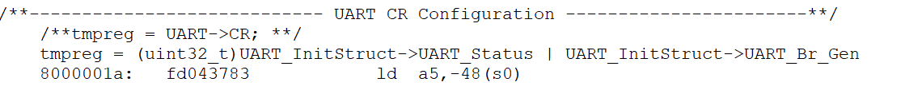

[TOC]


## UX607 C程序函数库


### 一、文档和库规范

本次C程序函数库按照以下章节所描述的规范描写。

#### 1.命名规范

PPP表示任一外设缩写，例如UART。

系统、源程序文件和头文件命名都以“ux607_”作为开头，例如：ux607_type.h。

常量仅被应用于一个文件的，定义于该文件中；被应用于多个文件的，在对应头文件中定义。所有常量都 由英文字母大写书写.

寄存器作为常量处理。他们的命名都由英文字母大写书写。在大多数情况下，他们采用与缩写规范与本用户手册一致。

外设函数的命名以该外设的缩写加下划线为开头。每个单词的第一个字母都由英文字母大写，例如： UART_SendData。 在函数名中，只允许存在一个下划线，用以分隔外设缩写和函数名的其它部分。


#### 2.编码规范

本章节描述了函数库的编码规则。

##### 2.1变量

固态函数库定义了 24 个变量类型，他们的类型和大小是固定的。在文件 ux607_type.h 中我们定义了这些变量：

```c
typedef int32_t  s32;
typedef int16_t s16;
typedef int8_t  s8;

typedef const int32_t sc32;  /*!< Read Only */
typedef const int16_t sc16;  /*!< Read Only */
typedef const int8_t sc8;   /*!< Read Only */

typedef __IO int32_t  vs32;
typedef __IO int16_t  vs16;
typedef __IO int8_t   vs8;

typedef __I int32_t vsc32;  /*!< Read Only */
typedef __I int16_t vsc16;  /*!< Read Only */
typedef __I int8_t vsc8;   /*!< Read Only */

typedef uint32_t  u32;
typedef uint16_t u16;
typedef uint8_t  u8;

typedef const uint32_t uc32;  /*!< Read Only */
typedef const uint16_t uc16;  /*!< Read Only */
typedef const uint8_t uc8;   /*!< Read Only */

typedef __IO uint32_t  vu32;
typedef __IO uint16_t vu16;
typedef __IO uint8_t  vu8;

typedef __I uint32_t vuc32;  /*!< Read Only */
typedef __I uint16_t vuc16;  /*!< Read Only */
typedef __I uint8_t vuc8;   /*!< Read Only */
```

##### 2.2布尔型

在文件ux607_type.h中，布尔型变量被定义如下：

```c
typedef enum {FALSE = 0, TRUE = !FALSE} bool;
```

##### 2.3标志位状态类型

在文件ux607_type.h中，我们定义标志位类型的两个可能值为“设置”与“重置”：

```C
typedef enum {RESET = 0, SET = !RESET} FlagStatus, ITStatus;
```

##### 2.4功能状态类型

在文件ux607_type.h中，我们定义功能位类型的两个可能值为“使能”与“失能”：

```C
typedef enum {DISABLE = 0, ENABLE = !DISABLE} FunctionalState;
```

##### 2.5错误状态类型

在文件ux607_type.h中，我们定义错误状态类型的两个可能值为“成功”与“出错”：

```C
typedef enum {ERROR = 0, SUCCESS = !ERROR} ErrorStatus;
```

##### 2.6外设

用户可以通过指向各个外设的指针访问各外设的控制寄存器。这些指针所指向的数据结构与各个外设的控制寄存器布局一一对应。

**外设控制寄存器结构**

文件ux607_map.h包含了所有外设控制寄存器的结构，下列为UART寄存器结构的声明：

```

```

**外设声明**

在文件ux607_map.h包含了所有外设的声明，下列为UART外设的声明：

```

```

------


### 二、函数库概述

#### 1.文件夹描述

函数库在文件夹ux607_c中，其中包含如下所示的子文件夹：


##### 1.1文件夹Libraries

- 子文件夹Core包含了函数库所需要的头文件：
  - ux607_type.h：所有其他文件使用的通用数据类型和枚举；
  - ux607_map.h：外设寄存器数据结构;
  - ux607.h：包含ux607_type.h 和 ux607_map.h文件，便于后续调用；

- 子文件夹Periph包含了外设需要的头文件和源文件：
  - 文件夹inc中外设源文件所需要的头文件：
    - ux607_ppp.h：每个外设对应一个头文件，包含了该外设使用的函数原型，数据结构和枚举；
  -  文件夹inc中外设的源文件：
    - ux607_ppp.c：每个外设对应一个源文件，包含了该外设使用的函数体；

##### 1.2文件夹Project

文件夹中针对每个外设单独建立一个子文件夹，在该子文件夹中包含该外设的各类测试案例，每个案例中主要有如下文件：

- main.c：测试case主函数体；
- ux607_conf.h:  参数配置文件，起到应用层和库之间的作用。可以在文件中利用define宏定义，选择本次测试用例所有外设的使用的情况。


#### 2.函数库文件描述

下表列举和说明了函数库使用的所有文件：

| 文件名       | 描述                                                         |
| ------------ | ------------------------------------------------------------ |
| ux607_type.h | 所有其他文件使用的通用数据类型和枚举，所有外设都使用该文件。 |
| ux607_map.h  | 通用声明文件，包含所有外设驱动使用的通用类型和常数。         |
| ux607.h      | 包含了ux607_type.h与ux607_map.h的全部内容，方便后续引用。    |
| ux607_ppp.h  | 每个外设对应一个头文件，包含了该外设使用的函数原型，数据结构和枚举。 |
| ux607_ppp.c  | 每个外设对应一个源文件，包含了该外设使用的函数体。           |
| main.c       | 测试case主函数体。                                           |
| ux607_conf.h | 参数配置文件，  可以在文件中利用define宏定义，选择所有外设的使用的情况。 |

下图说明了函数库文件的体系结构：


#### 3.外设的初始化和设置

本节按步骤描述了如何初始化和设置任意外设，这里PPP代表任意外设。

1.在ux607_ppp.h文件中，定义一个结构PPP_InitTypeDef,其中包含初始化所需要的变量；

2.在main.c中，声明一个结构PPP_InitTypeDef，例如：

```c
PPP_InitTypeDef  PPP_InitStructure;
```

这里 PPP_InitStructure 是一个位于内存中的工作变量，用来初始化一个或者多个外设 PPP。

3.为变量 PPP_InitStructure 的各个结构成员填入允许的值。可以采用以下 2 种方式：

a）按照如下程序设置整个结构体 

```c
PPP_InitStructure.member1 = val1; 

PPP_InitStructure.member2 = val2; 

PPP_InitStructure.memberN = valN;
```

以上步骤可以合并在同一行里，用以优化代码大小：

```c
PPP_InitTypeDef PPP_InitStructure = { val1, val2,.., valN}
```

b)仅设置结构体中的部分成员：这种情况下，用户应当首先调用函数 PPP_SturcInit(..)来初始化变量PPP_InitStructure，然后再修改其中需要修改的成员。这样可以保证其他成员的值（多为缺省值）被正确填入。

```C
PPP_StructInit(&PPP_InitStructure); 

PP_InitStructure.memberX = valX; 

PPP_InitStructure.memberY = valY;
```

4.调用函数PPP_Init()来初始化外设PPP。

5.在这一步，外设PPP已经被初始化，可以调用PPP_Cmd（...）来使能它。

------


### 三、函数库

函数的描述按照一下格式进行：

| 函数名     | 外设函数的名称           |
| ---------- | ------------------------ |
| 函数原型   | 原形声明                 |
| 功能描述   | 简要解释函数是如何执行的 |
| 输入参数   | 输入参数描述             |
| 输出参数   | 输出参数描述             |
| 返回值     | 函数的返回值             |
| 先决条件   | 调用函数前应满足的要求   |
| 被调用函数 | 其他被该函数调用的库函数 |


#### 1.通用异步收发器（UART）

​		UART的全称是通用异步收发器（Universal Asynchronous Receiver/Transmitter），是实现设备之间低速数据通信的标准协议。“异步”指不需要额外的时钟线进行数据的同步传输，是一种串行总线口，只需占用两根线就可以完成数据的收发（一根接收数据，一根发送数据），常用的标准通信波特有9600bps、115200bps 等。

##### 1.1UART寄存器结构

UART寄存器结构，UART_TypeDef,在文件"ux607_map.h"中定义如下：

```C
typedef struct
{
  __IO uint32_t UART_CSR;
  __IO uint32_t UART_CTRL;
  __IO uint32_t UART_DATA;
} UART_TypeDef;
```

下表列举了UART所有的寄存器

| 寄存器    | 描述           |
| --------- | -------------- |
| UART_CSR  | UART状态寄存器 |
| UART_CTRL | UART控制寄存器 |
| UART_DATA | UART数据寄存器 |


利用结构体声明访问外设寄存器，声明于文件“ux607_map.h”：

```C
/*!< Peripheral memory map */
#define PERIPH_BASE           	((uint32_t)0x10000000) 	/*!< Peripheral base address in the alias region */

//UART
#define UART_BASE				(PERIPH_BASE + 0x16000)

#ifdef _UART 
#define UART 	((UART_TypeDef *) UART_BASE)
#endif   /*_UART */
```

为了访问UART寄存器，需要在文件"u607_conf.h” 中定义 _UART：

```C
#define _UART
```


##### 1.2UART库函数

下表例举了UART的库函数：

| 函数名             | 描述                                                  |
| ------------------ | ----------------------------------------------------- |
| UART_Init          | 根据 UART_InitStruct 中指定的参数初始化外设UART寄存器 |
| UART_StrucInit     | 把 UART_InitStruct 中的每一个参数按缺省值填入         |
| UART_Cmd           | 使能或者失能UART外设                                  |
| UART_GetFlagStatus | 检查指定的UART标志位设置与否                          |
| UART_SendData      | 通过外设UART发送单个数据                              |
| UART_ReceiveData   | 返回UART最近接收到的数据                              |

###### 1.2.1 函数UART_Init

| 函数名     | UART_Init                                                    |
| ---------- | ------------------------------------------------------------ |
| 函数原型   | void UART_Init(UART_TypeDef* UART, UART_InitTypeDef* UART_InitStruct) |
| 功能描述   | 根据 UART_InitStruct 中指定的参数初始化外设 UART 寄存器      |
| 输入参数1  | UART:选择外设                                                |
| 输入参数2  | UART_InitStruct：指向结构 UART_InitTypeDef的指针，包含了外设 UART 的配置信息 |
| 输出参数   | 无                                                           |
| 返回值     | 无                                                           |
| 先决条件   | 无                                                           |
| 被调用函数 | 无                                                           |

**UART_InitTypeDef structure** 

UART_InitTypeDef定义在文件“ux607_uart.h"，其中成员定义如下:

**UART_BaudRate定义**

该成员设置了UART的传输波特率。

**UART_Parity定义**

| UART_Parity      | 描述   |
| ---------------- | ------ |
| UART_No_Parity   | 无校验 |
| UART_Odd_Parity  | 奇校验 |
| UART_Even_Parity | 偶校验 |

**UART_Status定义**	

| UART_EN      | 描述     |
| ------------ | -------- |
| UART_Enable  | UART失能 |
| UART_Disable | UART使能 |

**UART_Br_GEN定义**	

| UART_BR_GEN     | 描述     |
| --------------- | -------- |
| UART_Br_Enable  | UART失能 |
| UART_Br_Disable | UART使能 |

**UART_Mode定义**

| UART_Mode    | 描述     |
| ------------ | -------- |
| UART_Mode_Rx | 接收使能 |
| UART_Mode_Tx | 发送使能 |

例：

```c
UART_Init(UART, &UART_InitStruct);
```


###### 1.2.2 函数UART_StructInit

| 函数名     | UART_StructInit                                            |
| ---------- | ---------------------------------------------------------- |
| 函数原型   | void UART_StructInit(UART_InitTypeDef* UART_InitStruct)    |
| 功能描述   | 把 UART_InitStruct 中的每一个参数按缺省值填入              |
| 输入参数1  | UART_InitStruct：指向结构 UART_InitTypeDef的指针，待初始化 |
| 输出参数   | 无                                                         |
| 返回值     | 无                                                         |
| 先决条件   | 无                                                         |
| 被调用函数 | 无                                                         |

下表为UART_InitStruct缺省值

| 成员          | 缺省值           |
| ------------- | ---------------- |
| UART_BaudRate | 115200           |
| UART_Parity   | UART_Even_Parity |
| UART_Status   | UART_Enable      |
| UART_Br_Gen   | UART_Br_Enable   |
| UART_Mode     | UART_Mode_Rx     |

```C
/* The following example illustrates how to initialize a UART_InitTypeDef structure */
UART_InitTypeDef UART_InitStructure; 
UART_StructInit(&UART_InitStructure);
```


###### 1.2.3 函数UART_Cmd

| 函数名     | UART_Cmd                                                    |
| ---------- | ----------------------------------------------------------- |
| 函数原型   | void UART_Cmd(UART_TypeDef* UART, FunctionalState NewState) |
| 功能描述   | 使能或者失能 UART 外设                                      |
| 输入参数1  | UART:来选择UART外设                                         |
| 输入参数2  | NewState: 外设 UARTx 的新状态 （可以取ENABLE或者DISABLE）   |
| 输出参数   | 无                                                          |
| 返回值     | 无                                                          |
| 先决条件   | 无                                                          |
| 被调用函数 | 无                                                          |

例：

```c
/* Enable the UART */
UART_Cmd(UART, ENABLE);
```


###### 1.2.4函数UART_GetFlagStatus

| 函数名     | UART_GetFlagStatus                                         |
| ---------- | ---------------------------------------------------------- |
| 函数原型   | UART_GetFlagStatus(UART_TypeDef* UART, uint32_t UART_FLAG) |
| 功能描述   | 检查指定的 UART 标志位设置与否                             |
| 输入参数1  | UART:来选择UART外设                                        |
| 输入参数2  | USART_FLAG：待检查的 USART 标志位                          |
| 输出参数   | 无                                                         |
| 返回值     | UART_FLAG的新状态（SET或者RESET)                           |
| 先决条件   | 无                                                         |
| 被调用函数 | 无                                                         |

例：

```c
/* Get the UART_FLAG_RX_OK */
UART_GetFlagStatus(UART,UART_FLAG_RX_OK);
```


###### 1.2.5函数UART_SendData

| 函数 名    | UART_SendData                                                |
| ---------- | ------------------------------------------------------------ |
| 函数原型   | void UART_SendData(UART_TypeDef* UART, uint8_t Data);        |
| 功能描述   | 通过外设 USARTx 发送单个数据                                 |
| 输入参数1  | UART:来选择UART外设                                          |
| 输入参数2  | Data: 待发送的数据                                           |
| 输出参数   | 无                                                           |
| 返回值     | 无                                                           |
| 先决条件   | 需要满足通过函数UART_GetFlagStatus得知UART_FLAG_TX_OK标志位置位后又复位（表示上次数据传输完成），如果是第一次发送数据，则只需要满足该标志位为复位状态。 |
| 被调用函数 | 无                                                           |

例：

```C
/* Send one byte data by UART */
UART_SendDate(UART, 0XA5);
```


###### 1.2.6函数UART_ReceiveData

| 函数名     | UART_ReceiveData                                          |
| ---------- | --------------------------------------------------------- |
| 函数原型   | uint8_t USART_ReceiveData(UART_TypeDef* UART);            |
| 功能描述   | 使能或者失能 UART 外设                                    |
| 输入参数1  | UART:来选择UART外设                                       |
| 输入参数2  | NewState: 外设 UARTx 的新状态 （可以取ENABLE或者DISABLE） |
| 输出参数   | 无                                                        |
| 返回值     | 无                                                        |
| 先决条件   | 无                                                        |
| 被调用函数 | 无                                                        |

例：

```c
/* Receive one byte data by UART */
uint8_t RxData;
RxData = UART_ReceiveData(UART);
```

------


### 四、主函数体（测试用例）

##### 1.UART_Init

这个测试用例主要实现UART模块的初始化。结构体UART_InitStruct均采用缺省值。


### 五、编译

##### 1.预处理

将main.c文件预处理为.i格式

因为多个.c和.v文件，不在一个文件夹下，所以需要用到-I参数添加目录;

注意不加参数-E ，因为加了之后只能同时编译一个文件;

```shell
riscv-nuclei-elf-gcc -I ./ux607_c/Libraries/Core/ -I ./ux607_c/Libraries/Periph/inc/ -I ./ux607_c/Libraries/Periph/src  -I ./ux607_c/Project/UART/UART_Init/ -o uart_init.i ./ux607_c/Project/UART/UART_Init/main.c
```

##### 2.编译

将预处理后的.i文件编译成.s文件


```shell
riscv-nuclei-elf-gcc -march=rv64imafdc -mabi=lp64 -static -mcmodel=medany -g -fvisibility=hidden -nostdlib -nostartfiles -I../../../vsim -I..//../env/p -I..//macros/scalar -T..//../env/p/link.ld ../rv64ui/add.S -o rv64ui-p-add
```

```shell
riscv-nuclei-elf-objdump --disassemble-all -S rv64ui-p-add > rv64ui-p-add.dump
```

```shell
riscv-nuclei-elf-objcopy -O verilog  rv64ui-p-add   rv64ui-p-add.verilog
```

```shell
sed -i 's/@800/@000/g' rv64ui-p-add.verilog
sed -i 's/@00002FB8/@00002000/g' rv64ui-p-add.verilog
sed -i 's/@00004FB8/@00004000/g' rv64ui-p-add.verilog
sed -i 's/@00005FB8/@00005000/g' rv64ui-p-add.verilog
sed -i 's/@00006FB8/@00006000/g' rv64ui-p-add.verilog
```


注意在main.c文件中不要include ".c"文件，而是选择在编译时加入相应的文件（否则将导致编译得到的_start入口不是main函数）：

```shell
riscv-nuclei-elf-gcc -march=rv64imafdc -mabi=lp64 -static -mcmodel=medany -g -fvisibility=hidden -nostdlib -nostartfiles -I../../../vsim -I..//../env/p -I..//macros/scalar  -I/mnt/d/prj/routine/daily/UART/c_package/ux607_c/libraries/Core/  -I/mnt/d/prj/routine/daily/UART/c_package/ux607_c/libraries/Periph/inc -I/mnt/d/prj/routine/daily/UART/c_package/ux607_c/libraries/Periph/src -I/mnt/d/prj/routine/daily/UART/c_package/ux607_c/project/UART/UART_Init/ -T../../env/p/link.ld /mnt/d/prj/routine/daily/UART/c_package/ux607_c/project/UART/UART_Init/main.c /mnt/d/prj/routine/daily/UART/c_package/ux607_c/libraries/Periph/src/ux607_uart.c -o /mnt/d/prj/routine/daily/UART/c_package/ux607_c/verilog/uart_init/uart_init

```

```shell
riscv-nuclei-elf-objdump --disassemble-all -S /mnt/d/prj/routine/daily/UART/c_package/ux607_c/Verilog/uart_init/uart_init > /mnt/d/prj/routine/daily/UART/c_package/ux607_c/Verilog/uart_init/uart_init.dump
```

```shell
riscv-nuclei-elf-objcopy -O verilog  /mnt/d/prj/routine/daily/UART/c_package/ux607_c/Verilog/uart_init/uart_init   /mnt/d/prj/routine/daily/UART/c_package/ux607_c/Verilog/uart_init/uart_init.verilog
```

```shell
sed -i 's/@800/@000/g' /mnt/d/prj/routine/daily/UART/c_package/ux607_c/Verilog/uart_init/uart_init.verilog
```

```shell
cp /mnt/d/prj/routine/daily/UART/c_package/ux607_c/Verilog/uart_init/uart_init.verilog /mnt/d/prj/routine/works/ux607_cct/works
```

BEGIN:

```verilog
F3 2F 00 7D 93 FF 0F 20 63 9A 0F 00 F3 2F 20 34 
93 FF FF 7F 93 CF 1F 00 63 82 0F 22 81 40 01 41 
81 41 01 42 81 42 15 43 99 43 1D 44 A1 44 25 45 
A9 45 2D 46 B1 46 35 47 B9 47 3D 48 C1 48 45 49 
C9 49 4D 4A D1 4A 55 4B D9 4B 5D 4C E1 4C 65 4D 
E9 4D 6D 4E F1 4E F5 4F 6F 10 00 1E 73 10 05 34 
17 45 00 00 13 05 05 FA 23 30 E5 01 23 34 F5 01 
73 2F 20 34 63 5B 0F 0A B7 15 00 00 9B 85 F5 FF 
73 25 20 34 6D 8D 8D 45 63 09 B5 06 B7 15 00 00 
9B 85 F5 FF 73 25 20 34 6D 8D 9D 45 63 03 B5 06 
B7 15 00 00 9B 85 F5 FF 73 25 20 34 6D 8D AD 45 
63 01 B5 04 B7 15 00 00 9B 85 F5 FF 73 25 20 34 
6D 8D C1 45 63 07 B5 04 B7 15 00 00 9B 85 F5 FF 
73 25 20 34 6D 8D C5 45 63 01 B5 04 B7 15 00 00 
9B 85 F5 FF 73 25 20 34 6D 8D C9 45 63 0B B5 02 
61 A8 09 45 73 10 05 34 41 A8 0D 45 73 10 05 34 
61 A0 11 45 73 10 05 34 41 A0 19 45 73 10 05 34 
A5 A8 41 45 73 10 05 34 85 A8 45 45 73 10 05 34 
A5 A0 49 45 73 10 05 34 85 A0 37 1F 00 00 1B 0F 
FF FF F3 2F 20 34 33 FF EF 01 B7 1F 00 00 9B 8F 
FF FF E3 04 FF FD A1 4F 63 03 FF 09 A5 4F 63 00 
FF 09 AD 4F 63 0D FF 07 89 4F 63 07 FF 09 85 4F 
63 01 FF 09 95 4F 63 0E FF 07 9D 4F 63 0B FF 07 
8D 4F 63 03 FF 09 81 4F 63 05 FF 07 91 4F 63 0D 
FF 07 99 4F 63 0A FF 07 CA 60 AA 6F 0A 6F E6 7E 
46 7E A6 73 06 73 E6 62 C6 68 26 68 86 67 62 77 
C2 76 82 75 62 65 63 DA 05 00 17 06 00 80 13 06 
66 E5 01 E6 22 76 73 10 46 7C 73 90 25 34 73 10 
15 34 42 66 22 65 82 65 0D 61 73 00 20 30 73 D0 
00 34 21 45 73 20 05 30 17 3F 00 00 23 34 4F E2 
FD B7 73 25 30 34 4D B7 73 25 30 34 17 05 00 80 
13 05 45 E1 51 D9 02 85 73 25 30 34 CA 60 AA 6F 
0A 6F E6 7E 46 7E A6 73 06 73 E6 62 C6 68 26 68 
86 67 62 77 C2 76 82 75 62 65 73 90 25 34 11 05 
73 10 15 34 42 66 22 65 82 65 0D 61 37 25 00 00 
1B 05 05 80 73 20 05 30 73 00 20 30 99 4F 73 90 
0F 34 73 00 20 30 5D 71 2A E0 2E E4 32 E8 73 25 
20 34 2A EC F3 25 10 34 2E F0 73 26 40 7C 32 F4 
73 60 04 30 01 00 01 00 01 00 01 00 01 00 01 00 
01 00 01 00 01 00 01 00 01 00 01 00 01 00 01 00 
01 00 01 00 01 00 01 00 01 00 01 00 01 00 01 00 
01 00 01 00 01 00 01 00 01 00 01 00 01 00 01 00 
01 00 01 00 01 00 73 96 85 34 73 96 95 34 01 00 
01 00 01 00 01 00 01 00 01 00 01 00 01 00 01 00 
01 00 01 00 01 00 01 00 01 00 01 00 01 00 01 00 
01 00 01 00 01 00 01 00 01 00 01 00 01 00 01 00 
01 00 01 00 01 00 01 00 01 00 01 00 01 00 01 00 
01 00 01 00 01 00 01 00 01 00 01 00 01 00 01 00 
01 00 01 00 01 00 01 00 01 00 01 00 01 00 01 00 
01 00 01 00 01 00 01 00 01 00 01 00 01 00 01 00 
73 70 04 30 22 76 73 10 46 7C 82 75 73 90 15 34 
62 65 73 10 25 34 B7 15 00 00 9B 85 F5 FF 73 25 
20 34 6D 8D 8D 45 63 09 B5 1A 9D 45 63 0A B5 1A 
AD 45 63 0F B5 18 C1 45 63 08 B5 1A C5 45 63 09 
B5 1A C9 45 63 0A B5 1A CD 45 63 0B B5 1A D1 45 
63 0C B5 1A D5 45 63 0D B5 1A D9 45 63 0E B5 1A 
DD 45 63 0F B5 1A E1 45 63 00 B5 1C E5 45 63 01 
B5 1C E9 45 63 02 B5 1C ED 45 63 03 B5 1C F1 45 
63 04 B5 1C F5 45 63 05 B5 1C F9 45 63 06 B5 1C 
FD 45 63 07 B5 1C 93 05 00 02 63 07 B5 1C 93 05 
10 02 63 08 B5 1C 93 05 20 02 63 09 B5 1C 93 05 
30 02 63 0A B5 1C 93 05 40 02 63 0B B5 1C 93 05 
50 02 63 0C B5 1C 93 05 60 02 63 0D B5 1C 93 05 
70 02 63 0E B5 1C 93 05 80 02 63 0F B5 1C 93 05 
90 02 63 00 B5 1E 93 05 A0 02 63 01 B5 1E 93 05 
B0 02 63 02 B5 1E 93 05 C0 02 63 03 B5 1E 93 05 
D0 02 63 04 B5 1E 93 05 E0 02 63 05 B5 1E 93 05 
F0 02 63 06 B5 1E 93 05 00 03 63 07 B5 1E 93 05 
10 03 63 08 B5 1E 93 05 20 03 63 09 B5 1E 93 05 
30 03 63 0A B5 1E 93 05 40 03 63 0B B5 1E 93 05 
50 03 63 0C B5 1E 93 05 60 03 63 0D B5 1E 93 05 
70 03 63 0E B5 1E 93 05 80 03 63 0F B5 1E 93 05 
90 03 63 00 B5 20 93 05 A0 03 63 01 B5 20 93 05 
B0 03 63 02 B5 20 93 05 C0 03 63 03 B5 20 93 05 
D0 03 63 04 B5 20 93 05 E0 03 63 05 B5 20 93 05 
F0 03 63 06 B5 20 93 05 00 04 63 07 B5 20 93 05 
10 04 63 08 B5 20 93 05 20 04 63 09 B5 20 93 05 
30 04 63 0A B5 20 93 05 40 04 63 0B B5 20 93 05 
50 04 63 0C B5 20 93 05 60 04 63 0D B5 20 05 A4 
09 45 73 10 05 34 21 AC 0D 45 73 10 05 34 01 AC 
11 45 73 10 05 34 21 A4 41 45 73 10 05 34 01 A4 
45 45 73 10 05 34 E5 AA 49 45 73 10 05 34 C5 AA 
4D 45 73 10 05 34 E5 A2 51 45 73 10 05 34 C5 A2 
55 45 73 10 05 34 E1 AA 59 45 73 10 05 34 C1 AA 
5D 45 73 10 05 34 E1 A2 61 45 73 10 05 34 C1 A2 
65 45 73 10 05 34 65 AA 69 45 73 10 05 34 45 AA 
6D 45 73 10 05 34 65 A2 71 45 73 10 05 34 45 A2 
75 45 73 10 05 34 61 AA 79 45 73 10 05 34 41 AA 
7D 45 73 10 05 34 61 A2 13 05 00 02 73 10 05 34 
BD AA 13 05 10 02 73 10 05 34 95 AA 13 05 20 02 
73 10 05 34 AD A2 13 05 30 02 73 10 05 34 85 A2 
13 05 40 02 73 10 05 34 99 AA 13 05 50 02 73 10 
05 34 B1 A2 13 05 60 02 73 10 05 34 89 A2 13 05 
70 02 73 10 05 34 25 AA 13 05 80 02 73 10 05 34 
3D A2 13 05 90 02 73 10 05 34 15 A2 13 05 A0 02 
73 10 05 34 29 AA 13 05 B0 02 73 10 05 34 01 AA 
13 05 C0 02 73 10 05 34 19 A2 13 05 D0 02 73 10 
05 34 F5 A8 13 05 E0 02 73 10 05 34 CD A8 13 05 
F0 02 73 10 05 34 E5 A0 13 05 00 03 73 10 05 34 
F9 A8 13 05 10 03 73 10 05 34 D1 A8 13 05 20 03 
73 10 05 34 E9 A0 13 05 30 03 73 10 05 34 C1 A0 
13 05 40 03 73 10 05 34 5D A8 13 05 50 03 73 10 
05 34 75 A0 13 05 60 03 73 10 05 34 4D A0 13 05 
70 03 73 10 05 34 61 A8 13 05 80 03 73 10 05 34 
79 A0 13 05 90 03 73 10 05 34 51 A0 13 05 A0 03 
73 10 05 34 AD A8 13 05 B0 03 73 10 05 34 85 A8 
13 05 C0 03 73 10 05 34 9D A0 13 05 D0 03 73 10 
05 34 B1 A8 13 05 E0 03 73 10 05 34 89 A8 13 05 
F0 03 73 10 05 34 A1 A0 13 05 00 04 73 10 05 34 
3D A8 13 05 10 04 73 10 05 34 15 A8 13 05 20 04 
73 10 05 34 2D A0 13 05 30 04 73 10 05 34 05 A0 
13 05 40 04 73 10 05 34 19 A8 13 05 50 04 73 10 
05 34 31 A0 13 05 60 04 73 10 05 34 09 A0 42 66 
A2 65 02 65 61 61 73 00 20 30 09 45 73 10 05 34 
82 80 0D 45 73 10 05 34 82 80 11 45 73 10 05 34 
82 80 41 45 73 10 05 34 82 80 45 45 73 10 05 34 
82 80 49 45 73 10 05 34 82 80 4D 45 73 10 05 34 
82 80 51 45 73 10 05 34 82 80 55 45 73 10 05 34 
82 80 59 45 73 10 05 34 82 80 5D 45 73 10 05 34 
82 80 61 45 73 10 05 34 82 80 65 45 73 10 05 34 
82 80 69 45 73 10 05 34 82 80 6D 45 73 10 05 34 
82 80 71 45 73 10 05 34 82 80 75 45 73 10 05 34 
82 80 79 45 73 10 05 34 82 80 7D 45 73 10 05 34 
82 80 13 05 00 02 73 10 05 34 82 80 13 05 10 02 
73 10 05 34 82 80 13 05 20 02 73 10 05 34 82 80 
13 05 30 02 73 10 05 34 82 80 13 05 40 02 73 10 
05 34 82 80 13 05 50 02 73 10 05 34 82 80 13 05 
60 02 73 10 05 34 82 80 13 05 70 02 73 10 05 34 
82 80 13 05 80 02 73 10 05 34 82 80 13 05 90 02 
73 10 05 34 82 80 13 05 A0 02 73 10 05 34 82 80 
13 05 B0 02 73 10 05 34 82 80 13 05 C0 02 73 10 
05 34 82 80 13 05 D0 02 73 10 05 34 82 80 13 05 
E0 02 73 10 05 34 82 80 13 05 F0 02 73 10 05 34 
82 80 13 05 00 03 73 10 05 34 82 80 13 05 10 03 
73 10 05 34 82 80 13 05 20 03 73 10 05 34 82 80 
13 05 30 03 73 10 05 34 82 80 13 05 40 03 73 10 
05 34 82 80 13 05 50 03 73 10 05 34 82 80 13 05 
60 03 73 10 05 34 82 80 13 05 70 03 73 10 05 34 
82 80 13 05 80 03 73 10 05 34 82 80 13 05 90 03 
73 10 05 34 82 80 13 05 A0 03 73 10 05 34 82 80 
13 05 B0 03 73 10 05 34 82 80 13 05 C0 03 73 10 
05 34 82 80 13 05 D0 03 73 10 05 34 82 80 13 05 
E0 03 73 10 05 34 82 80 13 05 F0 03 73 10 05 34 
82 80 13 05 00 04 73 10 05 34 82 80 13 05 10 04 
73 10 05 34 82 80 13 05 20 04 73 10 05 34 82 80 
13 05 30 04 73 10 05 34 82 80 13 05 40 04 73 10 
05 34 82 80 13 05 50 04 73 10 05 34 82 80 13 05 
60 04 73 10 05 34 82 80 01 45 81 45 01 46 81 46 
01 47 81 47 01 48 81 48 81 42 01 43 81 43 01 4E 
81 4E 01 4F 81 4F 37 06 00 00 13 06 06 00 09 E6 
F3 13 83 34 F3 13 93 34 B7 15 00 00 9B 85 F5 FF 
73 25 20 34 6D 8D 8D 45 E3 05 B5 DA 9D 45 E3 06 
B5 DA AD 45 E3 0B B5 D8 C1 45 E3 04 B5 DA C5 45 
E3 05 B5 DA C9 45 E3 06 B5 DA CD 45 E3 07 B5 DA 
D1 45 E3 08 B5 DA D5 45 E3 09 B5 DA D9 45 E3 0A 
B5 DA DD 45 E3 0B B5 DA E1 45 E3 0C B5 DA E5 45 
E3 0D B5 DA E9 45 E3 0E B5 DA ED 45 E3 0F B5 DA 
F1 45 E3 00 B5 DC F5 45 E3 01 B5 DC F9 45 E3 02 
B5 DC FD 45 E3 03 B5 DC 93 05 00 02 E3 03 B5 DC 
93 05 10 02 E3 04 B5 DC 93 05 20 02 E3 05 B5 DC 
93 05 30 02 E3 06 B5 DC 93 05 40 02 E3 07 B5 DC 
93 05 50 02 E3 08 B5 DC 93 05 60 02 E3 09 B5 DC 
93 05 70 02 E3 0A B5 DC 93 05 80 02 E3 0B B5 DC 
93 05 90 02 E3 0C B5 DC 93 05 A0 02 E3 0D B5 DC 
93 05 B0 02 E3 0E B5 DC 93 05 C0 02 E3 0F B5 DC 
93 05 D0 02 E3 00 B5 DE 93 05 E0 02 E3 01 B5 DE 
93 05 F0 02 E3 02 B5 DE 93 05 00 03 E3 03 B5 DE 
93 05 10 03 E3 04 B5 DE 93 05 20 03 E3 05 B5 DE 
93 05 30 03 E3 06 B5 DE 93 05 40 03 E3 07 B5 DE 
93 05 50 03 E3 08 B5 DE 93 05 60 03 E3 09 B5 DE 
93 05 70 03 E3 0A B5 DE 93 05 80 03 E3 0B B5 DE 
93 05 90 03 E3 0C B5 DE 93 05 A0 03 E3 0D B5 DE 
93 05 B0 03 E3 0E B5 DE 93 05 C0 03 E3 0F B5 DE 
93 05 D0 03 E3 00 B5 E0 93 05 E0 03 E3 01 B5 E0 
93 05 F0 03 E3 02 B5 E0 93 05 00 04 E3 03 B5 E0 
93 05 10 04 E3 04 B5 E0 93 05 20 04 E3 05 B5 E0 
93 05 30 04 E3 06 B5 E0 93 05 40 04 E3 07 B5 E0 
93 05 50 04 E3 08 B5 E0 93 05 60 04 E3 09 B5 E0 
82 80 13 00 00 00 13 00 00 00 13 00 00 00 13 00 
00 00 13 00 00 00 13 00 00 00 13 00 00 00 01 00 
35 71 2E E0 F3 25 20 34 2A E4 73 25 10 34 32 E8 
37 06 00 00 13 06 06 00 01 E6 73 26 40 7C 32 F4 
2A EC 2E F0 36 F8 3A FC BE E0 C2 E4 C6 E8 96 EC 
9A F0 9E F4 F2 F8 F6 FC 7A E1 7E E5 06 E9 37 0E 
00 00 13 0E 0E 00 63 03 0E 00 02 8E 63 D8 05 CC 
73 25 50 30 13 75 F5 03 8D 45 63 11 B5 CC 73 65 
54 34 15 CD 0C 61 73 60 04 30 82 95 73 65 54 34 
75 F9 37 06 00 00 13 06 06 00 09 E6 F3 13 83 34 
F3 13 93 34 CA 60 AA 6F 0A 6F E6 7E 46 7E A6 73 
06 73 E6 62 C6 68 26 68 86 67 62 77 C2 76 37 06 
00 00 13 06 06 00 01 E6 22 76 73 10 46 7C 82 75 
62 65 73 70 04 30 42 66 73 90 25 34 82 65 73 10 
15 34 73 75 54 34 59 FD 22 65 0D 61 73 00 20 30 
13 00 00 00 13 00 00 00 13 00 00 00 13 00 00 00 
13 00 00 00 13 00 00 00 13 00 00 00 13 00 00 00 
13 00 00 00 13 00 00 00 13 00 00 00 13 00 00 00 
35 71 2A E0 2E E4 73 50 E1 7E 73 D0 F1 7E 32 F0 
73 D0 B2 7E 36 F8 3A FC BE E0 C2 E4 C6 E8 96 EC 
9A F0 9E F4 F2 F8 F6 FC 7A E1 7E E5 06 E9 F3 90 
D0 7E CA 60 AA 6F 0A 6F E6 7E 46 7E A6 73 06 73 
E6 62 C6 68 26 68 A6 67 62 77 C2 76 22 76 73 10 
46 7C 02 76 62 65 C2 65 73 70 04 30 73 90 25 34 
A2 65 73 10 15 34 73 65 50 34 71 F1 02 65 0D 61 
73 00 20 30 13 00 00 00 13 00 00 00 13 00 00 00 
13 00 00 00 13 00 00 00 13 00 00 00 13 00 00 00 
13 00 00 00 13 00 00 00 13 00 00 00 13 00 00 00 
13 00 00 00 13 00 00 00 13 00 00 00 13 00 00 00 
13 00 00 00 13 00 00 00 13 00 00 00 13 00 00 00 
13 00 00 00 13 00 00 00 13 00 00 00 13 00 00 00 
13 00 00 00 13 00 00 00 13 00 00 00 13 00 00 00 
13 00 00 00 13 00 00 00 13 00 00 00 13 00 00 00 
13 00 00 00 13 00 00 00 13 00 00 00 13 00 00 00 
13 00 00 00 13 00 00 00 13 00 00 00 13 00 00 00 
13 00 00 00 13 00 00 00 13 00 00 00 13 00 00 00 
13 00 00 00 13 00 00 00 13 00 00 00 13 00 00 00 
13 00 00 00 13 00 00 00 13 00 00 00 13 00 00 00 
13 00 00 00 13 00 00 00 13 00 00 00 13 00 00 00 
13 00 00 00 13 00 00 00 13 00 00 00 13 00 00 00 
13 00 00 00 13 00 00 00 13 00 00 00 13 00 00 00 
13 00 00 00 13 00 00 00 13 00 00 00 13 00 00 00 
13 00 00 00 13 00 00 00 13 00 00 00 13 00 00 00 
13 00 00 00 13 00 00 00 13 00 00 00 13 00 00 00 
13 00 00 00 13 00 00 00 13 00 00 00 13 00 00 00 
13 00 00 00 13 00 00 00 13 00 00 00 13 00 00 00 
13 00 00 00 13 00 00 00 13 00 00 00 13 00 00 00 
13 00 00 00 13 00 00 00 13 00 00 00 13 00 00 00 
13 00 00 00 13 00 00 00 13 00 00 00 13 00 00 00 
13 00 00 00 13 00 00 00 13 00 00 00 13 00 00 00 
13 00 00 00 13 00 00 00 13 00 00 00 13 00 00 00 
13 00 00 00 13 00 00 00 13 00 00 00 13 00 00 00 
13 00 00 00 13 00 00 00 13 00 00 00 13 00 00 00 
13 00 00 00 13 00 00 00 13 00 00 00 13 00 00 00 
13 00 00 00 13 00 00 00 13 00 00 00 13 00 00 00 
13 00 00 00 13 00 00 00 13 00 00 00 13 00 00 00 
13 00 00 00 13 00 00 00 13 00 00 00 13 00 00 00 
13 00 00 00 13 00 00 00 13 00 00 00 13 00 00 00 
13 00 00 00 13 00 00 00 13 00 00 00 13 00 00 00 
13 00 00 00 13 00 00 00 13 00 00 00 13 00 00 00 
13 00 00 00 13 00 00 00 13 00 00 00 13 00 00 00 
13 00 00 00 13 00 00 00 13 00 00 00 13 00 00 00 
13 00 00 00 13 00 00 00 13 00 00 00 13 00 00 00 
13 00 00 00 13 00 00 00 13 00 00 00 13 00 00 00 
13 00 00 00 13 00 00 00 13 00 00 00 13 00 00 00 
13 00 00 00 13 00 00 00 13 00 00 00 13 00 00 00 
13 00 00 00 13 00 00 00 13 00 00 00 13 00 00 00 
13 00 00 00 13 00 00 00 13 00 00 00 13 00 00 00 
13 00 00 00 13 00 00 00 13 00 00 00 13 00 00 00 
13 00 00 00 13 00 00 00 13 00 00 00 13 00 00 00 
13 00 00 00 13 00 00 00 13 00 00 00 13 00 00 00 
13 00 00 00 13 00 00 00 13 00 00 00 13 00 00 00 
13 00 00 00 13 00 00 00 13 00 00 00 13 00 00 00 
13 00 00 00 13 00 00 00 13 00 00 00 13 00 00 00 
13 00 00 00 13 00 00 00 13 00 00 00 13 00 00 00 
13 00 00 00 13 00 00 00 13 00 00 00 13 00 00 00 
13 00 00 00 13 00 00 00 13 00 00 00 13 00 00 00 
13 00 00 00 13 00 00 00 13 00 00 00 13 00 00 00 
46 02 00 80 00 00 00 00 38 09 00 80 00 00 00 00 
46 02 00 80 00 00 00 00 38 09 00 80 00 00 00 00 
46 02 00 80 00 00 00 00 38 09 00 80 00 00 00 00 
46 02 00 80 00 00 00 00 38 09 00 80 00 00 00 00 
46 02 00 80 00 00 00 00 38 09 00 80 00 00 00 00 
46 02 00 80 00 00 00 00 38 09 00 80 00 00 00 00 
46 02 00 80 00 00 00 00 38 09 00 80 00 00 00 00 
46 02 00 80 00 00 00 00 38 09 00 80 00 00 00 00 
46 02 00 80 00 00 00 00 38 09 00 80 00 00 00 00 
46 02 00 80 00 00 00 00 38 09 00 80 00 00 00 00 
46 02 00 80 00 00 00 00 38 09 00 80 00 00 00 00 
46 02 00 80 00 00 00 00 38 09 00 80 00 00 00 00 
46 02 00 80 00 00 00 00 38 09 00 80 00 00 00 00 
46 02 00 80 00 00 00 00 38 09 00 80 00 00 00 00 
46 02 00 80 00 00 00 00 38 09 00 80 00 00 00 00 
46 02 00 80 00 00 00 00 38 09 00 80 00 00 00 00 
46 02 00 80 00 00 00 00 38 09 00 80 00 00 00 00 
46 02 00 80 00 00 00 00 38 09 00 80 00 00 00 00 
46 02 00 80 00 00 00 00 38 09 00 80 00 00 00 00 
46 02 00 80 00 00 00 00 38 09 00 80 00 00 00 00 
46 02 00 80 00 00 00 00 38 09 00 80 00 00 00 00 
46 02 00 80 00 00 00 00 38 09 00 80 00 00 00 00 
46 02 00 80 00 00 00 00 38 09 00 80 00 00 00 00 
46 02 00 80 00 00 00 00 38 09 00 80 00 00 00 00 
46 02 00 80 00 00 00 00 38 09 00 80 00 00 00 00 
46 02 00 80 00 00 00 00 38 09 00 80 00 00 00 00 
46 02 00 80 00 00 00 00 38 09 00 80 00 00 00 00 
46 02 00 80 00 00 00 00 38 09 00 80 00 00 00 00 
46 02 00 80 00 00 00 00 38 09 00 80 00 00 00 00 
46 02 00 80 00 00 00 00 38 09 00 80 00 00 00 00 
46 02 00 80 00 00 00 00 38 09 00 80 00 00 00 00 
46 02 00 80 00 00 00 00 38 09 00 80 00 00 00 00 
46 02 00 80 00 00 00 00 38 09 00 80 00 00 00 00 
46 02 00 80 00 00 00 00 38 09 00 80 00 00 00 00 
46 02 00 80 00 00 00 00 38 09 00 80 00 00 00 00 
46 02 00 80 00 00 00 00 97 31 00 00 93 81 81 5D 
97 F2 00 00 93 82 02 DC 16 81 13 0F 00 00 93 0F 
00 00 73 25 40 F1 01 E1 21 45 73 20 05 30 1B 05 
10 00 13 15 05 02 13 05 F5 FF 73 20 45 30 97 F2 
FF FF 93 82 E2 FC 73 90 32 7C 97 02 00 00 93 82 
62 8C 73 90 52 30 97 02 00 00 93 82 A2 D7 93 03 
00 20 33 63 73 00 73 10 03 7D 73 D0 02 34 73 D0 
A0 7C C1 63 73 A0 A3 7C 37 25 00 00 1B 05 05 88 
73 20 05 30 9B 02 10 00 93 92 02 02 93 82 F2 FF 
73 90 42 30 97 02 00 00 93 82 42 01 73 90 12 34 
73 25 40 F1 73 00 20 30
```


程序在此处停止运行：




opcode=7'b0000011

rd = 5'b01111;

rs1=5'b01000

offset=12'hfd0


属于c.ldsp开头的指令


trace_cause:


**简洁的子程序调用**

为了理解此节，需先对一般RISC架构中程序调用子函数的过程予以介绍，其过程如下：

- 进入子函数之后需要用存储器写（Store）指令来将当前的上下文（通用寄存器等的值）保存到系统存储器的堆栈区内，这个过程通常称为“保存现场”。
- 在退出子程序之时，需要用存储器读（Load）指令来将之前保存的上下文（通用寄存器等的值）从系统存储器的堆栈区读出来，这个过程通常称为“恢复现场”。

“保存现场”和“恢复现场”的过程通常由编译器编译生成的指令来完成，使用高层语言（譬如C或者C++）开发的开发者对此可以不用太关心。高层语言的程序中直接写上一个子函数调用即可，但是这个底层发生的“保存现场”和“恢复现场”的过程却是实实在在地发生着（可以从编译出的汇编语言里面看到那些“保存现场”和“恢复现场”的汇编指令），并且还需要消耗若干的CPU执行时间。

为了加速这个“保存现场”和“恢复现场”的过程，有的RISC架构发明了一次写多个寄存器到存储器中（Store Multiple），或者一次从存储器中读多个寄存器出来（Load Multiple）的指令，此类指令的好处是一条指令就可以完成很多事情，从而减少汇编指令的代码量，节省代码的空间大小。但是此种“Load Multiple”和“Store Multiple”的弊端是会让CPU的硬件设计变得复杂，增加硬件的开销，也可能损伤时序使得CPU的主频无法提高，笔者在曾经设计此类处理器时便深受其苦。

RISC-V架构则放弃使用这种“Load Multiple”和“Store Multiple”指令。并解释，如果有的场合比较介意这种“保存现场”和“恢复现场”的指令条数，那么可以使用公用的程序库（专门用于保存和恢复现场）来进行，这样就可以省掉在每个子函数调用的过程中都放置数目不等的“保存现场”和“恢复现场”的指令。

此选择再次印证了RISC-V追求硬件简单的哲学，因为放弃“Load Multiple”和“Store Multiple”指令可以大幅简化CPU的硬件设计，对于低功耗小面积的CPU可以选择非常简单的电路进行实现，而高性能超标量处理器由于硬件动态调度能力很强，可以有强大的分支预测电路保证CPU能够快速的跳转执行，从而可以选择使用公用的程序库（专门用于保存和恢复现场）的方式减少代码量，但是同时达到高性能。


for test ~/add.S:

```shell
riscv-nuclei-elf-gcc -march=rv64imafdc -mabi=lp64 -static -mcmodel=medany -g -fvisibility=hidden -nostdlib -nostartfiles -I. -I/mnt/d/prj/routine/works/ux607_cct/vsim -I/mnt/d/prj/routine/works/ux607_cct/riscv-tests/env/p -I/mnt/d/prj/routine/works/ux607_cct/riscv-tests/isa/macros/scalar -T/mnt/d/prj/routine/works/ux607_cct/riscv-tests/env/p/link.ld add.S -o add
```

