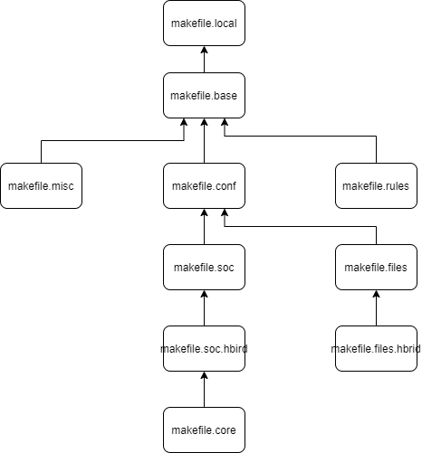

[TOC]


### nuclei_sdk 说明


#### 1.makefile的嵌套结构



**Makefile:**

- 即图中的makefile.loacl，位于目录application/baremetal/helloworld/下；

- 主要说明了target的名称；

**makefile.base：**

- 位于目录Build/下；

- 主要包含参数SOC,DOWNLOAD,V,SILENT变量的声明；

**makefile.misc：**

- 位于目录Build/下；
- 定义了函数get_csrcs（获取所有子目录中的.c文件）
- 定义了函数get_asmcrcs（获取所有子目录中的.s文件）
- 定义了函数get_cxxsrcs（获取所有子目录中的.cpp文件）

- 描述变量V与SILENT的功能，即运行中是否打印相关信息；

**makefile.conf:**

- 位于目录Build/下；
- 声明了与nuclei工具相关的变量；
- 定义GDB_PORT等与GDB相关的变量；
- 引入soc目录，进行riscv-nuclei-elf-gcc命令后的参数配置

**makefile.soc:**

- 位于目录Build/下；

- include "makefile.soc.***"

**makefile.soc.hbird :**

- 位于目录Build/下；

- 定义变量BOARD和CORE;
- 定义两个变量指向目录下的两个子目录;
- 根据不同的DOWNLOAD变量指定各自的ld文件；
- 根据makefile.core中的变量，由指令输入的CORE变量得到CORE_ARCH_ABI参数；
- 如果引入的CORE变量不符合要求，则打印warning信息；

**makefile.core :**

- 根据引入的CORE变量，获取NXXX_CORE_ARCH_ABI，即gcc后续编译所需的参数；

**makefile.rules:**

- 定义make dasm命令;
- 定义make bin命令;
- 定义make size命令;
- 定义make upload命令;
- 定义make run_openocd命令；
- 定义make run_gdb命令；
- 定义make debug命令；
- 定义make clena命令；

**makefile.files:**

- 声明工作目录；


#### 2.ux607引入

##### 2.1步骤：

- 文件makefile.soc.ux607；

- 文件makefile.files.ux607;

- 添加目录SoC/ux607:

  |——SoC

  |		|——ux607

  |				  |——Include

  |							|——nuclei_sdk_hal.h

  |				  |——Source

  |							|——GCC

  |									   |——gcc_ux607_ilm.ld

  | 				  |openocd_ux607.cfg

  |		|——Common
  
  |				   |——Include
  
  |							 |——*.h文件
  
  |				   |——Source
  
  |							 |——Drivers
  
  |										|——*.c文件
  
  |							 |——GCC
  
  |										|——inexc_ux607.S
  
  |										|——startup_ux607.S
  
  |							 |——Stubs
  
  |
  
  |——application
  
  |		|——baremetal
  
  |				   |——uart_test		
  
  |							 |——Makefile
  
  |							 |——main.c

conf.h文件放在哪里？？


make SOC=? CORE=? DOWMLOAD=? all 

make dasm 

```shell
make SOC=ux607 BOARD=ux607_eval CORE=ux600 DOWMLOAD=ilm V=1 all
```

在添加makefile.conf中添加变量：

