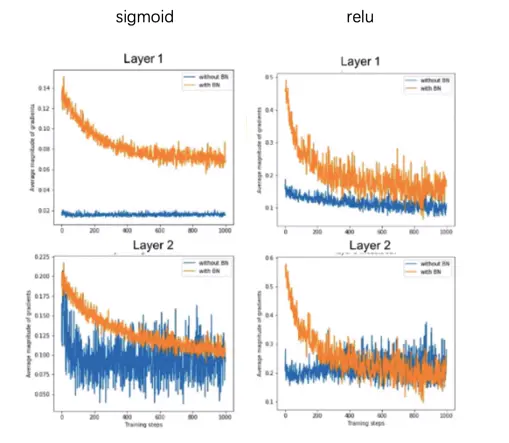
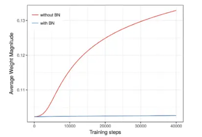
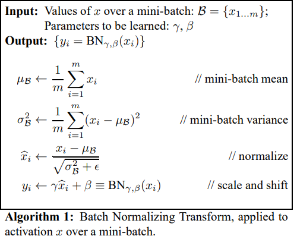
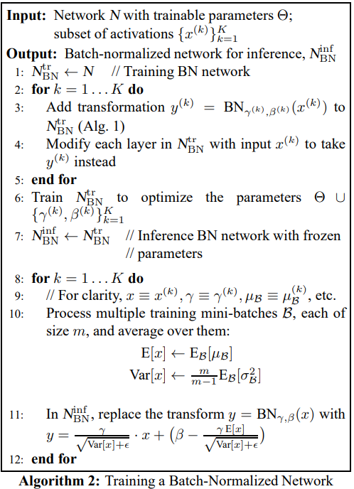

[TOC]

------

### Internal Covariate Shift

网络一旦train起来，那么参数就要发生更新，除了输入层的数据外(因为输入层数据，我们已经人为的为每个样本归一化)，后面网络每一层的输入数据分布是一直在发生变化的，因为在训练的时候，前面层训练参数的更新将导致后面层输入数据分布的变化。以网络第二层为例：网络的第二层输入，是由第一层的参数和input计算得到的，而第一层的参数在整个训练过程中一直在变化，因此必然会引起后面每一层输入数据分布的改变。我们把网络中间层在训练过程中，数据分布的改变称之为：“Internal Covariate Shift”。BN的提出，就是要解决在训练过程中，中间层数据分布发生改变的情况。

### Batch Normalization

#### 1.介绍

 **本质**：

**对于每个隐层神经元，把逐渐向非线性函数映射后向取值区间极限饱和区靠拢的输入分布强制拉回到均值为0方差为1的比较标准的正态分布，使得非线性变换函数的输入值落入对输入比较敏感的区域，以此避免梯度消失问题。标准的正态分布之后，绝大部分的输入数据落入了激活函数的sigmoid的线性区，这就说明网络的表达能力下降了，所以BN为了保证非线性的获得，对变换后的满足均值为0方差为1的x又进行了scale加上shift操作**
$$
y=scale*x+shift
$$
通过scale和shift把这个值从标准正态分布左移或者右移一点并长胖一点或者变瘦一点，每个实例挪动的程度不一样，这样等价于非线性函数的值从正中心周围的线性区往非线性区动了动。

**优势**:

- 解决内部协变量偏移

- 使得梯度变平缓

- 优化激活函数

- 解决梯度弥散问题

- 使模型正则化具有正则化效果

  

- **解决内部协变量偏移**

如果单单是做了**减均值除方差归一化**的操作，那么就会像图a中这样子，把输入数据框定在以0为中心的一块区域，在这一区域内绝大多数激活函数都会有一个问题：**函数梯度变化程线性增长，不能保证对数据的非线性变换，从而影响数据表征能力，降低神经网络的作用**。

sigmoid函数是这样，其他主流的激活函数也一样，如图：

**BN的本质就是利用优化变一下方差大小和均值位置，使得新的分布更切合数据的真实分布，保证模型的非线性表达能力**。BN的极端的情况就是这两个参数等于mini-batch的均值和方差，那么经过batch normalization之后的数据和输入的数据分布基本保持一致。

- **使得梯度变平缓**

如果梯度变得平缓后就可以使用大的学习率(learning rate)，从而使得学习速度变快加速收敛到最优点的时间。

- **优化激活函数**

同样的激活函数，在使用BN与不使用BN有着明显的差异(虚线代表没有使用，实线代表使用)，使用BN后能在更短的时间达到较稳定的状态。

- **增强优化器作用**

在增强优化器功效方面BN也有一定的作用，比较典型的是sigmoid函数，在没有使用BN之前它的迭代是震荡的，不稳定的，在使用了BN之后有了非常明显的提升。

- **解决梯度弥散问题**

拿sigmoid和relu来举例，如果没有使用BN的话，第一层与第二层蓝色的曲线相差会很大，但是使用了BN的黄色曲线相差的值其实并不是很多了。

- **使模型具有正则化效果**

采用BN算法后可以选择更小的L2正则约束参数，因为BN本身具有提高网络泛化能力的特性。

#### 2.BN训练阶段步骤

**疑问**：反向传播的问题？？

#### 3.BN推断阶段步骤

BN在训练的时候可以根据Mini-Batch里的若干训练实例进行激活数值调整，但是在推理（inference）的过程中，很明显输入就只有一个实例，看不到Mini-Batch其它实例，那么这时候怎么对输入做BN呢？

既然没有从Mini-Batch数据里可以得到的统计量，那就想其它办法来获得这个统计量，就是均值和方差。可以用从所有训练实例中获得的统计量来代替Mini-Batch里面m个训练实例获得的均值和方差统计量，因为本来就打算用全局的统计量，只是因为计算量等太大所以才会用Mini-Batch这种简化方式的，那么在推理的时候直接用全局统计量即可。

决定了获得统计量的数据范围，那么接下来的问题是如何获得均值和方差的问题。很简单，因为每次做Mini-Batch训练时，都会有那个Mini-Batch里m个训练实例获得的均值和方差，现在要全局统计量，只要把每个Mini-Batch的均值和方差统计量记住，然后对这些均值和方差求其对应的数学期望即可得出全局统计量，即：
$$
E(x) \leftarrow E_B(\mu_B)
$$

$$
Var(x) \leftarrow \frac{m}{m-1}E_B(\sigma^2_B)
$$

有了均值和方差，每个隐层神经元也已经有对应训练好的Scaling参数和Shift参数，就可以在推导的时候对每个神经元的激活数据计算NB进行变换了，在推理过程中进行BN采取如下方式：
$$
y=\frac{\gamma}{\sqrt{Var(x)+\varepsilon}}·x+(\beta-\frac{\gamma·E(x)}{\sqrt{Var(x)+\varepsilon}})
$$
对于每个节点来说：
$$
\frac{\gamma}{\sqrt{Var(x)+\varepsilon}} \quad \quad \quad \frac{\gamma·E(x)}{\sqrt{Var(x)+\varepsilon}}
$$
都是固定值，这样这两个值可以事先算好存起来，在推理的时候直接用就行了，这样比原始的公式每一步骤都现算少了除法的运算过程。

步骤如下：

### CGBN

在CNN中，batch normalization形式如下：
$$
\hat{x_c}= \gamma·V^{-1/2}(x_c-E(x_c))+\beta
$$

> V is the 2×2 covariance matrix, and E[xc] is the mean of complex activations within the mini-batch. γ is a 2 × 2 matrix and β is a complex number. Both γ and β can be learned during backpropagation.

但是这种BN需要太多的计算，而CGBN不仅可以降低计算复杂度，还拥有更高的精度，CGBN的计算形式如下：
$$
\hat{x_c}=\gamma·(\frac{x_r-\mu_r}{\sqrt{2\sigma_r^2+\varepsilon}}-\frac{x_r-\mu_r}{\sqrt{2\sigma_i^2+\varepsilon}})+\beta
$$

> Both γ and β are complex numbers scaling factors and can be learned.

