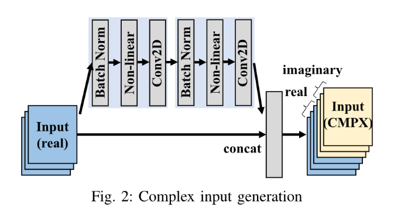
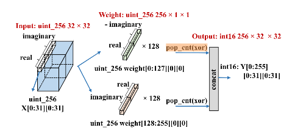

[TOC]


## Conv2D在FPGA的硬件实现


### 1.Conv2D

#### 二值网络为什么可以使用xnor与popcount代替乘加计算

对于二值网络的卷积运算，只是+1和-1之间的乘累加运算，根据+1和-1的乘法运算真值表的特点，可是使用"xnor"代替”乘法”的优化方式，推导过程：

二值乘法真值表：

| a<-1,+1> | b<-1,+1> | a·b<-1,+1> |
| :------: | :------: | :--------: |
|    1     |    1     |     1      |
|    1     |    -1    |     -1     |
|    -1    |    1     |     -1     |
|    -1    |    -1    |     1      |

二值xnor真值表：

| a<0,1> | b<0,1> | a xnor b<0,1> |
| :----: | :----: | :-----------: |
|   1    |   1    |       1       |
|   1    |   0    |       0       |
|   0    |   1    |       0       |
|   0    |   0    |       1       |

可见如果使用0表示-1，那么使用XNOR计算代替二值乘法运算完全是可行的，实际的计算中也常用“异或取反”来代替xnor操作。

例如,a=[1,-1, 1, 1, -1]，W=[-1,1,1,-1,-1]。按照正常的乘法应该是：

$$
a1*w1+a2*w2+a3*w3+a4*w4+a5*w5=1*-1+-1*1+1*1+1*-1+-1*-1=-1
$$
那么转成Xnor的计算方式，在程序中，a=[1,0,1,1,0],W=[0,1,1,0,0]表示的，具体运算过程如下：

先进行异或计算：

 **a ^ w=[1 ^ 0, 0 ^ 1, 1 ^ 1, 1 ^ 0, 0 ^ 0]=[1,1,0,1,0]**

再进行popcount计算：

**popcount(a^w)=3**

计算结果：

**-(2*popcount(a^w)-5) = -1**

其中popcount(x)表示统计向量x中1的个数，我们知道0表示-1，1表示+1，所以，a和W异或求和，应该等于（popcount-（5-popcount））=2*popcount-5=1，而我们要求的是Xnor求和，所以还需要在前面加个负号“-”，即-(2*popcount(a^w)-5) = -1。

如果用vec_len表示向量元素个数的话，那么用xnor代替正常的乘累加（卷积），可以用通式：

**-(2*popcount(a^w)-vec_len)**来计算。


#### 基于FPGA的BCNN总体架构


BCNN网络的硬件实现主要分为三个部分：

1.复数产生层（complex input generation layer）：如下图：例如输入为RGB图片，其初始输入值都是实数值，经过该层网络可以得到复数值（具体原理不清楚）；


2.全精度复数卷积层（full precision complex convolutional layer）：原始的复数卷积层，未经过二值化，保持了全精度；部署在卷积过程的第一层和最后一层；


3.二值复数卷积层（binarized complex convolutional layer ）：将全精度的复数的乘加计算简化为1-bit的二值的xnor、popcount和加减计算，减少存储空间和增加计算效率；例如将32-bits的乘法计算转为1-bit的xnor计算就可以将速度提升32倍，也大幅度减少了硬件资源开销；

除了上述各层，还有全连接层（FC）会在最后阶段产生预期的输出。


#### 二值复数卷积算法解读

```python
void BC_Conv2D(	uint_256 X[32][32],
				uint_256 weight[256],
				int_16 Y[256][32][32],)
{
	Fig_Dim: for(int i = 0; i < 1024; i++)
		CH_out: for(int j = 0; j < 256; j++)
	{
		#pragma HLS PIPELINE II = 1
		#pragma HLS UNROLL factor = p
		uint_256 Mul = X[i/32][i%32] ^ weight[j];
		Y[j][i/32][i%32] = 256 – 2 * pop_cnt_256(Mul);
	}
}
```

如下图所示，算法的循环结构主要就是将目标向量`X[32][32]`中的每一个元素都与权重向量`weight[256]`中的256个元素进行乘加计算，得到结果向量`Y[256][32][32]`；其中乘加计算使用`pop_cnt(xor)`操作来优化，具体原理参考**二值网络为什么可以使用xnor与popcount代替乘加计算**




#### pop_cnt(xor)操作的硬件实现 

使用chisel语言进行设计：

popcount_4(4-bit输入的popcount)真值表：

|  in  | out  |  in  | out  |
| :--: | :--: | :--: | :--: |
| 0000 |  0   | 1000 |  1   |
| 0001 |  1   | 1001 |  2   |
| 0010 |  1   | 1010 |  2   |
| 0011 |  2   | 1011 |  3   |
| 0100 |  1   | 1100 |  2   |
| 0101 |  2   | 1101 |  3   |
| 0110 |  2   | 1110 |  3   |
| 0111 |  3   | 1111 |  4   |

利用真值表使用组合逻辑设计popcount_4还是很容易实现的；

popcount(参数自定义)，根据输入位宽选择例化popcount_4的个数，输出为所有popcount_4输出之和：

```scala
class popcount(width: Int) extends Module{
  val io = IO(new Bundle() {
    val in = Input(UInt(width.W))
    val out = Output(UInt(log2Ceil(width+1).W))
  })
  //例化多个popcount_4模块
  val pop_cnt_4 = VecInit(Seq.fill(width/4)(Module(new popcount_4).io))
  pop_cnt_4.map(_.in).zipWithIndex.foreach{ case (in, index) =>
    in := io.in(index*4+3, index*4)
  }

  io.out := pop_cnt_4.map(_.out).reduce(_ +& _)
}
```


### 2.Pooling

池化层在卷积神经网络中主要用来缩减模型的大小，提高计算速度，同时提高所提取特征的鲁棒性；

目前神经网络中采用最多的就是最大池化（max pooling）和均值池化（average pooling)，池化层中最重要的两个参数就是过滤器大小和步幅。


#### 快速傅里叶变化（FFT）

快速傅里叶变换（Fast Fourier Transform，FFT）是一种可在O(nlogn)时间内完成的离散傅里叶变换（Discrete Fourier transform，DFT）算法，主要用来加速多项式的乘法。

##### 1.多项式的表示

多项式有两种表示方法，**系数表示法**和**点值表示法**

**系数表示法**：多项式的所有项的系数组成的系数向量
$$
(a_0,a_1,a_2,...,a_{n-1})
$$
唯一确定了这个多项式。

如（1，2，3）确定了多项式
$$
A(x) = 1+2x+3x^2
$$
**点值表示法：**一个n-1次多项式在n个不同点的取值唯一确定了该多项式。
$$
A(x)=((x_0,A(x_0)),(x_1,A(x_1)),...,(x_{n-1},A(x_{n-1})))
$$


##### 2.多项式的乘法

利用点值表示法分别去计算多项式的乘法：

对于`n/2`项的A(x)和`n/2`项的B(x)，在一组插值点
$$
(x_0,x_1,x_2,...,x_{n-1})
$$
的点值向量分别为：
$$
((x_0,A(x_0)),(x_1,A(x_1)),...,(x_{n-1},A(x_{n-1})))
$$

$$
((x_0,B(x_0)),(x_1,B(x_1)),...,(x_{n-1},B(x_{n-1})))
$$

分别点对点相乘可得：
$$
((x_0,A(x_0)·B(x_0)),(x_1,A(x_1)·B(x_1)),...,(x_{n-1},A(x_{n-1})·B(x_{n-1})))
$$
如此计算既可以得到n项的多项式C(x)。

而FFT的基本思路就是由系数表达式到点值表达式再到结果的系数表达式。如下图：


##### 3.点值表示法的取点

对于m项的多项式A(X)和n项的多项式B(X)，需要取m+n个点相乘才能得到m+n项的多项式C(x)；

而如果只是随意的取m+n个不同的点，计算的复杂度仍然还是O(n*n)，所以合适的取点具有一点的技巧和重要性，可以利用的就是多项式的**奇偶性**：


##### 4.复数的单位圆


**折半定理：**
$$
w^{2k}_{2n} = w^{k}_n
$$
**消去定理：**
$$
w^{k+\frac{n}{2}}=-w^k_n
$$


##### 5.多项式的拆分计算


##### 6.为什么用复数单位圆

- 对称性
- 递归性


##### 7.矩阵形式


##### 8.IFFT


##### 9.硬件实现

？？？


#### Spectral Pooling

