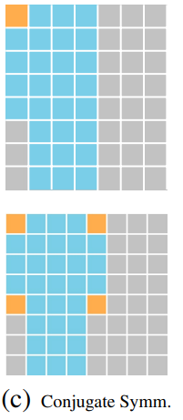

###  

[TOC]

------

### Spectral Pooling

#### 1.Spectral Pooling介绍

**原理**：

- 自然界中的能量主要集中在低频信号中，高频信号倾向于产生噪声。

- 如何选择合适的Pooling层的主要任务在于

  - 选择合适的basis funcitons

  - 修剪掉合适的输入数据去得到一个低维度的输出

  而选择Spectral Pooling的重要原因也是因为时域上可以为空间结构的输入提供一个理想basis（这一点暂时还没有理解）。

  

**Pooling步骤**:

Input: 	Map x （M*N的实数矩阵）

Output: Pooling map x^ （H*W的实数矩阵）

1. y ← F(x) 	//对输入矩阵（假定已经进行了移除the DC component）进行傅里叶转换，根据DFT的结果具有Conjugate symmetry性质，只需要存储矩阵一半的数据（具体保存哪些数据参考[2.Conjugate symmetry constraints](#2.Conjugate symmetry constraints)）
2.  yˆ ← CROPSPECTRUM(y, H × W)     //对上述得到的矩阵y进行处理，根据H\*W保留中间频率的子矩阵
3.  yˆ ← TREATCORNERCASES(yˆ)        //第二步的修剪过程可能会影响到数据的Conjugate symmetry constraints，所以为了后续得到的输出为实数域的必要进行[3.TREATCORNERCASES](#3.TREATCORNERCASES)来恢复数据的Conjugate symmetry constraints
4.  xˆ ← F−1 (yˆ)              //通过IDFT将频域数据转为空间域

**优势**：

- 减少信息的丢失
- 起到一定的降噪作用

- 根据网络深度随意的指定输出的维度

  

**劣势**：

- 电路复杂，单纯只是在Pooling这个静态层引入FFT，带来的硬件开销不算是可忽略的；但是如果在卷积层也使用`Spectral parametrization`，在pooling层只需要做一个矩阵维度的裁剪，这样引入的硬件开销才算是可忽略的；

  > Spectral pooling can be implemented at a negligible additional computational cost in convolutional neural networks that employ FFT for convolution kernels, as it only requires matrix truncation.

  > In practice, the DFTs are the computational bottlenecks of spectral pooling. However, we note that in convolutional neural networks that employ FFTs for convolution computation, spectral pooling can be implemented at a negligible additional computational cost, since the DFT is performed regardless.

- 有一些细节没有说明清楚，例如如何移除数据的直流分量、如何进行TREATCORNERCASES等；

**疑问**：

- 2.2节的Differentiation前半部分讨论了DFT和IDFT中的梯度传播，后半部分继续阐述了Conjugate symmetry 约束的几个特殊情况，这两者有什么关联吗？

  > There is an intricacy that makes matters a bit more complicated. Namely, the conjugate symmetry condition discussed in Subsection 2.1 introduces redundance.

- 时域可以为空间结构的输入提供理想的basis怎么理解？

  > The idea behind spectral pooling stems from the observation that the frequency domain provides an ideal basis for inputs with spatial structure.

- Spectral Pooling的第一步是将M*N的矩阵送入DFT，但是需要满足**the DC component has been shifted to the center of the domain**，不明白这一步是什么意思。

  > First, we compute the discrete Fourier transform of the input into the frequency domain as y = F(x) ∈ CM×N , and assume that the DC component has been shifted to the center of the domain as is standard practice.

- Spectral Pooling的第三步TREATCORNERCASES具体是指什么操作，没有找到相关的资料。

- 反向传播过程描述不太清楚：

  

####  2.Conjugate symmetry constraints

整个网络中，我们都是通过DFT和IDFT层传播信号和信号梯度，在DFT和IDFT层我们使用复数表示频域信息，但是除了这两个层我们需要确保信号和他的梯度都是实数。为了满足这个约束，我们的频域信号必须要满足共轭对称约束：
$$
y_{mn}=y^*_{(M-m)modM,(N-n)modN}\quad \forall\text{m from }\text{{0,...,M-1}} ,\forall\text{n from }\text{{0,...,N-1}}
$$
 利用这一个特性，我们在保存频域信息时只需要考虑左半部分的信息，但是这个并没有减少存储开销，因为频域的信号包含实部和虚部两个部分，需要分别保存的。

如上图所示，上层的是维度为奇数时的共轭对称类型的矩阵，下层为偶数时的：

**其中黄色约束为实数，蓝色不做约束，灰色的根据共轭对称性自动填入。**

当输入为实数时，其2D DFT的结果必然是满足共轭对称的，所以我们**只需要关注送入IDFT层的输入满足共轭对称即可（这一部分体现在Spectral Pooling中的TREATCORNERCASES过程）**。

#### 3.TREATCORNERCASES

在论文中2.2节 Differentiation中描述了CORNER代表了哪些点，另外在[2.Conjugate symmetry constraints](#2.Conjugate symmetry constraints)中的图也可以直观的观察到：

> Inspecting the conjugate symmetry constraints in Equation (3), we note their enforcement of the special case y(0,0) ∈ R for N odd, and y(0,0), y(N/2 ,0) , y(0, N /2) , y (N/2 , N/2) ∈ R for N even. For all other indices they enforce conjugate equality of pairs of distinct elements. These conditions imply that the number of unconstrained parameters is about half the map in its entirety.

所以我猜测函数TREATCORNERCASES的处理过程如下：

​	根据H*W参数判断输出矩阵的维度是奇数还是偶数，再根据Conjugate Symm特性将特殊位置的复数改为0。

> Apart from these, the last component left undiscussed is differentiation through the truncation of the frequency matrix, but this corresponds to a simple zero-padding of the gradient maps to the appropriate dimensions.