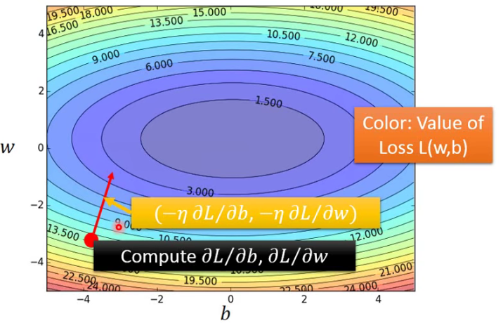

#### What to do with large bias?

- Diagnosis:
  - if your model cannot even fit the training examples,then you have large bias(Underfitting)
  - if you can fit the training data, but large error on testing data,then you probably have large variance(Overfitting)

- For bias,redesign your model:
  - Add more features as input
  - A more complex model 

#### What to do with large variance？

- More data

  very effective,but not always practical

- Regularization

#### Model Selection 

- There is usually a trade-off between bias and variance
- Select a model that balances two kinds of error to minimize total error 

### Gradient Descent

对于图中的各点，当我们想用一个函数就表示他们的线性关系是，我们可以通过优化下面问题来求解：
$$
\theta^* = arg\,min\,L(\theta) \quad L:loss function \quad \theta:patameters
$$
其中损失函数L(θ)为各点实际值与预测值的均方差。这时候就可以使用gradient descent：

- 选择初始点
- 计算梯度值
- 按学习率前进

#### 考虑θ只有一个参数：

#### 考虑θ有两个及以上的参数：

如下图所示，经过多次迭代损失函数将沿着法线方向逐步减小，趋向中心：

多个参数时：

#### learning rate的考量：

η作为learning rate不仅影响结果是否可以merge，还影响着merge的速度。当η过大时，会导致学习结果变差，无法收敛；而过小时，收敛速度又过慢，增大了计算量。所以设定一个合适的learning rate十分关键。

当下使用的learning rate意见：

- 在开始的时候可以使用较大的η，因为我们距离目标还较远

- 在多次步进之后，我们逐步减小learning rate

- 例：
  $$
  \eta^t=\eta/\sqrt{t+1}
  $$
  

#### Adagrad算法

为了满足上述learning rate的要求，介绍Adagrad算法：

多次迭代之后，有如下式：
$$
\omega^{t+1} \leftarrow \omega^t-\frac{\eta}{\sqrt{{\sum}^t_{i=0}(g^i)^2}}g^t
$$
可见在adagrad下，learning rate将不断减小，在learning的最后阶段速度会非常慢。

### Stochastic Gradient Descent

Gradient Descent方法每次都将所有的数据带入计算，此时的计算量必然非常庞大，而SDG方法每次只随机选择一个数据带入计算，计算量小，但是拟合效果并不一定好。

#### 与Gradient Descent对比：

