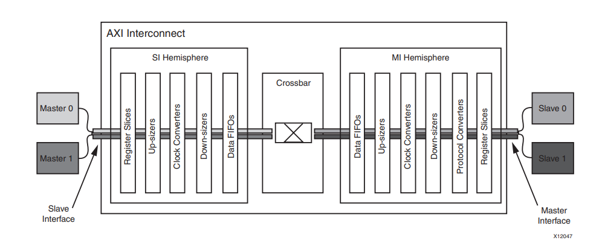
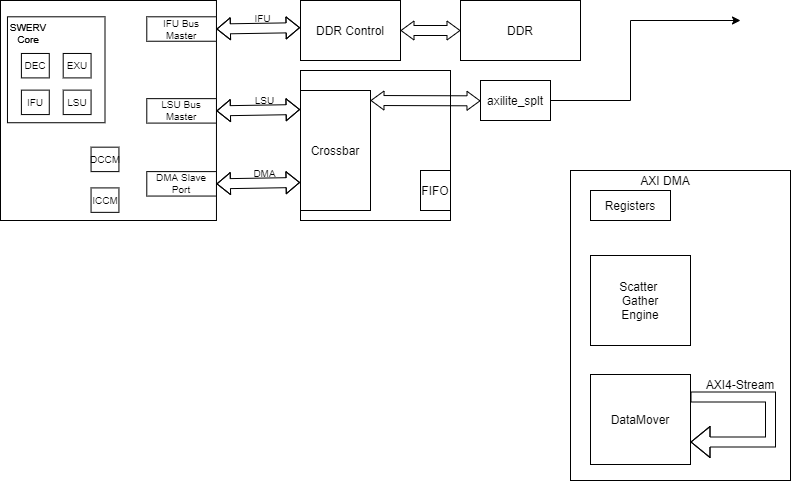

[TOC]

------

### AXI总线集成

DATAMOVER

**Centralized DMA**

几个常用的 AXI 接口 IP 的功能（上面已经提到）：
AXI-DMA：实现从 PS 内存到 PL 高速传输高速通道 AXI-HPAXI-Stream 的转换
AXI-FIFO-MM2S：实现从 PS 内存到 PL 通用传输通道 AXI-GPAXI-Stream 的转换
AXI-Datamover：实现从 PS 内存到 PL 高速传输高速通道 AXI-HPAXI-Stream 的转换，只不过这次是完全由 PL 控制的， PS 是完全被动的。
AXI-VDMA：实现从 PS 内存到 PL 高速传输高速通道 AXI-HPAXI-Stream 的转换，只不过是专门针对视频、图像等二维数据的。
AXI-CDMA：这个是由 PL 完成的将数据从内存的一个位置搬移到另一个位置，无需 CPU 来插手。
涉及到DMA主要包括AXI Centralized DMA、AXI Video DMA和AXI DMA，详细的描述及IP核如下图所示

**TCM**与缓存的内容不会自动保持一致，这意味着**TCM**映射到的内存区域必须是不缓存的区域。如果一个地址同时落在缓存和**TCM**内，那么访问这一地址的结果是不能预测的。另一个限制是各个**TCM**必须要配置成不相交的。