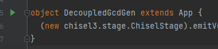

[TOC]

------


## Chisel-design User Guide

### 项目来源介绍

- 项目从github中的chisel-template模板clone而来，具体步骤可参考chisel-template项目的README文档进行操作；

- 使用chisel-template后在build.sbt的libraryDependencies参数添加scalatest，如下：

```scala
    libraryDependencies ++= Seq(
      "edu.berkeley.cs" %% "chisel3" % "3.4.3",
      "edu.berkeley.cs" %% "chiseltest" % "0.3.3" % "test",
      "org.scalatest" %% "scalatest" % "3.0.5" % "test"
    ),
```

- 项目主要在Intellij IDEA中使用，IDEA中自带sbt shell，可以方便地进行项目管理，后续的说明都是针对IDEA环境下的；


### 使用说明

在IDEA中打开项目后，IDEA会根据build.sbt自动配置所需的库，顺带产生一些陌生的目录，在此不做说明；

#### 1.主要目录结构

```
-src
---main
-----package_name(建议每次新建一个新的module都新建一个package,里面主要是目标模块的chisel代码)
-----generator(各个模块生成verilog的方法)
---test
-----package_name(建议与main中相应的module具有相同的package_name，里面主要是目标模块的测试用例)
—generated
---package_name(保存目标模块的.v、.fir、.json文件)
-test_run_dir
---test_name(保存.vcd波形文件)
```

**上述generated与test_run_dir文件夹及子文件夹都是在代码中实现的，不需要手动创建，后续将说明.v与.vcd文件如何生成**

#### 2.scalatest

```scala
package package_name

import chisel3._
import chisel3.tester._
import org.scalatest.FreeSpec
import chisel3.experimental.BundleLiterals._

class GCDSpec extends FreeSpec with ChiselScalatestTester {

  "Gcd should calculate proper greatest common denominator" in {
    test(new DecoupledGcd(16)) { dut =>
    //test_body
    }
  }
}
```

上述代码就是一个test的模板:

- `package`后加上与main中相应的`package_name`,让测试代码与模块代码在一个package下

- `import`加上所需的资源包

- `"Gcd should calculate proper greatest common denominator"`对应test_run_dir文件夹下的子文件夹名

- 在sbt shell下仿真：`testOnly package_name.testclass_name`，项目自带的GCDSpec即可通过`testOnly gcd.GCDSpec`进行仿真，出现如下情况表示成功：

  ```shell
  [IJ]testOnly gcd.GCDSpec
  Elaborating design...
  Done elaborating.
  test DecoupledGcd Success: 0 tests passed in 841 cycles in 0.890038 seconds 944.90 Hz
  [info] GCDSpec:
  [info] - Gcd should calculate proper greatest common denominator
  [info] Run completed in 3 seconds, 169 milliseconds.
  [info] Total number of tests run: 1
  [info] Suites: completed 1, aborted 0
  [info] Tests: succeeded 1, failed 0, canceled 0, ignored 0, pending 0
  [info] All tests passed.
  ```

#### 3.生成波形的仿真

在仿真命令后添加参数`-DwriteVcd=1`，即可在`test_run_dir/test_name`下生成波形文件，如：

```shell
testOnly gcd.GCDSpec -- -DwriteVcd=1
```

#### 4.verilog代码生成

在scala/main/scala下新建一个名为generator.scala的文件，其中`import+需要生成代码的package名`，该文件专门用于生成所需要module的verilog代码，注意详细声明模块的形参，提升代码的复用性；

verilog代码生成的方法需要定义在继承于`App`的object中；

- 推荐object命名方式为“模块名+Gen",例如DecoupledGcdGen等

- 推荐object放在generator.scala中，如`generator.scala`中声明object:

  ```scala
  object DecoupledGcdGen extends App {
    (new chisel3.stage.ChiselStage).emitVerilog(new DecoupledGcd(4),Array("--target-dir", "generated/DecoupledGcdGen"))
  }
  ```

  生成的.v文件将保存在`generated/DecoupledGcdGen`文件夹下。

- 可直接在IDEA中使用点击相应的run开关进行代码生成（如下绿色的三角按钮）


- 或者直接通过sbt shell

  ```shell
  runMain  DecoupledGcdGen
  ```


#### 5.Makefile介绍

```shell
make clean
```

删除generated/*/下除.v文件外的其他文件；

```shell
make cp module=模块名
```

将相应模块生成的verilog代码复制到verilog_sim/rtl下，进行后续的仿真验证；

```shell
make all_clean
```

清空文件夹generated/和test_run_dir/（谨慎使用）