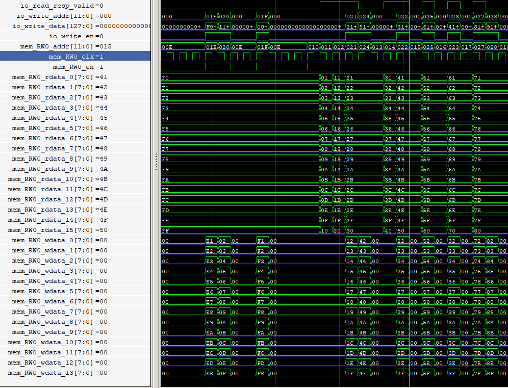
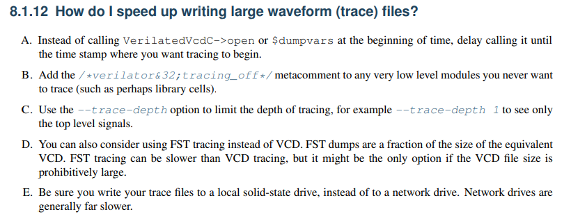

### 工作日志


#### 2022-10-10

- [x] Gemmini配置是在chipyard/generators/gemmini/configs文件下完成的，选择哪一种配置在`SoCConfigs.scala`中完成。如下：

  默认自定义配置保留下行：

  ```
  new gemmini.GemminiCustomConfig ++
  ```

  双核配置需注释上一行代码，添加如下行：

  ```scala
  new gemmini.DualGemminiConfig ++
  ```

  生成的verilog文件在`chipyard/sims/verilator/generated-src`文件夹；

- [x] 记住每次进入项目后需要运行进行配置，不然会报错：

  ```shell
  cd chipyard
  source env.sh
  cd chipyard/generators/gemmini
  ./scripts/setup-paths.sh
  ```

- [x] VSCODE安装C/C++ Extension Pack插件,黄色字体一般都是define，右键可以直接go to definition

- [ ] 疑问1：为什么地址是乱序的？是不是跟DMA请求队列有关？

  

- [ ] 搞清楚mvin和mvout指令执行时，loadcontroller和storecontroller分别是如何工作的？


#### 2022-10-11

- [ ] 阐述原始卷积过程和现在的BCNN卷积过程的区别与联系；
- [ ] gtkwave工具太烂了，1g以上的波形都无法查看；换modelsim?
- [ ] 计算一下采用类NHWC存储方式，比原先快了多少倍


#### 2022-10-12

- [x] 搞清楚mvout指令、scale功能
- [x] Cat操作符
- [x] BCNN硬件平台数据通路图（算法中的拼接具体是怎么实现）
- [ ] 算清楚zero_dec++具体需要多少内存
- [x] 搞定第四章RSICV相关的废话
- [x] 从胡涛那边找到modelsim、vivado安装资源
- [x] 搞清楚PE os模式的计算方式


#### 2022-10-16

- [ ] OS模式下compare是否也可以在PE的PL电路中完成


#### 2022-10-17

- [ ] 弄清楚tiled_matmul_auto、tiled_conv_auto函数
- [x] 弄清楚matmul_os、matmul_ws函数
- [x] C语言指针 * &


#### 2022-10-18

- [ ] 第三章和第四章的本章小结
- [ ] conv相关的case
- [x] 查看波形 弄清楚脉动阵列的内部信号
- [x] 修改了gemmini_testutils.h中的`printMatrix`函数


#### 2022-10-19

- [ ] 找到波形文件太大的可能解决方法：




#### 2022-10-20

- [ ] 开始修改代码：
  - [ ] 备份原始gemmini src中的代码于`/mnt/d/prj/routine/inferencor/gemmini_code/`
  - [ ] 将`tutorial`中的`Arithmetic.scala`拷贝并替换原始的文件，修改其中关于Complex的代码为Bcomplex
  - [ ] 修改`config.scala`中配置


#### 2022-10-23

- [ ] `VectorScalarMultiplier.scala` line41将ScalePipe中的函数
- [ ] Acc: line134 8 -> 32,其余搜aligned_to
- [ ] 


#### 2022-10-29

- [ ] 定义新方法 d_default 并在ex_controller中：

```
  val dataD = VecInit(dataD_unpadded.asTypeOf(Vec(block_size, inputType)).zipWithIndex.map { case (d, i) => Mux(i.U < cntl.d_unpadded_cols, d, inputType.zero)})
 修改：
    val dataD = VecInit(dataD_unpadded.asTypeOf(Vec(block_size, inputType)).zipWithIndex.map { case (d, i) => Mux(i.U < cntl.d_unpadded_cols, d, inputType.d_default)})
```


#### 2022-10-31

- [ ] 论文中2.3.3节 CGBN是不是不太需要？