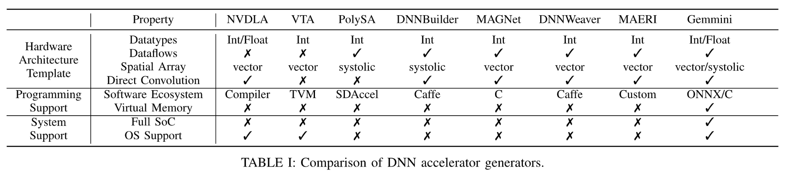

[TOC]

## Gemmini Generator

### 1. 介绍

​		近些年深度神经网络（DNNs）引起了人们的极大开发兴趣，在多项应用领域均有使用，例如计算机视觉、机器翻译和自动驾驶仪等。然而，如果没有专用的加速器，如何高性能低功耗地起去运行一个先进准确的DNN网络是极其困难的，而且去设计这样一个专用的加速器也是十分困难和昂贵的。基于这样的需求，近年来有大量的人员在开发高参数化和模块化的硬件生成器的工作中投入了大量的精力。虽然这些模块化的硬件生成器让我们可以更方便地去例化一个DNN加速器，但是他们仅仅只考虑到加速器这一组件的本身，而忽略了系统级参数这一重要因素。系统级的参数化在我们的SoC全局部署和整个软件栈中起到了至关重要的作用，行业中也倡导提出一个更加全面的DNN加速器开发方案。现存的DNN加速器生成器均不支持全栈的编程接口和全系统的SoC集成，这就无法对加速器实现高层次和低层次的软件控制，也让我们无法整体评估系统应用。

​		在此基础上，我们推出了一个开源、全栈式的加速器生成器：Gemmini。Gemmini可以端到端、全栈式地开发和评估用户自定义硬件加速器系统，对于快速迭代地DNN网络来说，这无疑是极为合适的。Gemmini的参数化的硬件模板可以让使用者在一个宽泛的性能、效率和可扩展性的trade-off中对硬件设计进行调整。与其他的现存的DNN加速器生成器不同，Gemmini不再只是关注加速器本身，而是提供了一个横跨软硬件栈和兼容RISC-V生态的SoC集成环境的完整方案。除此之外，为了满足不同的编程要求，Gemmini采用了带有一个易于编程的接口的多层次软件栈，且可以与支持Linux的SoCs紧密集成，这就让带Gemmini的系统可以完成任意软件算法的执行。

​		Gemmini-generated 加速器已经再TSMC 16nm和 Intel 22nm FinFET工艺下成功流片了，证实了该加速器可以物理实现。除此之外我们的评估结果显示Gemmini-generated 加速器拥有和最先进的商用DNN加速器相近的性能，在相同的一系列配置下可以实现基准CPU 的2670倍的计算速度。Gemmini全集成、全栈式的流程可以让用户同时协同设计加速器、应用和系统，为未来的深度学习SoC提供了新的选择。

### 2. 背景与意义

​		为了实现快速高效的DNN计算，目前已经开发出多个从终端到云端的应用于不同DNN算法和不同应用场景的新型加速器。这一章主要讨论并比较当下最先进的几个DNN加速器及其生成器。

#### 2.1 DNN Accelerators		

​		为了适用于众多场景的不同应用，研究人员提出了多种基于不同性能和能效目标的新型DNN加速器。从架构层面出发，不同的DNN加速器利用了不同的复用模式去构造特定的存储层次和互连网络来提升性能和能效。大多数现存的硬件DNN架构在面积上都很大，其中并行的计算单元主要有两种分布：一种是采用脉动阵列分布，例如TPU；另一种采用并行的向量计算单元，例如Brainwave和NVDLA.基于这些架构模板，我们开始着手于如何利用应用的稀疏性模式和新兴的内存计算技术来提升加速器性能。

#### 2.2 DNN Accelerator Generators

​		上表在不同的特性中，对Gemmini和现存最新的DNN 加速器硬件生成器做了比较。与设计指定的硬件电路不同，基于generator设计的参数化架构模板可以生成面向不同应用的硬件和软件，极大的提升了硬件设计效率。下面我们从三个方面来讨论：

- hardwave

  ​		为了适配不同的操作环境和面积/功耗/性能目标，DNN加速器生成器必须可以灵活配置架构模型。现下多数DNN加速器生成器仅致力于定点数表示或者只支持单种数据流，除此之外，还只倾向于使用一个特定的spatial array，例如脉动阵列（TPU）或者向量阵列（NVDLA）,这就让他们之间很难做一个系统化的比较。与之不同，Gemmini ：

  - 支持浮点和定点数据类型，在训练和推理都便于处理数据表示；
  - 支持多种数据流，且在设计和运行期间均可配置；
  - 支持向量和脉动两种空间阵列，可以实现效率和可扩展性的量化比较；
  - 支持各种DNN操作的直接执行。

- softwave

  ​		通常来说，DNN加速器生成器还需要一个易于编程的接口，这样用户才可以快速的实现他们的应用。不同的开发者根据他们的研究目标和兴趣会偏向于不同的软件设计环境。例如，DNN应用开发人员倾向于让硬件编程环境可以嵌在DNN开发架构（如PyTorch或者TVM）中，如果这样他们就可以忽略底层的编程细节，例如VTA和DNNWeaver。而架构开发者和系统编程人员则希望可以在低层次水平与硬件交互，如C/C++或者汇编层面，这样他们就可以准确的控制硬件状态，将硬件的效率开发到极致，例如MAGNet和Maeri。为了满足不同开发需求，Gemmini提供了多层次的编程接口，而相比之下其他的DNN生成器仅能支持其中某一点需求。除此之外，Gemmini还首次提供了virtual memory，且不需要任何软件驱动，极大的提升了终端用户的编程效率。

- system 

  ​		第三点，对于DNN加速器生成器来说，系统集成也是至关重要的，其中包括了整个SoC和系统软件。当下的DNN加速器通常都是单独的设计和评估的，没有考虑到系统层面。然后，如果想要让他们最终投入使用，就必须要集成到一个大的系统中。事实上，最新的行业评估证实了即使在拥有硬件加速器的情况下，也有近77%的ML工作量实在CPUs上完成的，因为他们需要CPUs去执行一些新的操作或者在CPU和accelerators传输数据。更糟糕的是，现有的DNN加速器中还没有一款可以与主CPU和共享资源（如caches和system buses）做到全SoC集成。相较之下，Gemmini 内置系统集成功能，用户可以直接实例化完整的 SoC 环境，且该环境可以运行Linux，便于让架构师在系统层级直接评估和权衡性能。

### 3. Gemmini Generator架构

​		Gemmimi作为一个开源、全栈式的DNN加速器生成器，横跨不同的硬件架构、编程接口和系统集成选项。利用Gemmini，用户可以根据自己需要生成从低功耗的边缘设备到高性能的云端加速器中各种架构。

#### 3.1 Gemmini Generator架构

​		实际应用中，Gemmini是作为一个执行非标准RISC-V用户自定义指令集的RoCC（ Rocket Custom Coprocessor）加速器，应用中的标准RISC-V指令集将在CPU中完成。Gemmini单元使用RoCC端口与CPU核通信（Rocket或者BOOM)，且默认通过System Bus与存储系统连接（例如L2 cache)。

​		在加速器的核心部分部署了一个脉动阵列，用来执行矩阵乘法运算。矩阵乘法默认支持output-stationary （输出固定）和 weight-stationary（权重固定）两种数据流向，在硬件运行中用户可以选择配置哪一种数据流向。且在设计阶段也可以通过参数化直接选择单一的数据流向，并固化。脉动阵列的输入和输出都存储在指定的scratchpad中，该存储单元由banked SRAMs构成，运算中的暂时结果可以存储在Accumulator。

​		Gemmini还配备了DMA模块，用于main memory和scratchpad之间的数据传输。

​		因为ws数据流需要在脉动阵列外有一个累加器，所以我们添加了一块配备加法单元的SRAM bank，从理论上来说这也属于scatchpad memory空间的一部分。脉动阵列可以向accumulator中的任意地址存储结果，也可以从中读取新的输入数据。因为数据类型不同，向Accumulator的读写数据接口带宽将高于scatchpad的数据接口带宽。DMA也可以直接在accumulator和main memory中传输数据，这就极大方便了算法中的偏置数据的预载。

​		Gemmini还包含了丰富的外设电路，方便DNN算法中部分函数操作：

- ReLU或者ReLU6:可选择性的使用非线性激活函数
- Pool:通过2的幂次倍缩减计算结果
- Transposer:在输入数据进入脉动阵列前进行转置来支持OS数据流
- Mat-Scalar Mult等。						

### 4. 硬件部分及参数

​		这一章节主要介绍了Gemmini的主要硬件组件和他们之间如何交互，最后介绍Gemmini的参数化、参数意义以及如何使用。

#### 4.1 Decoupled Access/Excute

​		Gemmini采用了Decoupled Access/Excute架构，这就意味着"memory-access"和“excute"指令可以在硬件的不同区域同时执行，该机制可以极大的提高指令执行效率。我们把硬件分解为三个控制模块：一个负责”excute"指令，另一个负责“load”指令，第三个负责“store"指令。如下图所示，该架构与VTA的架构类似：

​		这一硬件部分对应Gemmini架构图中**Reservation Station**模块，当CPU取指令取到协处理器的“excute"、”load“、”store“的指令时，便以RoCC Commands形式发送给Gemmini，同时分享scatchpad和accumulator的访问权。此后Gemmini对RoCC Commands进行解码和执行。根据上述的三个部分，其各自功能如下：

- ExecuteController: 该部分负责执行”excute"类型的ISA指令，例如矩阵乘法。由负责点积的脉动阵列和transposer构成。
- LoadController：该部分负责执行从main memory向Gemmini的Scratchpad或者accumulator传输数据的指令。

- StoreController：该部分负责执行从Gemmini的Scratchpad或者accumulator向main memory传输数据的指令。值得注意的是，该部分还负责执行“max-pooling”指令，因为Gemmini的pooling在从private SRAMS存储数据到main memory过程中一并完成了。

#### 4.2 Scratchpad and Accumulator

​		作为Gemmini私有的SRAMs,scratchpad和accumulator用于存储脉动阵列的输入和输出。特别之处，输入数据一般存储在scratchpad中，而中间值（partial sums）和最终结果（final results）一般存储在accumulator中。

​		scratchpad和accumulator都例化在**Scatchpad.scala**文件中。scratchpad通过例化**Scatchpad**模块实现，accumulator banks通过例化**AccumulatorMen**模块实现。

​		scratchpad和accumulator SRAMs每行宽度为**DIM**个"element"，其中**DIM**为脉动阵列每行PE的个数，"element"表示Gemmini操作的单个标量值。scratchpad中的"element"默认的数据类型是**inputType**(可配，默认为8-bit integer)，accumulator中的"element"默认的数据类型是**accType**（可配，默认为32-bit integer)。举例来说，对于默认配置的一个16*16的脉动阵列，scratchpad banks每行的宽度是**16 * bits(inputType) = 128** bits，而accumulator banks每行的宽度则是**16 * bits(accType) = 512** bits。

​		scratchpad的输入和输出数据必须是**inputType**类型的，而accumulator的输入和输出数据既可能是**accType**也可以是**inputType**。如果**inputType**类型的值输入到accumulator，该数据将会被扩展为**accType**；当**inputType**类型的值从accumulator输出时，该数据将首先被压缩为**inputType**。这个“压缩”函数可以根据用户需求而配置，但是在默认配置下，这个"压缩"函数是一个简单的乘法操作，通过乘以一个**float32**类型的值来将**int32**压缩为**int8**。

​		下面讨论一下scratchpad和accumulator的电路实现。scratchpad banks结构十分简单，仅由一块SRAM和一个queue构成。相比之下，accumulator的结构稍显复杂：除了SRAM，还包含了一系列的加法器去支持内部累加操作，除此之外还有一系列的“压缩”和激活函数单元。这些“压缩”和激活函数可以被编程人员调用，用于从accumulator中读数据时将**accType**类型的值转化为**inputType**类型的值。例如DNN算法中将某一层的partial-sum从accumulator输出作为下一层的输入（inputType)。

#### 4.3 Systolic Array 

 		Gemmini的脉动阵列拥有两级结构来适应不同的微架构，如下图所示，空间阵列的首先由**tiles**构成，每个tile通过流水线寄存器和相邻的tiles连接。而每个tile又可以拆分为一个PEs组成的阵列，其中相连的PEs直接连接，不通过流水线寄存器。PE可配置为WS或者OS数据流模式，每个周期完成一次MAC（乘加）运算。每个PE和每个tile只和其相邻的单元分享输入和输出。

​		下图详细说明了Gemmini的两级阵列结构是如何既支持全流水线的TPU-like架构又支持NVDLA-like并行向量处理架构的，或者其他介于二者之间的设计架构。基于两种结构，我们以256个PEs为准综合了两种电路并进行评估。相较而言，由于较短的MAC路径，TPU-like的设计的最高频率可达到NVDLA-like的最高工作频率的2.7倍，但是面积和功耗分别是NVDLA-like的1.8倍和3.0倍。

​		**MeshwithDelays**模块例化在**ExecuteController**中，其中包含了脉动阵列（**Mesh**），一个transposer(Transposer)和一系列的移位寄存器（将输入数据移位进入脉动阵列）。**MeshwithDelays**模块每次每周期引入三个矩阵（**A**,**B**,**D**)，同时每周期输入结果**C = A * B + D** 。

​		在WS(weight-stationary)模式下，矩阵B需要提前加载进入脉动阵列，A和D依次进入；在OS(output-stationary)模式下，矩阵D需要提前加载进入脉动阵列，而A和B依次输入。

​		A,B和D矩阵数据都属于**inputType**类型，而C矩阵数据属于**outputType**类型。如果编程人员期望去把计算结果C写入scratchpad，那么C中数据会被压缩为**inputType**类型；然而，如果需要写入accumulator中，那么C中数据就需要升为**accType**类型。注意到在WS模式下，**inputType**类型的D没有足够的位宽来准确的表示partial sums，因此在该模式下，D通常是0矩阵。

​		输入（A,B,D）必须要经过移位寄存器的打拍才可以进入脉动阵列，只有经过打拍后，某一矩阵的输入数据才可以准确送到相应的PE，也同时精确地和另一个矩阵相应的输入完成乘加计算。下图以OS模式下2x2矩阵的乘加运算（忽略D）为例，展示如何利用合适的移位寄存器准确的实现脉动阵列的输入和输出：

​		除此之外，**MeshwithDelays**模块还包含了许多计数器和配置寄存器。**MeshwithDelays**假设每次的乘加运算的规模都是**DIM**x**DIM**，其中**DIM**值为脉动阵列每行PE的个数（默认为16）。如此，当计数器计到**DIM**时，Gemmini将更新**MeshwithDelays**中的配置寄存器。这些配置寄存器不仅控制了A或B中哪一个矩阵在输入前需要转置，也控制了脉动阵列中已经预载的值是被保存还是被覆盖或者替代。

#### 4.4 Transposer

​		transposer模块本身就是一块非常简单的脉动阵列，完成一次矩阵的转置需要2x**DIM**个周期，其中**DIM**个周期用于从左至右移位，另外**DIM**个周期用于自下而上移位。如下图所示：

​		注意对于OS模式下的乘加运算，即使编程人员没有配置转置需求，这个transposer模块也会被使用。因为在OS模式下，脉动阵列需要来自矩阵A的某一行数据输入到阵列中相同行的PE中。

#### 4.5 DMA

​		Gemmini中包含两个DMAs，一个负责从main memory向Gemmini的private SRAMs中读数据，另一个负责将Gemmini的private SRAMs的数据存入main  memory。这两个DMA模块都例化在**DMA.scala**文件中。

​		两个DMA都可以对虚拟地址进行操作，从Reservation Station获取地址（虚拟地址）后会将其送入TLB，经过映射得到main memory的物理地址。如果TLB misses后，该虚拟地址将直接转回主机CPU中的PTW来获取物理地址。

​		从Gemmini的private TLB中获取物理地址后，DMA将会把一个大型的memory请求拆分为多个小型的[TileLink](https://sifive.cdn.prismic.io/sifive%2Fcab05224-2df1-4af8-adee-8d9cba3378cd_tilelink-spec-1.8.0.pdf)读写请求。为了满足TileLink协议，每次的memory请求必须满足字节对齐，而且每次memory请求中的字节数必须是2的幂次。

​		DMA通常会尽量减少TileLink的访问请求次数，即使这样会需要从main memory中读取更大的数据总量。因为根据以往的经验，我们发现过量的TileLink访问请求比额外读少量的数据更影响性能。

​		负责将private SRAMs中数据写入main memory的DMAWriter，除了与DMAReader相同的功能外，还包含了一些**>**比较器，这些比较器可以在memory-write操作期间完成max-pooling的功能。

####  4.6 ROB

​		由于Gemmini采用的是decoupled access-execute架构，在`LoadController`, `StoreController`, 和 `ExecuteController` 中的指令相对于其他控制器中的指令可以同时且无序的执行。Gemmini通过使用ROB来监测不同控制器间的指令是否存在冒险，一旦检测到某一条指令与其他控制器中的指令间没有依赖关系，就将立马被送往他们各自的控制器去执行。

​		值得注意的是被派往相同的控制器的指令之间是顺序执行的，ROB也不会去检查同一个控制器中的指令之间是否有冒险，因为每一个控制器都将在内部自行处理指令之间的依赖关系和冒险。

#### 4.7 Matmul and Conv Loop Unrollers

​		Gemmini的脉动阵列一次仅可对**DIMxDIM**个元素进行乘加计算。所以当执行的乘加和卷积的计算量大于这个规模，编程人员就必须要把他们的乘加运算分解为一系列更小的**DIMxDIM**大小的乘加运算。然而，对于编程人员来说，如何高效地平铺这些操作是十分有难度的，因为他们不仅需要考虑CPU和循环的开销，还要解决软件循环的分解和流水线的难题。

​		为了减轻这一困难，Gemmini的ISA中引入了高层次的CISC-type指令，可以自动展开和分解大型的乘加和卷积运算，这些指令在**LoopMatmul**和**LoopConv**两个模块中实现。这些模块//TODO

#### 4.8 Generator Parameters

​		Gemmini的参数化功能十分强大，主要的参数包含：

- Systolic array dimensions ( **tileRows** , **tileColumns** , **meshRows** , **meshColumns**)：脉动阵列由两级层级结构，其中每个tile中的PE都是直接连接的，而tile之间都是通过流水线寄存器连接的。
- Dataflow parameters ( **dataflow** ):该参数决定了Gemmini的脉动阵列是output-stationary或者weight-stationary模式，或者两种模式都支持，让用户可以在运行期间对二者进行选择。
- Scratchpad and accumulator memory parameters ( **sp_banks** , **sp_capacity** ,**acc_capacity** ):**sp_banks**决定了scratchpad可以被均分多少个banks，**sp_capacity** ,**acc_capacity**分别决定了sp和acc的容量，单位为KiB。
- Type parameters (**inputType**, **outputType**, **accType**):决定了Gemmini 加速器数据流中的不同部分的数据类型。例如，**inputType**可以是8-bit的定点整数，而**accType**默认是32-bit的整数。**outputType**仅仅决定了两个PEs之间传输的数据的类型，例如完成一个8-bit乘法的PE之间传输的结果必须是16-bit的。
  - 可能的数据类型如下：
    - `SInt(8.W)`:有符号8-bit整数
    - `UInt(32.W)`:无符号32-bit整数
    - `Float(8, 24)`:单精度IEEE浮点数
  - 如果你的数据类型是浮点数，那么你可能需要去修改**pe_latency**参数，因为这个参数决定了需要在PEs中添加多少移位寄存器。

- Access-execute queue parameters (**ld_queue_length**， **st_queue_length**, **ex_queue_length**, **rob_entries**):为了实现 Decoupled Access/Excute架构，Gemmini加速器需要拥有一个”load"指令队列，一个“excute"指令队列和一个”store"指令队列。相应的队列的大小决定了access-excute decoupling的水平。而**rob_entries**参数指的是ROB中指令的条目数，决定了可能依赖关系的限制。
- DMA parameters (**dma_maxbytes**, **dma_buswidth**, **mem_pipeline**):Gemmini使用了两个DMA来实现main memory和private SRAMs之间的数据交互，DMA的参数就决定了DMA transactions的大小。而且这些参数和部分Rocket Chip SoC系统参数是紧密耦合的： **dma_buswidth**和**SystemBusKey**,**beatBytes**相互联系；**dma_maxbytes**和**cacheblockbytes**是相互关联的。

除此之外还有其他一些可选的参数，这些参数既可以在Gemmini的配置时选择使能或放弃。

- Scaling during "move-in" operations (**mvin_scale_args**, **mvin_scale_acc_args**):当数据从DRAM或者main memory输入Gemmini的local sratchpad memory时，可能需要乘以一个标量元素。这些参数就确定了这个标量元素的数据类型，和scaling如何执行。

  如果这些参数设置为**None**,则这些可选特性就会被disable。如果scratchpad和accumulator的输入都需要被scaled，则参数**mvin_scale_shared**需要被设置为**true**。

### 5. 软件部分

​		Gemmini generator不仅可以生成一个硬件栈，还包括一个软件栈，当开发者去例化不同的硬件模板时，软件栈自动调整，极大的提高了开发者的开发效率，且Gemmini的多层级软件栈可以支持不同开发场景。在高层级，Gemmini支持直接读取ONNX文件格式的DNN算法并将其转换软件的二进制文件来执行。而在底层级，加速器还可以通过C/C++ APIs来编程，不过基于不同的scratchpad size和其他的参数，每次例化不同的硬件后，这些APIs的函数也需要进行微调。因此每次一个新的加速器生成后，Gemmini也会相应生成一个伴随的头文件，其中包含了各种参数，例如spatial array的维度，支持的dataflows，含有哪些计算blocks（如pooling,im2cool,或transposition blocks）。

#### 5.1 Data Staging and Mapping

​		在runtime期间，基于每一层输入的维度和加速器例化的硬件参数，Gemmini使用heuristics策略来最大化每次迭代过程中送入的scratchpad的数据量。当需要计算的矩阵维度高于Mesh中PE的维度，我们就需要循环展开矩阵并分批送入脉动阵列。runtime期间，Gemmini会计算loop tile的尺寸，而这些tile的尺寸就决定了在我们展开的矩阵乘法、卷积、残差加法，核等的执行过程中，什么时候有多少数据需要在DRAM,L2和scratchpad之间传输。如果编程人员有需求，这个底层的API接口还允许他们手动去设置每个核的tile-sizes。

#### 5.3 DNN Tests

#### 5.4 Memory Addressing Scheme 

#### 5.5 ISA

​		这一节主要描述了Gemmini 由自定义RISC-V指令组成的汇编级别的ISA。ISA中主要包括configuration指令，data movement指令，和matirx multiplication excute指令。因为Gemmini的指令不是通过GNU binutil汇编的，所以C语言库添加了几个宏来构造这些指令编码来调用这些指令。例如Gemmini generator的C语言库中将Gemmini自定义指令的调用函数包装成常用的DNN操作（如matmuls,convolutions,matrix-addition等）。

​		C library在**software/gemmini-rocc-tests/include/gemmini.h**文件中。另外Gemmini generator还基于generator的参数生成了一个C header file，这个文件可以和C library一起编译来调整library性能。这个头文件位于**software/gemmini-rocc-tests/include/gemmini_params.h**。

##### 5.5.1 Data Movement 

##### 5.5.2 Configuration 

##### 5.5.3 Core Matmul Sequences

##### 5.5.4 Loop Instructions

### 6. 系统集成

​		Gemmini允许架构师在Chipyard中将Gemmini-generated加速器集成到RISC-V CPUs上。集成工作对CPU性能没有限制，既可以简单顺序执行的微处理器也可以是高性能、乱序执行、服务器级的CPUs，只不过低端的微处理器只能做一些IO管理，而高性能的CPUs甚至可以一边向Gemmini-generated加速器一边发送指令一边运行多个计算密集型的程序。选择何种CPUs，就需要架构师综合考虑面积/功耗和应用场景了。

​		除了单核单加速器，SoCs还可以配置为多核多加速器，且多核可以并行的处理不同的任务。下图展示的是一个双核系统，其中每个CPU配备了自己专属的协处理器（Gemmini-generated加速器）。与单核相比，多核系统的会添加一些额外的SoC级参数，例如加速器和主CPUs之间的总线宽度，多核多caches存储系统中caches的大小，关联性和层级结构。下面我们将基于DNNs的计算特性来调整这些参数并提升性能。

#### 6.1 System-Level Resource Partition

​		由于灵活的参数化设计，Gemmini可以协同设计DNN的应用和系统。基于此我们提出一个系统设计的策略：基于应用特点来进行内存分区。后面我们分别对单核和多核SoCs进行讨论：

​		譬如CNN推断，现实生活中的DNN应用中的不同层都有不同的计算需求，而且不同层以不同的方式去占用SoC中的资源。例如ResNet50包括了卷积、矩阵乘法和残差加法等计算，每种计算都有着不同的计算模式。卷积运算有着极高的计算强度；矩阵乘法的计算强度稍弱；而残差加法几乎不会有数据复用。除此之外，和其他两层不一样的，//TODO

​		为了证明这一策略，我们在六种不同SoC配置中运行了ResNet50推断网络。其中主要有三种不同配置（如下图a，Base,BigSP,BigL2），分别应用在单核和双核SoCs上。双核SoC两个核并行的处理ResNet50，而单核SoC只有一个CPU处理任务。**Base**配置下的SoC每个核只含有256KB的scratchpad，256KB的accumulator，和一个1MB的share L2 cache。scratchpad和accumulator是加速器私有的，而L2 cache是CPUs和加速器共享的。假设我们现在有额外的1MB SRAM允许我们分配到SoC存储系统，但是我们需要决定是分配给加速器的私有memory，还是L2 caches中。**BigSP**配置表示额外内存分配给private memory；**BigL2**配置则表示将额外内存分配给L2 caches。

​		下图b，由于非常高的计算强度，在**BigSP**配置下卷积层性能得到极大提升：当scratchpad和accumulator内存翻倍后，单核的卷积运算速度提升了10%，而双核的仅提升8%。相较之下，因为较低的计算强度，乘加层在单核和双核的情况下仅分别有1%和3%的性能提升。而残差加法层，因为几乎没有数据复用和memory-bound操作，当scratchpad内存增加后，不仅没有性能提升，反而有1-4%的下降（由于增加的cache thrashing)。所以在单核SoC，去增加scratchpad memory比增加L2 memory更能提升整体性能。

​		与图b不同，下图c展示了在双核SoC中，增加shared L2 cache的大小比增加加速器的private memory提升的性能更高。虽然双核情况下，增加scratchpad大小对卷积层性能的提升依旧高于增加L2 cache的，但是**BigL2**配置对Resadd的性能提升却达到了22%。这是因为在原本双核 shared L2 cache内存不足的情况下，其中一个核的Resadd层会把另一个核的输入从shared L2 cache给挤出去，这就增加了Resadd层memory-bound的延迟。而**BigL2**增加了shared cache的尺寸，就减轻了这一竞争，将L2的缺失率降低了7.1%，整体性能提升了8.0%。相比之下，**BigSP**配置下的双核SoC的整体性能仅提升大约4.2%。

​		综上所述，我们说明了memory partition策略作为系统级设计策略的关键之一，是如何根据应用的特性（如应用中每一层的类型，同时运行的进程等）来裁定的。

#### 6.2 Virtual Address Translation

​		只有RTL中支持虚拟内存，用户才可以基于他们的加速器核SoC配置来协同设计专属的地址翻译机制。在以往的工作中，对于DNN加速器的虚拟地址翻译已经提出了众多不同的翻译机制,如NeuMMU和Cong等人提出的两级TLB结构。其中NeuMMU中将128个page-table-walker（PTW）高度并行；而Cong等人提出的两级TLB结构就相对简单，而主CPUs中默认的PTW只在必要时去服务加速器的请求。可是对于硬件设计人员和研究人员来说，这些文献中提出的结构都缺乏灵活性，无法让他们协同设计加速器SoC及其虚拟地址翻译系统。不过使用Gemmini，我们可以通过调整加速器和SoC的配置来迭代一系列的address translation机制。

​		我们通过配置Gemmini生成了两级TLB cache，一个位于加速器内部的private TLB，另一个稍大的shared TLB位于L2 cache中，当private TLB misses时便前往L2 cache。设计中仅包含一个PTW，且该PTW为CPU和加速器共享，这对低功耗设备是十分合适的。与此同时，我们也按照低功耗边缘设备来配置Gemmini：16*16的systolic mesh和一个256KB的scratchpad。如下图a所示，我们迭代了各种TLB大小的配置来找到TLB开销和整体性能之间最优解，甚至包括了shared L2 TLB没有entires的情况。

​		从图a中不难发现，private acclerator TLB对性能的影响远甚于尺寸更大的shared L2 TLB。例如只是将private TLB的条目数从4增加到16就能将性能提升超过11%，而即使将L2 TLB添加到512条，性能提升也不超过8%。这是因为我们面向的任务具有极高的page局部性；经过我们测试，即使使用最小的TLB，而且还是tiled workloads，我们的private TLB的命中率也超过了84%。为了解释极高的page局部性的原因，我们评估了workloads，发现87%的连续TLB读请求，83%的连续写请求，都是面向同一page的。然而 ，因为读和写任务是重叠的，所以读和写操作可能会把对方最近的TLB entries挤出去。这一点我们将在后面给出解决方案。

​		虽然调整了TLB尺寸可以提高命中率，但是private TLB命带来的延迟仍然还是又几个周期那么长。不过在Gemmini platform中，我们提出了一个优化方案：利用一个寄存器来缓存上一个TLB命中的读操作地址，而另一寄存器来缓存上一个命中的写操作地址。如果连续的请求是访问同一个页地址的，这两个寄存器允许DMA直接跳过TLB请求直接获取物理地址，不仅将连续访问同一页时TLB 命中带来的延迟降为0，还减少了在读写请求在TLB中竞争的可能。如上图b所示，这个低开销的优化方案为我们端到端的性能却带来了极大的提升，特别是对于private TLB尺寸较小的时候。基于较高的TLB的命中率和极低的TLB命中带来的延迟，我们发现一个极小的4-entries的private TLB配上filter寄存器后，即使没有昂贵的shared L2 TLB，实现的性能比最高的性能来说也只低了2%。在这样的配置下，private TLB的命中率（包括命中在filter寄存器中）可以达到90%，而后即使为private TLB和shared L2 TLB增加上百条entries，性能提升也不超过2%，这就十分方便我们平衡硬件的开销和性能。

​		总结来说，基于Gemmini，我们提出了一个简单的虚拟地址翻译系统，使用一个非常小的private TLBs，一个page-table-walker和两个开销极低的filter registers,就可以实现近乎最高的性能了。

### 7. 测试与性能评估

### 8. 后续工作