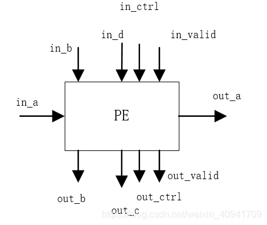

# Gemmini解读


脉动阵列框图如下：


PE（process element）是阵列最小单元，实现一维乘加计算。然后PEs规律地按照行列排列成二维的Tile，需要注意Tile里每一个PE是纯组合地连接，PE之间并无寄存器存储中间结果。Tiles则流水地排列起来组成整个脉动阵列，Tile之间插入了寄存器。这一点从后面的代码分析可以了解得更清楚。需要计算的数据则被提前按照一定规律或是存入脉动阵列或是排列在脉动阵列周围的存储器（bank）里。


#### GEMM的参数：

```scala
object  Constant {
  def inputType = UInt(32.W)
  def outputType = UInt(32.W) 
  def accType = UInt(32.W)

  def OS = false.B
  def WS = true.B
  def df = OS
  def latency = 0
  def tileRows=16
  def tileColumns=16
  def meshRows=16
  def meshColumns=16
}
```

##### PE单元：

脉动阵列最核心代码为Mesh模块，包括Tile、PE、PEcontrol等子模块，最基础单元为PE模型。由于Gemmini中脉动阵列（systolic matrix）模块支持两种数据流，OS(output stationary)和WS(weight stationary)模式，因此PE结构较为复杂，输入控制端信号较多。甚至自定义了IO端口模块PEcontrol，源码如下：

```scala
class PEControl extends Bundle{
    //define two control signal
    val propagate = UInt(1.W)
    val dataflow = UInt(1.W)
}
```


latency参数指定要在PEs中添加多少个移位寄存器，因为有些数据类型的乘加操作无法在一个周期完成，如浮点数等。

端口定义：

```scala
 val io = IO(new Bundle {
    val in_a = Input(inputType)
    val in_b = Input(outputType)
    val in_d = Input(outputType)
	val out_a = Output(inputType)
	val out_b = Output(outputType)
	val out_c = Output(outputType)

	val in_control = Input(new PEControl(accType))
	val out_control = Output(new PEControl(accType))

	val in_valid = Input(Bool())
	val out_valid = Output(Bool())
})
```
矩阵乘法：C = A ∗ B + D，D是偏置矩阵。输入有in_a\in_b\in_d,以及控制信号in_control,和valid信号；输出信号有，直接传递的out_a，以及out_b\out_c,传递给下一个PE的控制信号out_control,和valid信号.
PE模块框图如下：



源码分析
1.移位输出，直接传到下一个PE。

```scala
  val cType = if (df == Dataflow.WS) inputType else accType

  val a  = ShiftRegister(io.in_a, latency)
  val b  = ShiftRegister(io.in_b, latency)
  val d  = ShiftRegister(io.in_d, latency)
//
  val c1 = Reg(cType)
  val c2 = Reg(cType)
  val dataflow = ShiftRegister(io.in_control.dataflow, latency)
  val prop  = ShiftRegister(io.in_control.propagate, latency)
  val shift = ShiftRegister(io.in_control.shift, latency)
  val valid = ShiftRegister(io.in_valid, latency) // TODO should we clockgate the rest of the ShiftRegisters based on the values in this ShiftRegisters
//*after latency cycle ,input signal passthrough to output.
//*why output a ?
//In both dataflow,a will always propagate. 
  io.out_a := a
  io.out_control.dataflow := dataflow
  io.out_control.propagate := prop
  io.out_control.shift := shift
  io.out_valid := valid
```

2.计算模块部分
TODO

#### Tile模块

- 参数

```scala
/**

  * A Tile is a purely combinational 2D array of passThrough PEs.
  * a, b, s, and in_propag are broadcast across the entire array
    and are passed through to the Tile's outputs
  * @param width The data width of each PE in bits
  * @param rows Number of PEs on each row
  * @param columns Number of PEs on each column
    */

  //*Arithmetic ??what type?
  //*pe_latency: Int what mean?

class Tile[T <: Data : Arithmetic](inputType: T, outputType: T, accType: T, df: Dataflow.Value, pe_latency: Int, val rows: Int, val columns: Int) extends Module {
//... code skipped
}
```

T <: Data : Arithmetic，T为自定义数据类型，属于Data类的子类和自定义Arithmetic类。Arithmetic类详见Arithmetic.scala。

- 模块端口

```scala
val io = IO(new Bundle {
    val in_a        = Input(Vec(rows, inputType))
    val in_b        = Input(Vec(columns, outputType)) // This is the output of the tile next to it
    val in_d        = Input(Vec(columns, outputType))
    val in_control  = Input(Vec(columns, new PEControl(accType)))
	val out_a       = Output(Vec(rows, inputType))
	val out_b       = Output(Vec(columns, outputType))
	val out_c       = Output(Vec(columns, outputType))

	val out_control = Output(Vec(columns, new PEControl(accType)))

	val in_valid = Input(Vec(columns, Bool()))
	val out_valid = Output(Vec(columns, Bool()))
})
```
- 源码分析

1.Seq例化二维PE阵列。

```scala
  val tile = Seq.fill(rows, columns)(Module(new PE(inputType, outputType, accType, df, pe_latency)))
  val tileT = tile.transpose
```

2.阵列内部PE连接关系
PEs被纯组合地行和列顺序连接。每行连接以in_a的传播为例：

```scala
  // Broadcast 'a' horizontally across the Tile
  for (r <- 0 until rows) {
    tile(r).foldLeft(io.in_a(r)) {
      case (in_a, pe) =>
        pe.io.in_a := in_a
        pe.io.out_a
    }
  }
```

对于每一行PE(tile( r ))，首先in_a( r )连接到最右边的PE，然后再前一个输出连接到后一个输入，类似于一个链表。准确理解foldLeft函数含义即可。计算过程：首先tile(r ).foldLeft(io.in_a( r)){…}以io.in_a(r )为初始值，匹配到case里的in_a,tile(r )第一个函数元素匹配到pe，代码{pe.io.in_a := in_a，pe.io.out_a}实现in_a与pe的连接，并且运算结果为pe.io.out_a，作为下一次case里匹配到in_a的值，因此即可实现一行里每一个PE的级联。
每列连接同理：

```scala
  // Broadcast 'b' vertically across the Tile
  for (c <- 0 until columns) {
    tileT(c).foldLeft(io.in_b(c)) {
      case (in_b, pe) =>
        pe.io.in_b := in_b
        pe.io.out_b
    }
```


3.驱动底部和右部输出

3.驱动底部和右部输出

```scala
  // Drive the Tile's bottom IO
  for (c <- 0 until columns) {
    io.out_c(c) := tile(rows-1)(c).io.out_c
    io.out_b(c) := tile(rows-1)(c).io.out_b
    io.out_control(c) := tile(rows-1)(c).io.out_control
    io.out_valid(c) := tile(rows-1)(c).io.out_valid
  }

  // Drive the Tile's right IO
  for (r <- 0 until rows) {
    io.out_a(r) := tile(r)(columns-1).io.out_a
  }
```

取最后一行和最后一列相应信号驱动模块的输出。

#### Mesh模块

结构与Tile相似，不同之处在于子单元之间插入了寄存器，使得各Tile之间成流水形式组织起来。
以行流水的a为例：

```scala
  // Chain tile_a_out -> tile_a_in (pipeline a across each row)
  // TODO clock-gate A signals with in_garbage
  for (r <- 0 until meshRows) {
    mesh(r).foldLeft(io.in_a(r)) {
      case (in_a, tile) =>
        tile.io.in_a := RegNext(in_a)
        tile.io.out_a
    }
  }
```


RegNext(in_a)即往Tile之间插入一个寄存器，存储中间状态。


