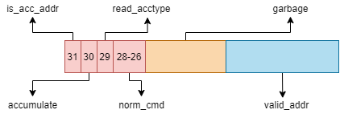
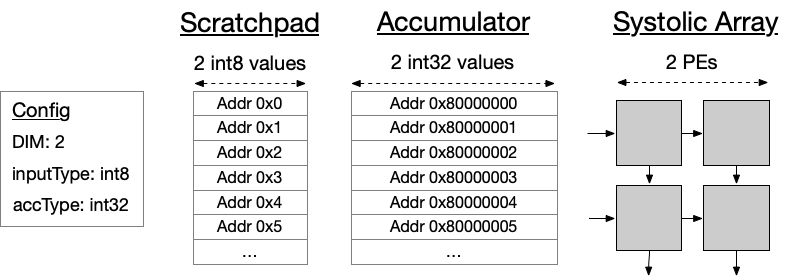

### Memory map细化

#### 1.memory概述

​		作为Gemmini私有的SRAMs,scratchpad和accumulator用于存储脉动阵列的输入和输出。特别之处，输入数据一般存储在scratchpad中，而中间值（partial sums）和最终结果（final results）一般存储在accumulator中。

​		scratchpad和accumulator都例化在**Scatchpad.scala**文件中。scratchpad通过例化**Scatchpad**模块实现，accumulator banks通过例化**AccumulatorMen**模块实现。

​		scratchpad和accumulator SRAMs每行宽度为**DIM**个"element"，其中**DIM**为脉动阵列每行PE的个数，"element"表示Gemmini操作的单个标量值。scratchpad中的"element"默认的数据类型是**inputType**(可配，默认为8-bit integer)，accumulator中的"element"默认的数据类型是**accType**（可配，默认为32-bit integer)。一般来说**accType**比**inputType**的位宽要更宽一些，因为accumulator中需要执行累加功能，如果位宽不足，会存在累加结果溢出的危险。举例来说，对于默认配置的一个16*16的脉动阵列，scratchpad banks每行的宽度是**16 * bits(inputType) = 128** bits，而accumulator banks每行的宽度则是**16 * bits(accType) = 512** bits。

​		scratchpad的输入和输出数据必须是**inputType**类型的，而accumulator的输入和输出数据既可能是**accType**也可以是**inputType**。如果**inputType**类型的值输入到accumulator，该数据将会被扩展为**accType**；当**inputType**类型的值从accumulator输出时，该数据将首先被压缩为**inputType**。这个“压缩”函数可以根据用户需求而配置，但是在默认配置下，这个"压缩"函数是一个简单的乘法操作，通过乘以一个**float32**类型的值来将**int32**压缩为**int8**。

​		下面讨论一下scratchpad和accumulator的电路实现。scratchpad banks结构十分简单，仅由一块SRAM和一个queue构成。相比之下，accumulator的结构稍显复杂：除了SRAM，还包含了一系列的加法器去支持内部累加操作，除此之外还有一系列的“压缩”和激活函数单元。这些“压缩”和激活函数可以被编程人员调用，用于从accumulator中读数据时将**accType**类型的值转化为**inputType**类型的值。例如DNN算法中将某一层的partial-sum从accumulator输出作为下一层的输入（inputType)。


#### 2. 内存寻址策略

​	Gemmini的内部memory按照“row-addressed"方式存储数据，即每行的位宽为`DIM`个元素宽度，其中`DIM`为脉动阵列每行或者每列PE的个数。在scratchpad中元素类型为`inputType`，而在accumulator中类型为`accType`。

​	Gemmini 内部memory的地址宽度为32bits；其中高六位是默认的功能位，且具有特殊意义：

```
metadata_w = is_acc_addr.getWidth + accumulate.getWidth + read_full_acc_row.getWidth + norm_cmd.getWidth
```

- Bit 31(the MSB）：当寻址scratchpad时为0，当寻址accumulator时为1；
- Bit 30在寻址scratchpad或者读accumulator时忽略。取而代之，当我们向accumulator写数据时，bit 30作用很关键；如果需要覆盖该地址之前的数据则需要将bit30置0，如果想要与该地址之前的数据累加，则需要置1。
- Bit 29在寻址scratchpad或者写accumulator时忽略。与bit 30类似，bit 29在读accumulator时起作用，bit 29置0时会将从accumulator读的数据scale down到`inputType`格式，如果置1则依旧是`accType`格式。
  如果accumulator的读地址的bit 29为1，则不需要对acculator的输出数据使用激活函数或者scaling。
- Bit 28-26是norm_cmd位，表示读取该地址数据需要做哪一种normalization.

Gemmini的地址的低`maxAddrBits`位是寻址的有效地址位，当地址进入内部memory后功能位首先被译码，并将有效地址映射到对应的Scratchpad或者Accumulator的特定位置，其中`maxAddrBits`为**均**满足Scratchpad和Accumulator存储需求所需的最小地址位宽（`maxAddrBits = spAddrBits max accAddrBits`）。

​		32位地址信号除功能位和有效地址位之外都是**垃圾位**，默认为0，不需要处理，但是存在一种特殊情况，在处理**执行指令**时，如果指令中32位地址信号全为1时（包括**垃圾位**），则不需要去memory中读取数据，内部会向脉动阵列中传输全零数据。



2x2脉动阵列的memory addressing scheme示意图如下：




#### 3. Scratchpad与Accumulator内部结构

​		作为Gemmini私有的SRAMs,scratchpad和accumulator用于存储脉动阵列的输入和输出。特别之处，输入数据一般存储在scratchpad中，而中间值（partial sums）和最终结果（final results）一般存储在accumulator中。

​		scratchpad和accumulator都例化在**Scatchpad.scala**文件中。scratchpad通过例化**Scatchpad**模块实现，accumulator banks通过例化**AccumulatorMen**模块实现。

​		scratchpad和accumulator SRAMs每行宽度为**DIM**个"element"，其中**DIM**为脉动阵列每行PE的个数，"element"表示Gemmini操作的单个标量值。scratchpad中的"element"默认的数据类型是**inputType**(可配，默认为8-bit integer)，accumulator中的"element"默认的数据类型是**accType**（可配，默认为32-bit integer)。举例来说，对于默认配置的一个16*16的脉动阵列，scratchpad banks每行的宽度是**16 * bits(inputType) = 128** bits，而accumulator banks每行的宽度则是**16 * bits(accType) = 512** bits。

​		scratchpad的输入和输出数据必须是**inputType**类型的，而accumulator的输入和输出数据既可能是**accType**也可以是**inputType**。如果**inputType**类型的值输入到accumulator，该数据将会被扩展为**accType**；当**inputType**类型的值从accumulator输出时，该数据将首先被压缩为**inputType**。这个“压缩”函数可以根据用户需求而配置，但是在默认配置下，这个"压缩"函数是一个简单的乘法操作，通过乘以一个**float32**类型的值来将**int32**压缩为**int8**。

​		下面讨论一下scratchpad和accumulator的电路实现。scratchpad banks结构十分简单，仅由一块**单端口**SRAM和一个queue构成。相比之下，accumulator的结构稍显复杂：除了一块**双端口**SRAM，还包含了一系列的加法器去支持内部累加操作，除此之外还有一系列的“压缩”和激活函数单元。这些“压缩”和激活函数可以被编程人员调用，用于从accumulator中读数据时将**accType**类型的值转化为**inputType**类型的值。例如DNN算法中将某一层的partial-sum从accumulator输出作为下一层的输入（inputType)。

​		之所以scratchpad使用单端口sram，而accumulator使用双端口sram，是因为scratchpd在算法运行过程的load、prelaod和excute阶段的每个周期只需要完成写数据或者读数据任务，而不存在同时进行读写两个任务的可能。例如load阶段我们将数据从main memory加载进入scratchpad，此阶段的每个周期内只需要完成写数据任务；perload阶段我们将数据从scratchapd预加载进入脉动阵列，此阶段的每个周期只需要完成读数据任务；与preload阶段相同，excute阶段将矩阵乘加计算所需的输入数据依次从scratchpad按行读取进入脉动阵列，也不存在读数据任务，所以为了节约资源，scratchpad只需要使用单端口SRAM即可实现。Accumulator的工作机制与Scratchpad则有些许不同，accumulator用于保存计算的中间值和最终结果，每完成一次矩阵乘加计算的结果都将进入accumulator并与目标地址保存的初始值进行累加，这就需要在excute阶段的每个周期accumulator需要同时完成一次读数据任务、累加计算任务、写数据任务，虽然这三个任务可以通过寄存器缓存并使用状态机依次完成，但是在边缘智能设备这类实时性要求较高的应用场景中，这种方式显然是不满足要求的，所以我们采用了流水线形式将三个任务并行执行，极大的缩短了算法的运行时间，因此accumulator也必须要使用双端SRAM实现。

​	下图为

​	

#### 4. DMA

​		Gemmini中包含两个DMAs，一个负责从main memory向Gemmini的private SRAMs中读数据，另一个负责将Gemmini的private SRAMs的数据存入main  memory。这两个DMA模块都例化在**DMA.scala**文件中。

​		两个DMA都可以对虚拟地址进行操作，从Reservation Station获取地址（虚拟地址）后会将其送入TLB，经过映射得到main memory的物理地址。如果TLB misses后，该虚拟地址将直接转回主机CPU中的PTW来获取物理地址。

​		从Gemmini的private TLB中获取物理地址后，DMA将会把一个大型的memory请求拆分为多个小型的[TileLink](https://sifive.cdn.prismic.io/sifive%2Fcab05224-2df1-4af8-adee-8d9cba3378cd_tilelink-spec-1.8.0.pdf)读写请求。为了满足TileLink协议，每次的memory请求必须满足字节对齐，而且每次memory请求中的字节数必须是2的幂次。

​		DMA通常会尽量减少TileLink的访问请求次数，即使这样会需要从main memory中读取更大的数据总量。因为根据以往的经验，我们发现过量的TileLink访问请求比额外读少量的数据更影响性能。

​		负责将private SRAMs中数据写入main memory的DMAWriter，除了与DMAReader相同的功能外，还包含了一些**>**比较器，这些比较器可以在memory-write操作期间完成max-pooling的功能。