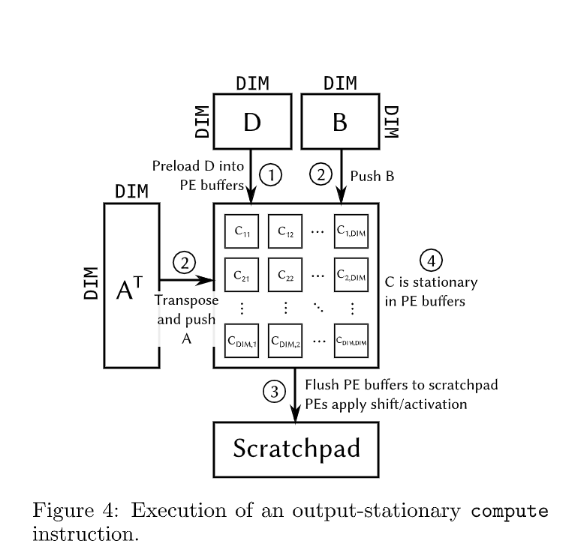
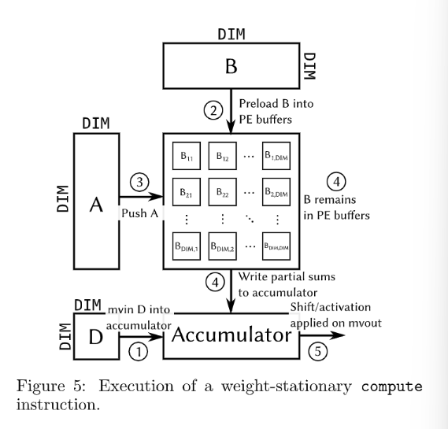
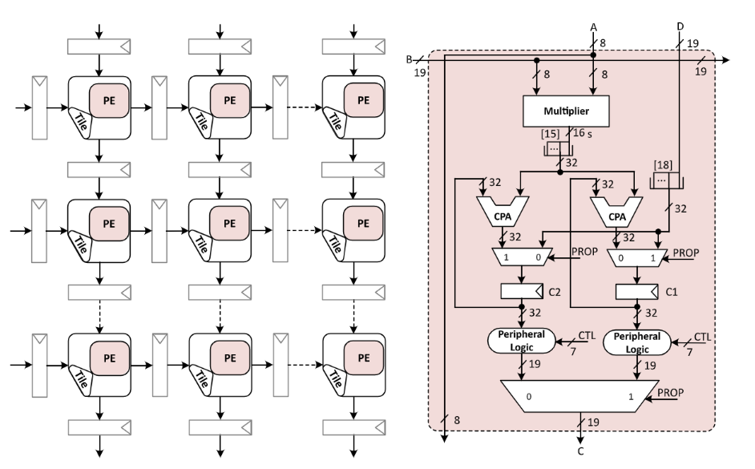
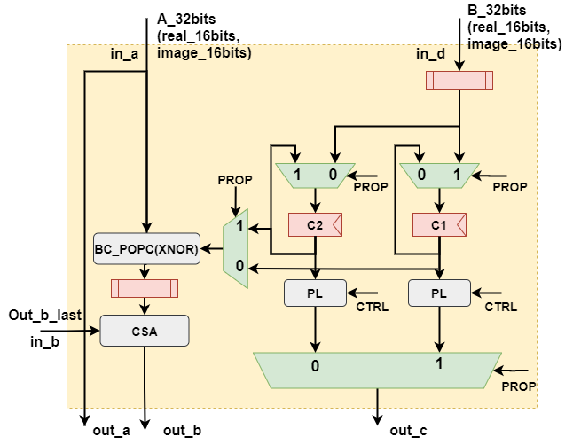
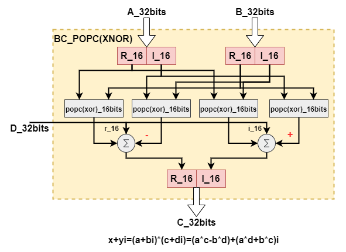

[TOC]

### Systolic Array 

#### 1. Gemmini Systolic Array简介	

​	Gemmini中的脉动阵列拥有两级结构来适应不同的微架构，如下图所示，空间阵列的首先由**tiles**构成，每个tile通过流水线寄存器和相邻的tiles连接。而每个tile又可以拆分为一个PEs组成的阵列，其中相连的PEs直接连接，不通过流水线寄存器。PE可配置为WS或者OS数据流模式，每个周期完成一次MAC（乘加）运算。每个PE和每个tile只和其相邻的单元分享输入和输出。

​	

​	基础介绍请参考文档：Gemmini Generator.md 4.4节


#### 2. Dataflow: WS or OS or both?

 	accelerator和host processer之间的数据流和memory management都是显式的看，例如数据必须要通过一系列的move指令，明确地在处理器的主存储器地址空间和加速器的private地址空间传输。Gemmini的ISA中定义了两个数据movement指令`mvin`和`mvout`指令，这些指令使用Gemmini中的DMA单元，在main memory和private memory之间不断传输成倍的systolic-demension（DIM）矩阵数据。

​	一旦矩阵从main memory中移入pm中，Gemmini ISA会提供一个**计算指令**（该指令的dataflow,scaling factor和激活函数可配）来完成计算。这个**计算指令**通过处理矩阵A,B,C,D的地址来完成计算。

​	下图4展示了OS模式的计算过程：

1. 将D数据load进入PE的内部累加器中；
2. 将A和B顺序压入脉动阵列；
3. 结果C(`C=A*B+D`)存储在PEs的累加器中。

而且在OS情况下，D和C矩阵的地址可选可不选。这一点十分有用，例如当编程人员想要重复累加计算多个子矩阵的乘法结果时，就可以不断在之前的结果上不断累加，知道计算出最终结果并读出。

​	


​	下图5展示了weight stationary（WS）模式下的计算过程：

1. 偏置矩阵D首先通过`mvin`指令进入accumulator;
2. 将矩阵B数据preload进入PE的weight buffer中；
3. 将矩阵A压入脉动阵列；
4. 结果C陆续写入accumulator。

特别指出，和OS的矩阵D相同，WS中矩阵B也是可选的，所以编程人员可以重复使用已经loaded进入脉动阵列的权重。



#### 3. Gemmini Systolic Array Architecture

##### 3.1 Output stationary

下图展示了output-stationay 数据流的脉动阵列中PE单元的结构，以8 bits有符号数的运算为例。Gemmini的脉动阵列包含了一系列连接起来的PEs，类似一个二维队列。流水线寄存器放置在每个PEs的输入和输出位置，通过寄存器每个PE可以也只可以和相邻的PE进行少量的数据迁移和高的计算并行性。输入矩阵A,B和D通过脉动阵列的左侧和顶侧边缘进行阵列完成表达式：
$$
C=A*B+D
$$
其中A和B是multiplied矩阵，C是计算结果，D是preload的偏置矩阵。



这个脉动阵列的MAC包含了一个8 bit的有符号数乘法和两个32bit的加法器（CPA）。之所以使用32bit的累加器是为了避免计算过程的精度损失。除此之外还有一些组件（例如double buffer和peripheral logic（PL））。为了让更充分的使用MAC计算，每个PE都使用了double buffer，通过这个这两个buffer将输入数据缓存下来，用于后续的计算；而之前的计算结果也可以通过脉动阵列的输出端口输出，即使现在的计算正在运行。为了减少关键路径的延迟，每个PE拥有两个accumulator寄存器和两套独立的数据通路，每个通路负责一个寄存器。因此每个寄存器有一个独立的accumulator（CPA）和一个用于累加的PL。为了选择哪一条通路去计算，哪一条通路去传播，Gemmini脉动阵列，在输入端有两个二选一mux，在输出端有一个大的二选一mux，这些选择器通过1bit信号PROP来控制。

**pe code:**

端口信号：

```scala
class PE[T <: Data](inputType: T, outputType: T, accType: T, df: Dataflow.Value, max_simultaneous_matmuls: Int)
                   (implicit ev: Arithmetic[T]) extends Module { // Debugging variables
  import ev._

  val io = IO(new Bundle {
    val in_a = Input(inputType)
    val in_b = Input(outputType)
    val in_d = Input(outputType)
    val out_a = Output(inputType)
    val out_b = Output(outputType)
    val out_c = Output(outputType)

    val in_control = Input(new PEControl(accType))
    val out_control = Output(new PEControl(accType))

    val in_id = Input(UInt(log2Up(max_simultaneous_matmuls).W))
    val out_id = Output(UInt(log2Up(max_simultaneous_matmuls).W))

    val in_last = Input(Bool())
    val out_last = Output(Bool())

    val in_valid = Input(Bool())
    val out_valid = Output(Bool())

    val bad_dataflow = Output(Bool())
  })
```

dataflow == os:

```scala
 when ((df == Dataflow.OS).B || ((df == Dataflow.BOTH).B && dataflow === OUTPUT_STATIONARY)) {
    when(prop === PROPAGATE) {
      io.out_c := (c1 >> shift_offset).clippedToWidthOf(outputType)
      io.out_b := b
      c2 := c2.mac(a, b.asTypeOf(inputType))
      c1 := d.withWidthOf(cType)
    }.otherwise {
      io.out_c := (c2 >> shift_offset).clippedToWidthOf(outputType)
      io.out_b := b
      c1 := c1.mac(a, b.asTypeOf(inputType))
      c2 := d.withWidthOf(cType)
    }
```

**tile code:**

值得关注的就是`out_c`和`in_d`的连接：在preload的过程中，prop拉高，表示将偏置矩阵D依次传入各个PEs中：

```scala
  // Broadcast 'd' vertically across the Tile
  for (c <- 0 until columns) {
    tileT(c).foldLeft(io.in_d(c)) {
      case (in_d, pe) =>
        pe.io.in_d := in_d
        pe.io.out_c
    }
  }
```


##### 3.2 weight stationary

weight stationay情况下的PE结构与3.1中os的中的类似，不同的是`c1`与`c2`寄存器类型不同，gemmini中通过一个mux控制不同dataflow下的寄存器位宽来声明不同的`c1`与`c2`。

```scala
  val cType = if (df == Dataflow.WS) inputType else accType

  val a  = io.in_a
  val b  = io.in_b
  val d  = io.in_d
  val c1 = Reg(cType)
  val c2 = Reg(cType)
```

dataflow == ws:

```scala
elsewhen ((df == Dataflow.WS).B || ((df == Dataflow.BOTH).B && dataflow === WEIGHT_STATIONARY)) {
    when(prop === PROPAGATE) {
      io.out_c := c1
      io.out_b := b.mac(a, c2.asTypeOf(inputType))
      c1 := d
    }.otherwise {
      io.out_c := c2
      io.out_b := b.mac(a, c1.asTypeOf(inputType))
      c2 := d
    }
```

当执行指令`matmul_compute_preload，`prop为1时，矩阵B通过端口d依次进入脉动阵列，并将数据依次传播到所有的PEs中；之后执行`matmul_compute_accumulated`,将矩阵A依次通过脉动阵列并计算结果。

#### 4. PE for BCNN  in weight stationary 

针对BCNN算法，我们可以选择ws模式的脉动阵列,理由如下：

- OS更适合NCHW存储方式的卷积运算，即每个通道分别卷积，并将同一感受野对应的各通道卷积结果累加，使用output stationay dataflow可以依次完成各个通道的卷积，在最后一次卷积完成后将卷积和输出，中间各个阶段不需要输出中间结果；
- 本次设计的BCNN硬件实现平台，采用的是类似NHWC存储方式，将一个像素点的16个通道的单比特数据合并成一个16bits的多比特数据，我们可以认为每次的卷积运算只有一个通道，在`3x3`的卷积核完成某个感受野的卷积运算后，即可立即进行下一个感受野的卷积运算，直至完成该卷积核对应的计算后，才需要读取下一个卷积核的权重数据并计算；

- `C=A*B+D`中D矩阵作为zero矩阵，不需要向C矩阵对应的accumulator中`mvin`数据；
- 将B矩阵preload到脉动阵列后，在完成一个卷积核的运算后，可以重复使用已经loaded的权重，减少了memory的访问；






与原始的gemmini的PE（WS）相比，我们的设计的PE，只是将`inputType`类型的乘法器改为了`pop(xor)`运算，即每个周期完成16bit数据的异或并popcount，数据处理能力不仅大幅度提升，所需要的门数也大幅下降。

完成一次MAC(`C=A*B+D`)计算的过程：

- 因为偏置矩阵D为zero矩阵，所以可以省略向矩阵C累加D的过程；

- 在`compute_preloaded`过程，PROP信号拉高，将权重矩阵B通过输入端口d，逐个输入到寄存器`c1`，并传播到同一个column的相邻PE；
- 在`compute_accumulated`过程，PROP信号拉低，矩阵A通过输入端口a，逐个输入进入PE，
  - 如果该PE是每个column的第一个，每个周期完成一次`A*c1+zero`的计算，并将计算值通过输出端口out_b,输入到下一级PE的输入端口in_b；
  - 后续的PE每个周期完成一次`A*c1+in_b`的计算，并将结果输出到下一级；

- 输出结果进入矩阵C对应地址的Accumulator(SRAM)中。


给出以下解决方案：

**code(TODO):**

```scala
elsewhen ((df == Dataflow.WS).B || ((df == Dataflow.BOTH).B && dataflow === WEIGHT_STATIONARY)) {
    when(prop === PROPAGATE) {
      io.out_c := c1
      io.out_b := b+2*PopCount(a^c2.asTypeOf(inputType))-8*sizeof(a)
      c1 := d
    }.otherwise {
      io.out_c := c2
      io.out_b := b+2*PopCount(a^c1.asTypeOf(inputType))-8*sizeof(a)
      c2 := d
    }
```

**question:**

PopCount作为chisel自带的函数，直接去popcount一个16bits的数，生成的硬件电路会不会太大，需不需要改为popcount(a[15:12])+popcount(a[11:8])+popcount(a[7:4])+popcount(a[3:0])???


**chisel操作符：**

[Chisel/FIRRTL: Introduction (chisel-lang.org)](https://www.chisel-lang.org/chisel3/docs/introduction.html)


**WS脉动阵列数据流（含动态图）：**

[Understanding Matrix Multiplication on a Weight-Stationary Systolic Architecture | Telesens](https://www.telesens.co/2018/07/30/systolic-architectures/)

