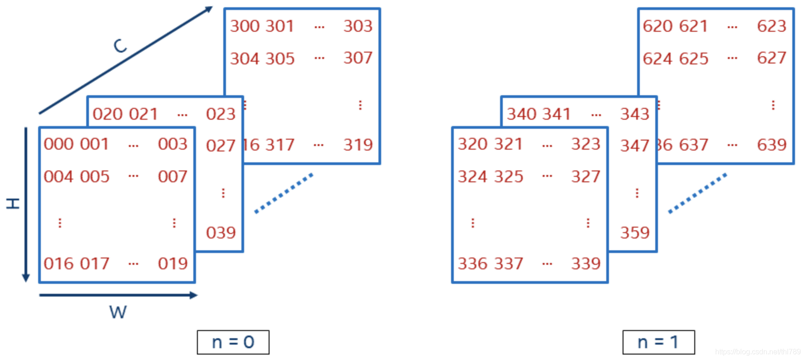
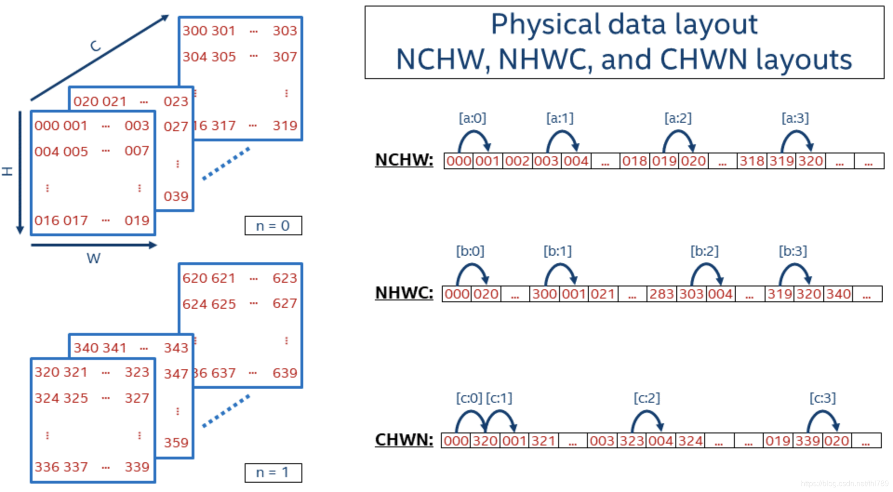

# 图像数据通道格式：NCHW和NHWC的区别

深度学习中，图像数据通道格式有两种：

- NCHW，又称：“channels_first”，是nvidia cudnn库原生支持的数据模式；在GPU中，使用NCHW格式计算卷积，比NHWC要快2.5倍左右（0:54 vs 2:14）

- NHWC, 又称“channels_last”，是CPU指令比较适合的方式，SSE 或 AVX优化，沿着最后一维，即C维计算，会更快
- NCHW排列，C在外层，所以每个通道内，像素紧挨在一起，即“RRRGGGBBB”；NHWC排列，C在最内层，所以每个通道内，像素间隔挨在一起，即“RGBRGBRGB”，如下所示：

- 尽管存储的数据实际上是一样的，但是不同的顺序会导致数据的访问特性不一致，因此即使进行同样的运算，相应的计算性能也会不一样。对于"NCHW" 而言，其同一个通道的像素值连续排布，更适合那些需要对每个通道单独做运算的操作，比如"MaxPooling"。对于"NHWC"而言，其不同通道中的同一位置元素顺序存储，因此更适合那些需要对不同通道的同一像素做某种运算的操作，比如“Conv1x1”

  

- 由于NCHW，需要把所有通道的数据都读取到，才能运算，所以在计算时需要的存储更多。这个特性适合GPU运算，正好利用了GPU内存带宽较大并且并行性强的特点，其访存与计算的控制逻辑相对简单；而NHWC，每读取三个像素，都能获得一个彩色像素的值，即可对该彩色像素进行计算，这更适合多核CPU运算，CPU的内存带宽相对较小，每个像素计算的时延较低，临时空间也很小；若采取异步方式**边读边算**来减小访存时间，计算控制会比较复杂，这也比较适合CPU。
   **结论**：在训练模型时，使用GPU，适合NCHW格式；在CPU中做推理时，适合NHWC格式。采用什么格式排列，由计算硬件的特点决定。OpenCV在设计时是在CPU上运算的，所以默认HWC格式。TensorFlow的默认格式是NHWC，也支持cuDNN的NCHW

  

# 图解NCHW与NHWC数据格式

### 一、基本概念

深度学习框架中，数据一般是4D，用NCHW或NHWC表达，其中：

- N - Batch
- C - Channel
- H - Height
- W - Width

### 二、逻辑表达

假定N = 2，C = 16，H = 5，W = 4，那么这个4D数据，看起来是这样的：

人类比较直接的理解方式是3D，上图中从三个方向上理解，C方向/H方向/W方向。然后是N方向上，就是4D。

上图中红色标准的数值是这个数据里每个元素的数值。

### 三、物理存储

无论逻辑表达上是几维的数据，在计算机中存储时都是按照1D来存储的。NCHW和NHWC格式数据的存储形式如下图所示：

#### 3.1 NCHW

NCHW是先取W方向数据；然后H方向；再C方向；最后N方向。

所以，序列化出1D数据：

000 (W方向) 001 002 003，(H方向) 004 005 ... 019，(C方向) 020 ... 318 319，(N方向) 320 321 ...

#### 3.2 NHWC

NHWC是先取C方向数据；然后W方向；再H方向；最后N方向。

所以，序列化出1D数据：

000 (C方向) 020 ... 300，(W方向) 001 021 ... 303，(H方向) 004 ... 319，(N方向) 320 340 ...

### 四、RGB图像数据举例

表达RGB彩色图像时，一个像素的RGB值用3个数值表示，对应Channel为3。易于理解这里假定N=1，那么NCHW和NHWC数据格式可以很直接的这样表达：

**NCHW**是

- 先在一个Channel面上把W方向|H方向上元素存储起来 // R

- 然后再在另一个Channel切面上把W方向|H方向上元素存储起来 // G

- 最后一个Channel切面上把W方向|H方向上元素存储起来 // B

这样看起来，就是先把R通道的每个像素都存储；然后存储G通道；再然后B通道。

**NHWC**是

- 先把3个Channel上元素存储起来 // 也就是一个像素的RGB

- 然后再在W方向|H方向上元素存储起来

这样看起来，就是顺序地取像素的RGB数值存储起来

### 五、不同框架支持

目前的主流ML框架对NCHW和NHWC数据格式做了支持，有些框架可以支持两种且用户未做设置时有一个缺省值：

- TensorFlow：缺省NHWC，GPU也支持NCHW
- Caffe：NCHW
- PyTorch：NCHW