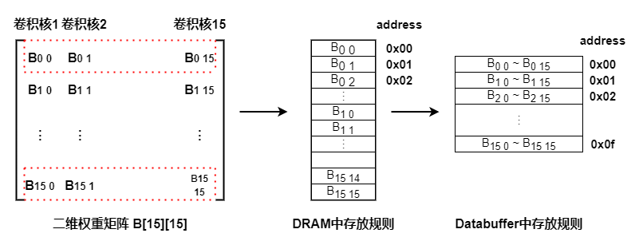
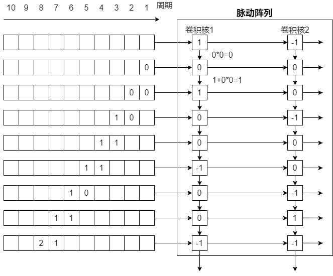

### 不同尺寸的矩阵运算

 本文从软件、硬件两个角度解决脉动阵列中”0 popc(xnor) 0 不等于 0“的问题，进而适应不同尺寸的卷积核进行矩阵计算，如大小为**4x4**、**3x3**、**1x1**的卷积核。软件角度解决方案虽然简单，便于实现，但是带来了附加的数据move操作，硬件角度解决方案则杜绝了上述问题，避免了附加的数据操作，极大的降低了内存的访问次数。

#### 1. 问题描述

硬件平台中采用了尺寸为**16x16**的脉动阵列，假设某卷积层中卷积核尺寸为**4x4**，卷积核个数为16，通道数为1（采用类NHWC存储方式，即多通道同一像素点拼接后存储在同一个存储单元，所以多通道可作为单通道处理），此时可将所有卷积核组合后展开为一个大小为**16x16**的二维矩阵，如下图中二位权重矩阵`B[15][15]`所示，且同一个卷积核的数据位于同一列。

脉动阵列计算过程如下图，首先将卷积核矩阵按列从脉动阵列的上侧 push进入脉动阵列，从Databuffer的0x0f地址读取权重`B[15][0] ~ B[15][15]`的数据，并分别送入对应列的PE，即`B[15][0]`进入第一列PE，`B[15][1]`进入第二列，···之后再从地址0x0e读取权重`B[14][0] ~ B[14][15]`的数据,按照上述步骤push进入脉动阵列，此时原先`B[15][0] ~ B[15][15]`的数据被压入下一级，依此将**16x16**的权重矩阵全部压入脉动阵列中，刚好可以布满所有PE。之后再从输入特征图中滑动选取**16x16**的激活矩阵，“梯队式”从脉动阵列左侧进入，经过16个周期的popcount（xnor）和累加计算，即可得到一个卷积核的一次卷积结果。

上述中对于**16x16**的矩阵运算，脉动阵列电路可以顺利地完成计算，但是当尺寸小于**16x16**时，例如卷积核尺寸为**3x3**，卷积核个数为16，此时权重矩阵的大小为**9x16**；按照原先的步骤压入脉动阵列后，前9级PE（从脉动阵列的上侧开始计数）中有权重数据，后7级PE中的寄存器没有权重数据，默认值为0，当继续计算时，“2 * popcount(16'h0 xnor 16'h0) -16 = 16” ，此时该部分和的结果就会被累加，影响到最终的结果，不仅仅是**9x16**，其他尺寸不同于**16x16**的计算均会出现问题，所以我们将该问题归结为 **尺寸不规则的矩阵运算**问题。

考虑到“2 * popcount(16'h0000 xnor 16'h00ff)  - 16= 0” ，所以我们需要将后7级PE的权重值改为0x00ff，下面是从软件和硬件两个角度做出的解决方案：

#### 2. 软件解决方案

为了解决该问题，我们从软件角度提出了解决方案：将不规则矩阵转成**16x16**的矩阵进行处理。即每次将**9x16**的权重矩阵从DRAM load进入Databuffer后，继续load **7x16** 值为0x00ff的数据进入Databuffer；向脉动阵列preload权重矩阵时还是按照将**16x16**的规格进行load。同理，当卷积核尺寸为**1x1**，卷积核个数为16时，除了load**1x16**的权重矩阵还需要load**15x16**值为0x00ff的矩阵。

软件角度方案，虽然可以在不修改电路的情况下直接解决尺寸不规则的矩阵运算问题，但是在数据的move过程存在很多附加操作，效率不是很高，感觉很low。

#### 3. 硬件解决方案

采用硬件解决方案后，在将**9x16**的权重矩阵从DRAM load进入Databuffer后，不再需要进行其余load操作；向脉动阵列中preload权重矩阵也只需要preload尺寸 **9x16**的矩阵数据，极大的减少了内存的访问次数；

SATU（脉动阵列阈值单元）支持preload不规则权重矩阵，例如prelaod尺寸为**9x16**的矩阵,在preload指令中设置push的矩阵B的cols为9，rows为16，虽然此时SATU只需要去Databuffer读取9行数据，但是SATU内部会将这**9x16**的数据自动转成**16x16**的数据，按行处理，当rows序号小于9时，直接采用权重矩阵B的数据，当rows序号大于或等于9时，直接赋值0x00ff。这样进入脉动阵列后7级PE的权重值即为0x00ff，在计算中“2 * popcount(16'h0000 xnor 16'h00ff)  - 16= 0” ，对累加值和最终计算值都不会有影响了。

