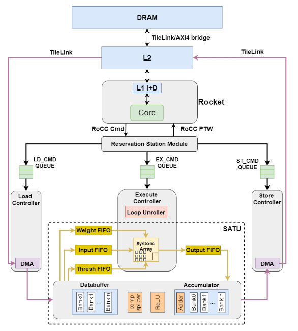
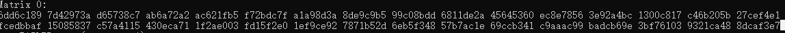
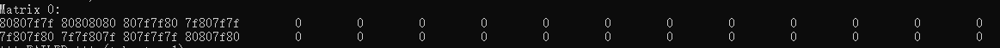
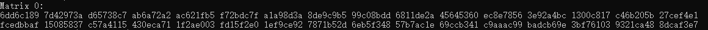
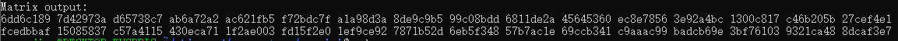
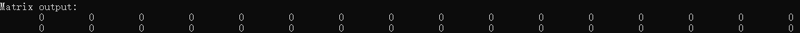

[TOC]


### 问题报告

#### 1.问题描述



整个系统的存储分为协处理器片上存储**Databuffer**和**Accumulator**，片外DRAM，以及两者之间的高速缓存L2 Cache;**Accumulator**有两种读取方式，一种为Full_data读取，一种为non_full_data读取（可以理解为为full_data方式为直接全位宽读取，另一种会将数据作处理后读取，但是在现在的配置下，也还是全位宽，所以默认non_full_data读取方式对数据做了一次黑盒处理）；**Databuffer**只有non_full_data读取。

追踪信号也只能追踪到L2 Cache中，无法确定DRAM在哪一级。

待测试case的数据通路为：声明一个二维数组，将数组中的数据从DRAM通过L2缓存load到片上存储DB（**Databuffe**）或者ACC（**Accumulator**）中，再将数据从片上存储store回L2缓存，未知是否写回DRAM。最后打印store回去的那个数组的数据。

仿真命令有两种情况，含仿真参数`--debug`（生成波形文件）或不含参数`--debug`，如：

```
./scripts/run-verilator.sh --debug  mvin_mvout_acc
或者
./scripts/run-verilator.sh  mvin_mvout_acc
```


测试情况如下：

- full_data方式测试ACC，仿真命令不含`--debug`，此种情况**可以**正确的打印结果(以前两行数据为例)；



- non_full_data方式测试ACC，仿真命令不含`--debug`，此种情况**不能**正确的打印结果(以前两行数据为例)；



- non_full_data方式测试ACC，仿真命令含`--debug`，此种情况**可以**正确的打印结果(以前两行数据为例)；



- non_full_data方式测试DB，仿真命令含`--debug`，此种情况**可以**正确的打印结果(以前两行数据为例)；



- non_full_data方式测试DB，仿真命令不含`--debug`，此种情况**不能**正确的打印结果(以前两行数据为例)；




#### 2.问题分析

除了上述各种测试，我们还测试连续重复读写，将数据load到片上存储后store回到L2，再将store回去的数据读到片上存储后再store回去（即data -> OCM -> L2 -> OCM -> L2），此种情况要注意数据store回去后要间隔一段时间再读取，不然会出错。

从上述各种情况分析来看，仿真时只要加上参数`--debug`，数据就可以正确打印，而不论数据能否正确打印，数据在存储和计算过程中都是**正确的**。

具体为什么加上`--debug`后可以正确打印信息，而不加就能，我百思不得其解。可能跟我写的新的数据`Complex(16)`有关，因为原先平台的int8不论加不加`--debug`都可以正常的打印信息。

具体原因是什么暂时不做考虑了，以后有空再深究，因为在这个问题上已经耽误了太多时间。


#### 3.解决方法

目前能采用的方法就是仿真加上`--debug`参数，但是加上参数`--debug`存在的问题就是仿真会很慢。

硬件设计平台中协处理器的配置还是选择如下，PE的输入信号、输出信号以及片上两块存储的存储元素都配置为`Complex(16)`，实部虚部均为16bits：

```
inputType = new Complex(16),
accType = new Complex(16),

spatialArrayOutputType = new Complex(16),
```

