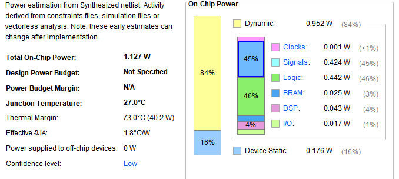

### 测试结果

#### 1.matmul_os

preload一维数组等：


输入A、B、D：


#### 2.matmul_ws


#### 3.mvin_mvout_acc


config_mvout中stride=1 mvout中cols=1:


mvin_mvout_acc debug:

原始版本仿真：int_8 elem_t; int_32 acc_t;

scale = 1:打印信息


scale = 1, out数组类型为acc_t，c_addr bit29为1；


```
3a6dd6c1 38c77d42 6a72a2d6 ac621fb5 3af72bdc c9b5a1a9 c08bdd8d 6811de2a 53 45 78 ec a4 3e 5b1300c8 6b
e1 ce fcedbbaf 15150858 ca71c57a 43 e01f2ae0 15 1ef9ce92 487871b5 ac1e6eb5 ccb34157 c9aaac99 b6 ba 483bf761
21 8dcaf3e7 f46fa2d8 24 6942dfd7 b100122a 61fd208d 34 cc 2b 5c d7 10 1f c7 787f5e54
c1 ca79caef 94809f04 15fa0fb3 5e 2b 5a441d49 92 ed bf 2d e2446eda a9910fbe a0cb541b ddc2162d c4
c2e2a7b5 7ec91a91 62 75 acc64992 f2 dd ac32a41 57 c5 688d3193 b 28 815708c5 3d 90
72e6bb29 d9da9791 cbadf5f0 6 9f067f43 c2 cbf41f45 a8ae90f7 4d525f75 7d3735f3 40 7 d0c46390 8180c190 6d 39
3a 73887073 55 52 7526e6e9 8 d6 3f a5beda37 f8419e87 57 b6 26 90 da160003 6d
56a761c4 81 45d045cc 3 58e2cdf e3ed1e10 82 549ac1c6 a4 48285c18 cb a94ee44d 56 94b58b8f f5 71
4136f21d 8e 89891390 d9 b98fb628 14a79a1c 2c 4397cdc5 a55eef60 c0 63d2016b 6e cf9d944f 2a e8 818cc8cd
b3 8e6b9aee 2a f330243d a9 59 f36074ee 415546ac 98246c15 807ff7ed 57 672cb716 63 8c 75 b0060ab1
ebca7435 b873d630 3846a8de aa 47ee9eb2 9a4c962a 9e375bb9 c7 dfb8891e b77413dd 17 1891a8c3 f64a3a5 84 4c c6
cfab77a d25be09 729e891 92 c6 7370f237 6570b0b4 75 c2fcfc62 85 b0 b9 71 6f edc3d3c3 bf
c232b638 98e5dbca 6e 791904aa 8ebf59e8 7c 64 51 56c50fce 9f 33 bf bbbe646b fa029a94 a285d3f3 99
b99d6439 ea 66 4b556d94 2ddb22a1 46544f09 19 fb 4066a94f 546d6c49 31cf3f98 1a76c7cd 83 c6 4433f337 318bb0b9
19c2bf1d 45 f1e1836f d57f92f1 b77564be 8d7c2f68 27397892 d8 9 18 61290527 d1 ee e 4b5b0c64 c5
79d5673a 99c45483 8f b2c84814 de0f7fe8 b98091eb 4a e717f41b 737f001e e99f4457 4e58fdcd 3367f0b3 ed c7d9048 18 33a863f5
Matrix 0:
Out : 0x80001f00
3a6dd6c1 38c77d42 6a72a2d6 ac621fb5 e1 ce fcedbbaf 15150858 21 8dcaf3e7 f46fa2d8 24 c1 ca79caef 94809f04 15fa0fb3
c2e2a7b5 7ec91a91 62 75 72e6bb29 d9da9791 cbadf5f0 6 3a 73887073 55 52 56a761c4 81 45d045cc 3
4136f21d 8e 89891390 d9 b3 8e6b9aee 2a f330243d ebca7435 b873d630 3846a8de aa cfab77a d25be09 729e891 92
c232b638 98e5dbca 6e 791904aa b99d6439 ea 66 4b556d94 19c2bf1d 45 f1e1836f d57f92f1 79d5673a 99c45483 8f b2c84814
de0f7fe8 b98091eb 4a e717f41b 737f001e e99f4457 4e58fdcd 3367f0b3 ed c7d9048 18 33a863f5 0 0 0 0
0 0 0 0 0 0 0 0 0 0 0 0 0 0 0 0
0 0 0 0 0 0 0 0 0 0 0 0 0 0 0 0
0 0 0 0 0 0 0 0 0 0 0 0 0 0 0 0
0 0 0 0 0 0 0 0 0 0 0 0 0 0 0 0
0 0 0 0 0 0 0 0 0 0 0 0 0 0 0 0
0 0 0 0 0 0 0 0 0 0 0 0 0 0 0 0
0 0 0 0 0 0 0 0 0 0 0 0 0 0 0 0
0 0 0 0 0 0 0 0 0 0 0 0 0 0 0 0
0 0 0 0 0 0 0 0 0 0 0 0 0 0 0 0
0 0 0 0 0 0 0 0 0 0 0 0 0 0 0 0
0 0 0 0 0 0 0 0 0 0 0 0 0 0 0 0
```

scale = 1, out数组类型为elem_t，c_addr bit29为1；


```
-63 -42 109 58 66 125 -57 56 -42 -94 114 106 -75 31 98 -84
-31 0 0 0 -50 0 0 0 -81 -69 -19 -4 88 8 21 21
33 0 0 0 -25 -13 -54 -115 -40 -94 111 -12 36 0 0 0
-63 0 0 0 -17 -54 121 -54 4 -97 -128 -108 -77 15 -6 21
-75 -89 -30 -62 -111 26 -55 126 98 0 0 0 117 0 0 0
41 -69 -26 114 -111 -105 -38 -39 -16 -11 -83 -53 6 0 0 0
58 0 0 0 115 112 -120 115 85 0 0 0 82 0 0 0
-60 97 -89 86 -127 0 0 0 -52 69 -48 69 3 0 0 0
29 -14 54 65 -114 0 0 0 -112 19 -119 -119 -39 0 0 0
-77 0 0 0 -18 -102 107 -114 42 0 0 0 61 36 48 -13
53 116 -54 -21 48 -42 115 -72 -34 -88 70 56 -86 0 0 0
122 -73 -6 12 9 -66 37 13 -111 -24 41 7 -110 0 0 0
56 -74 50 -62 -54 -37 -27 -104 110 0 0 0 -86 4 25 121
57 100 -99 -71 -22 0 0 0 102 0 0 0 -108 109 85 75
29 -65 -62 25 69 0 0 0 111 -125 -31 -15 -15 -110 127 -43
58 103 -43 121 -125 84 -60 -103 -113 0 0 0 20 72 -56 -78
```

scale = 1, out数组类型为elem_t，c_addr bit29为1，gemmini_extended_config_st中将elem_t改为acc_t;

```
activation: 0, scale: 1
Matrix 0:
Out : 0x80001ec0
3a6dd6c1 38c77d42 6a72a2d6 ac621fb5 3af72bdc c9b5a1a9 c08bdd8d 6811de2a 53 45 78 ec a4 3e 5b1300c8 6b
e1 ce fcedbbaf 15150858 ca71c57a 43 e01f2ae0 15 1ef9ce92 487871b5 ac1e6eb5 ccb34157 c9aaac99 b6 ba 483bf761
21 8dcaf3e7 f46fa2d8 24 6942dfd7 b100122a 61fd208d 34 cc 2b 5c d7 10 1f c7 787f5e54
c1 ca79caef 94809f04 15fa0fb3 5e 2b 5a441d49 92 ed bf 2d e2446eda a9910fbe a0cb541b ddc2162d c4
c2e2a7b5 7ec91a91 62 75 acc64992 f2 dd ac32a41 57 c5 688d3193 b 28 815708c5 3d 90
72e6bb29 d9da9791 cbadf5f0 6 9f067f43 c2 cbf41f45 a8ae90f7 4d525f75 7d3735f3 40 7 d0c46390 8180c190 6d 39
3a 73887073 55 52 7526e6e9 8 d6 3f a5beda37 f8419e87 57 b6 26 90 da160003 6d
56a761c4 81 45d045cc 3 58e2cdf e3ed1e10 82 549ac1c6 a4 48285c18 cb a94ee44d 56 94b58b8f f5 71
4136f21d 8e 89891390 d9 b98fb628 14a79a1c 2c 4397cdc5 a55eef60 c0 63d2016b 6e cf9d944f 2a e8 818cc8cd
b3 8e6b9aee 2a f330243d a9 59 f36074ee 415546ac 98246c15 807ff7ed 57 672cb716 63 8c 75 b0060ab1
ebca7435 b873d630 3846a8de aa 47ee9eb2 9a4c962a 9e375bb9 c7 dfb8891e b77413dd 17 1891a8c3 f64a3a5 84 4c c6
cfab77a d25be09 729e891 92 c6 7370f237 6570b0b4 75 c2fcfc62 85 b0 b9 71 6f edc3d3c3 bf
c232b638 98e5dbca 6e 791904aa 8ebf59e8 7c 64 51 56c50fce 9f 33 bf bbbe646b fa029a94 a285d3f3 99
b99d6439 ea 66 4b556d94 2ddb22a1 46544f09 19 fb 4066a94f 546d6c49 31cf3f98 1a76c7cd 83 c6 4433f337 318bb0b9
19c2bf1d 45 f1e1836f d57f92f1 b77564be 8d7c2f68 27397892 d8 9 18 61290527 d1 ee e 4b5b0c64 c5
79d5673a 99c45483 8f b2c84814 de0f7fe8 b98091eb 4a e717f41b 737f001e e99f4457 4e58fdcd 3367f0b3 ed c7d9048 18 33a863f5
```


 mvin_mvout_acc complex16:full_data读取正确，resp_data读取有错


matmul_ws:


scale = 2:打印信息


#### 4. mvin_mvout

只有前四个地址写了数据，还全是0


auto_id_out_a_bits_data

spad_auto_id_out_a_bits_data

  output [127:0] auto_tl_other_masters_out_0_a_bits_data,

TileResetDomain		auto_tile_tl_other_masters_out_0_a_bits_data

buffer_auto_in_0_a_bits_data


TLBuffer_20	auto_in_0_a_bits_data -> auto_out_0_a_bits_data

​						buffer_1_auto_in_0_a_bits_data

TLBuffer_21   auto_in_0_a_bits_data   -> auto_out_0_a_bits_data


auto_tl_master_clock_xing_out_0_a_bits_data


DigitalTop	tile_prci_domain_auto_tl_master_clock_xing_out_0_a_bits_data

subsystem_sbus_auto_coupler_from_tile_tl_master_clock_xing_in_0_a_bits_data

​	

SystemBus	auto_coupler_from_tile_tl_master_clock_xing_in_0_a_bits_data ->

coupler_from_tile_auto_tl_master_clock_xing_in_0_a_bits_data

TLInterconnectCoupler_3	auto_tl_master_clock_xing_in_0_a_bits_data -> auto_tl_out_0_a_bits_data


coupler_from_tile_auto_tl_out_0_a_bits_data -> fixer_auto_in_1_a_bits_data

TLFIFOFixer	auto_in_1_a_bits_data -> auto_out_1_a_bits_data

fixer_auto_out_1_a_bits_data 

TLXbar   	auto_in_1_a_bits_data	->		auto_out_1_a_bits_data

coupler_to_bus_named_subsystem_l2_auto_widget_in_a_bits_data

TLInterconnectCoupler_2   auto_widget_in_a_bits_data -> auto_widget_in_a_bits_data

-> widget_auto_in_a_bits_data ->

TLWidthWidget_2 widget  auto_in_a_bits_data-> auto_out_a_bits_data

widget_auto_out_a_bits_data -> auto_widget_out_a_bits_data


coupler_to_bus_named_subsystem_l2_auto_widget_out_a_bits_data


SystemBus 输出端口：auto_coupler_to_bus_named_subsystem_l2_widget_out_a_bits_data


DigitalTop  system

subsystem_sbus_auto_coupler_to_bus_named_subsystem_l2_widget_out_a_bits_data


CoherenceManagerWrapper subsystem_l2_wrapper

auto_coherent_jbar_in_a_bits_data -> coherent_jbar_auto_in_a_bits_data

TLJbar coherent_jbar

auto_in_a_bits_data  ->  auto_out_a_bits_data

coherent_jbar_auto_out_a_bits_data -> filter_auto_in_a_bits_data

TLFilter filter

auto_in_a_bits_data -> auto_out_a_bits_data

filter_auto_out_a_bits_data -> InclusiveCache_inner_TLBuffer_auto_in_a_bits_data

TLBuffer_15 InclusiveCache_inner_TLBuffer

auto_in_a_bits_data ->  auto_out_a_bits_data

InclusiveCache_inner_TLBuffer_auto_out_a_bits_data

InclusiveCache l2

auto_in_a_bits_data ->  mods_0_io_in_a_bits_data

Scheduler mods_0

io_in_a_bits_data  -> sinkA_io_a_bits_data 

SinkA sinkA

io_a_bits_data -> putbuffer_io_push_bits_data_data

ListBuffer putbuffer

io_push_bits_data_data -> data_data_MPORT_data -> io_data_data

SourceD sourceD

io_pb_beat_data -> 

 Atomics atomics

io_a_data -> io_data_out

io_bs_wdat_data -> sourceD_io_bs_wdat_data

BankedStore bankedStore

io_sourceD_wdat_data -> 


cc_banks_0 cc_banks_0


测试结果：


```
Matrix A:
6dd6c189 7d42973a d65738c7 ab6a72a2 ac621fb5 f72bdc7f a1a98d3a 8de9c9b5 99c08bdd 6811de2a 45645360 ec8e7856 3e92a4bc 1300c817 c46b205b 27cef4e1
fcedbbaf 15085837 c57a4115 430eca71 1f2ae003 fd15f2e0 1ef9ce92 7871b52d 6eb5f348 57b7ac1e 69ccb341 c9aaac99 badcb69e 3bf76103 9321ca48 8dcaf3e7
6fa2d805 e324c2f4 6942dfd7   122a45 208d0bb1 34a661fd 2b64cc78 d7c45c30 1f741056 54c9c71e 1e787f5e caef11c1  455ca79 3594809f 15fa0fb3 2b425efe
441d49c1 28922c5a  8bfceed 6edaf32d be81e244 6da9910f a0cb541b c2162d1d 49c434dd c2e2a7b5 c91a9133 9862267e 49924575 f240acc6 4175dd68 3a0ac32a
3bc58657 688d3193 28400b72 5708c57b 463dea81 bb292b90 914b72e6 95d9da97 cbadf5f0 43dd06aa 109f067f 1f45adc2 f76bcbf4 a5a8ae90 4d525f75 3735f3ab
5040407d 6390a707 9055d0c4 c68180c1 4639e86d 7073173a 55447388 e9c15280 c47526e6 bad6da08 da373b3f 871ba5be bef8419e c0b68e57 af900226 da160003
c4776d28 1e56a761 45cc9b81  36645d0 8e2cdf4d 1e107d05 8256e3ed 9ac1c6f7 91a4dc54 48285c18 4d51cbb0 3ca94ee4 8b8fcb56 f59694b5 1d6d710a 1e4136f2
1390418e d9da8989 8fb62885 9a1c73b9 2c0e14a7 97cdc52b ef608d43 c00ca55e d2016b0f 516e0463 cf9d944f e8f02ae4 8cc8cd43 37b34881 8e6b9aee 3d892a7a
fcf33024 1759e6a9 f36074ee 5546accd 6c150b41 edb59824 b2807ff7 b716a157 6394672c 75848cb2  60ab1d9 7435f7b0 307bebca b7b873d6 3846a8de b201aadc
7d47ee9e 9a4c962a 375bb919 3dc7ce9e dfb8891e 7413ddab 211704b7 1891a8c3 64a3a501 9884ea0f d9c67e4c  cfab77a 25be098f e8911d0d 92000729 37fdc69a
d57370f2 6570b0b4 627575a4 9ec2fcfc 52b09285 bc71beb9 d3c3a96f bf72edc3 32b63823 dbca57c2 6e4298e5 1904aab1 59e84d79 7c688ebf 51d6645a c50fce75
829fea56 b9bf8e33 bbbe646b  29a94f9 d3f369fa 999ca285 9d64394d c4eadeb9 6d947566 a1f14b55 2b2ddb22 46544f09 fb9219ac 66a94fc5 6c49ab40 980b546d
4131cf3f 1a76c7cd c686838c 33f337e7 b0b99344 1d9f318b 9619c2bf 836f2d45 f145f1e1 8dd57f92 b77564be 7c2f6871 7892138d d8002739 181809e8 290527c5
12d1d661 490e34ee 4b5b0c64 3ab1c556 7979d567 99c45483 14418f70 95b2c848 de0f7fe8 8091eb81 f74a8eb9 e717f41b 7f001ec3 44571f73 cd41e99f 334e58fd
3367f0b3 4843ed3e 500c7d90 63f55f18 fae933a8 a0983467 ad7b2d50 d5a7e2e5 917a3311 9c7fc76c 121cf54e f1d03479 fe315f31 5bda800e 4005f8f2 b07c36d7
21195469 5a124aa6 1ba992ed 3724653e 4302f08d  5e5376f 38a7688a 5e81e97c aa4d6332 453c8cdb 6e9977fc 435ea73c 24be3afe 12f4d1e2 68e122af db605254
Matrix B:
9b4f75f9  2b3e44f 3282489a 81e07619 a1fa92db d9b70715 cbe54d8c 88b48eaf  58fa25e 1ba2f199 b2b02f7e c7020f54 5f7f538e 9950da09 7b9793e2 2c0e7cb5
9fb00717   a492a4 5c25d9f3 4c0e743b a449dc97 6f588c12 bb922604 f0f3c15f c288c4ec  2cdeeaf c39279d4 aa416bf3 5c8a8f87 62daa4db f024b8da 60dac57b
6c23feba 58a06e4d 9f61c395 e0cf7e75 18a7d306 5a55ee60 a14f81de 6e31b3ac 3fbfde71 1c17bd65 c9adf23a 53defc8b  b3712cf 22bc78f2 7bc83d22 6f577c68
80cf9016 4ca1ce33 4046c25d c988f6d7  c09baaf 6a789537 51fa2b49 1da1d4f9 19fb44c2 ca1dd645 28b1762c 6edc42cd 991d3f89 c863dd28 15030e89 9557337d
991c2fa1 5ee24d7f c724d369 d1dc7ab4 d0a81755 b3cc2a11 e1b42eb0 58b6d4e7 30438af4 b0b9f019 888c216a e57ffca9 7513bc1d 88789c95 f293571c 4befb9fc
b4b29110 50e0c09c fa893017  2aeeb9c f0fbad00 879e95a8 a9dad8c2 b825a456 a1df855d af0704e8 ce6e50ef e3492d52 4c316d2e d5e8bc93 8a788528 4c711e65
1276aa57 24554231 de445703 a6216a61 3bb981f1 7978fdf4 3e0db46b 19df7369 ca564891 ea6249fe 22c79ff8 d1fe1238  ecd75a2 5fde87bb 92f1433a 9270b279
2f91adae 1e3d2a29 ba66040a 48995715 bfd9d7b0 5924cc2e 772c90d9 9319b180 4b6f2966 c2653ae3 e945ea04 59a12e0c e97f399e 1ac584e6  17d7e20 58c1073b
ca6a1088 bed211ad 143c344a b2b85207 cb933303 3bb0aad1 6956767a 8245103c   31baf2 dbec8d60 c9d84cd0 667540c1 4a1e5e89 38487c2e  ddc63e6 1675ecea
e2a7859b c890ce26 b4572120 ee623bca ed5d59ee 71667e94 6ceab5fa 7f177f7f  9e4d18a 16113a7e a8af2458 23fe4886 e0c2c706 2a5377ec 2c0d5edb 89e17109
b43103dc 3d337a3c 9d86492a 46bb322f f3f04eb6 8dd07172 1587d646 65822f6b c40e82c2 96307b87 ae390cda f90087cf 99c199fb a410bdb9 154f1a8a a998e859
bf2ebc80 60b56eda 18d76944 44249946 eb4256e1 61bbeca4 3b0da88c 4eb98f5f ce782170 bde4c704 4025e1d4 937a7d4a a4b3388d 97ecd66e bd2184c3 b26ddfdb
c00725fd b3534129 ab9b7b8c b4430e62 238af535   3296a3 f39b363a 953051fe  72842a9 2d09d7bf  464bf01 dab5eaeb 6e6f4822 36908b24 5b42c991 1d7227d0
b761f308 f886cc91 1a60bc5e 9efa7314 2b40efb5 bc7f5828 9590ccfb d399642a 8c66b9c3 c8baa3bf e1230361 fa30cee2 a60dae5f f3eae436 66b35442 a5fdd1b9
e2241996 320a26bd 6ef6aa5a 4e6be72c d01b49a8 262f5a2c b68cf7bf e3e9f902 bbb99c53 b1516350 fcd3492f 5cb16aa0 3be48d29 8122293b 93b2d263 449e2c59
be78ccdd a3dba995 eb6b005b 4dfccbbc 20134792 120c04e9 2c6e83b1 e0527fe8 34e73d2e 4a6b8ffa bd226cea ab3a3ed6 5a8a4ba5 d0a6e30e d8be2fc1 342bc9af
```

矩阵C：


```
ffe6fffa ffdaffea    8ffec   16fffa   240008    40028 fff6000a   12ffee ffe6fffa fffafff6    6003a    afff6 ffe2ffe2    2ffce fff8ffe0 fff0fffc
fffe000a fff60012 fffc0008 fff6ffe2   100004 fffcffe8 ffee0016 fff20002    2fff6 ffda0006 ffde0026   1affee   1a0002    e001a       1c    8ffe8
fffcffe8 fff4fffc fffefff2 ffe8fff4 fff2ffd6   1a000e fffcfff8    40004 ffd8fff0   10fff8   18fff4 ffdcfff4 ffe4ffec fff40008    60026   220012
   a0002 fffefff6 ffd8fff8 ffea0032    cffec fff80010 fff6fff6 ffeeffe6    20006   1effea   220006   26002a    2001a ffee0026       10    cfff0
fff6fffe ffeaffe6    cffe4 ffeaffee   10fff8 ffc4ffe4    2000a fffeffea ffe6fff6   160022 fff2ffee ffea0012 fff6000e ffea0006   180024   200008
   4ffe8 ffec0014 ffeaffe6 fff80010 fffafffe ffdefffe fff80018 fff4ffe4 fffcffc8 fff40018   24ffd4   180010 ffe8ffdc   200004 ffe2ffe6   12ffe2
  1e0006   1e002a fff00000   12ffca ffd40014    cfff4   12ffee ffe6fff2 fffeffee fff20002    6ffe2 ffee000e    2ffea ffe6ffe2    4fff8   100014
fff60006 ffe2fffa fff40010   220006 fff40018   1c0000 ffda0012 fffefffe   260022   36000e   1a0026 fff2fff2 ffe6002e fffeffde ffd4002c   20ffec
ffe0002c    4fffc   12fff6 ffec0004    e0016   1afff6   1cffd8   20000c ffe40000 ffecffe0    8fff8 ffe4fffc    cfffc ffdc0010    e0006 fff60002
  180028 ffe0fffc    2fff2 ffecffec    2000a fffaffe6    80004   10fff4   100004 ffd8ffec ffd8ffd0   1c001c    40018 ffe0fff0 fffe000a   1afff6
ffe40018     ffec   120016 ffe80020 fff60006    e0012 fff8fff8    c001c ffec002c ffdc0008    cffe8   1cffdc fff8ffe8 fff4ffe8    6000a    afffa
fffc000c fff8ffec fffa0016 fff4ffe8 fffe001a ffeefff6   2c0004 ffe00044   10fff8 ffe80004   10fff4    cfff0    cffd4        8    effee fff6fffe
fff2000a    2fffa ffe4fff4    afff6 ffe8fff4 ffe8001c   32fffe ffeafff2 fff60012   12ffbe ffeeffde fff6001a ffe2ffee    2fffe    8ffdc fff8fff8
fff4fffc    8fff0 fff60022 fffc002c    e0006 fff2fff6    4ffec    cffdc     ffec   18fff4 fff0fff0 fff8ffe0   200024 ffe00004    6fffa ffee0036
ffecfff0   1c000c fff6fff2   240008 fffe0012   160022   10fff8 ffec000c ffec0024   10000c fff00010   14fffc ffe4ffe0    4ffd4 fff2000a fffe000a
fff2ffda    affee   14ffe8    e0012   180010       18 ffe6fffe   16ffe6    2fff2 ffe2001a   16001a fffefff2 fffafffe   16fff2 fff4fff0   18ffec
```


