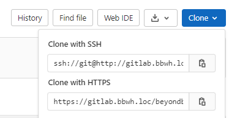
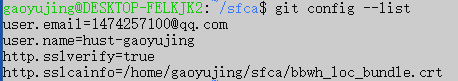
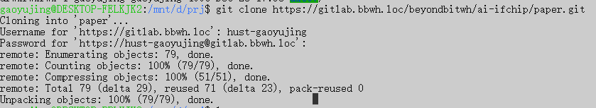
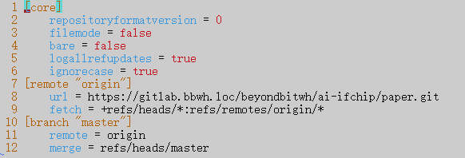
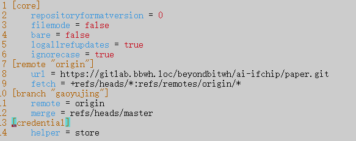

### git: server certificate verification 问题的解决

​	

​	当通过HTTPS去访问Git远程仓库，如果电脑的SSL证书未经过第三方机构签署，那么git就会报错，如下。所以针对该问题，就有两种解决方案：

 1. 让git忽略ssl证书错误（存在很大的安全风险）；

 2. 将自签署的证书添加到git的信任列表 （建议使用）；

    

#### 1.忽略ssl证书错误

可以直接通过在git中将http.sslverify变量设置为false，忽略所有git仓库的ssl证书验证：

`git config --global http.sslVerify false`

可以通过  `git congit --list`查看得到此时的git全局设置：

此时可以没有ssl约束的进行git clone等操作，但是禁用SSL证书验证具有极大的安全隐患；也可以通过下面的办法将禁用范围限制在某一个git仓库下，减小风险；

第一步：克隆远程仓库前，利用env命令GIT_SSL_NO_VERIFY环境变量短期内设置为true，并同时调用git  clone 命令。

shell:

`env GIT_SSL_NO_VERIFY=true`

`git clone https://<host_name>/git/project.git`

其中clone地址可通过在gitlab中获取：

第二步：在克隆完毕的仓库中将http.sslVerify设置为false。

shell:

`git config https.sslVerify false`

此方法可以将忽略证书错误的设置限定在特定的仓库下，减小了设置范围过大引起的安全风险；

#### 2.将自签署的证书添加到git的信任列表

第一步：NAS上下载*.bbwh.loc的根证书，下载链接如下：

http://192.168.20.4:5000/?launchApp=SYNO.SDS.Drive.Application#file_id=596499194045308946

第二步：`git config --list` 查看http.sslverify（如果是false就改为true)和http.sslcainfo

第三步：将http.sslcainfo变量指向下载的.crt文件

 `git config --global http.sslcainfo /home/gaoyujing/sfca/bbwh_loc_bundle.crt`

此时查看git 全局配置`git config --list`：

此时就可以安全的徜徉在git的海洋啦！！

#### 附录：

下面以paper.git仓库为例，演示git的常用操作：

1.新建一个文件夹，初始化为git文件夹,初始化后本目录下将产生.git文件夹：

`git init`

2.从git远程仓库中将需要的仓库克隆下来：

`git clone https://gitlab.bbwh.loc/beyondbitwh/ai-ifchip/paper.git`

3.查看当前目录，可以看到paper这个仓库已经被我们clone下来：

4.进入paper目录,.git/config 中可看到，当前仓库的配置详情：

5.但是因为我们的账号不是当前仓库的创建者，所以需要将branch修改，并将每次的修改上传的我们自己的branch，并等待master去merge,才可以将修改的内容上传：

`git branch -M gaoyujing`

6.一次完整的git的过程：

`git add 你修改的文件` + `git commit -m 注释` + `git pull` + `git push origin 分支名` 

git commit可以将你修改的内容上传到本地仓库；

在push（将本地仓库的内容上传到远程仓库）前pull（将远程仓库的更新内容Load到本地仓库），可以防止你的修改内容与其他人的修改内容发生冲突，如果发生冲突就需要协商解决，如果没有冲突就可以直接merge掉；

7.在每次的pull 和 push 过程都需要进行gitlab用户名和密码的输入，十分麻烦，可通过下面操作解决：

`git config (--global) credential.helper store`

--global设置的是全局变量，如果我们只需要对一个仓库进行操作，就不要添加，只需要在当前的仓库目录下进行配置即可；

配置后可以看到已经含有credential.hepler变量

下次进行pull或者push操作只需要输入一次密码，之后就不再需要输入了；