[TOC]


------

### 基于vscode搭建项目管理环境


#### 前言

之所以搭建基于vscode的项目管理环境，是因为现有的情况下，我们只能通过windows本地去修改文档，在服务器上进行代码修改和仿真，其中两个进程都是在对同一个gitlab仓库进行操作，这就让两个环境下的仓库文件同步起来复杂繁琐。

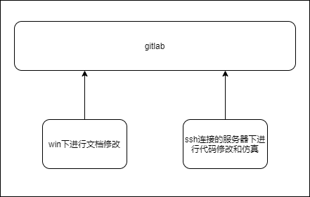

但是使用基于vscode搭建的项目管理环境就解决了这个问题，首先通过扩展工具Remote-WSL，在VScode界面嵌入WSL操作终端，在此窗口中执行的任何 VS code 操作都将在 WSL 环境中执行，从编辑和文件操作到调试、使用终端等等都是如此，这就让代码编译和wsl统一到一个界面下面，省略了界面切换的繁琐；再通过SSH将wsl链接到服务器的端口上，使用code指令，这样就可以将服务器的工作目录add到vscode中。

完成上述步骤后，我们就可以基于vscode进行项目的编辑、仿真和调试。


#### 1. 搭配 VS Code Remote 远程开发扩展在 WSL 下开发

Visual Studio Code Remote - WSL 扩展允许你直接借助 VS Code 令 [「适用于 Linux 的 Windows 子系统」（WSL）](https://link.zhihu.com/?target=https%3A//docs.microsoft.com/windows/wsl) 作为你的全职开发环境。你可以在基于 Linux 的环境中进行开发，使用 Linux 特有的的工具链和实用库，并在舒适的 Windows 中运行和调试基于 Linux 的应用程序。

该扩展直接在 WSL 中运行命令和其它扩展，因此你可以编辑位于 WSL 中的文件或挂载在其上的 Windows 文件系统（例如 /mnt/c），而无需担心遇到文件路径问题、二进制兼容性或其它跨操作系统的难题。

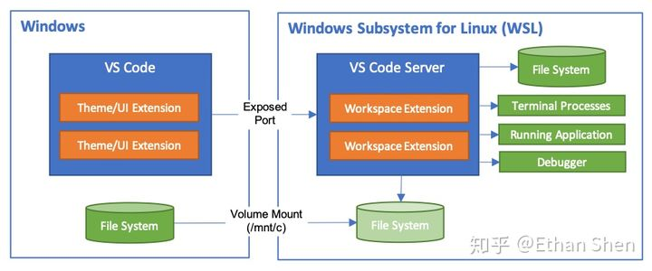

##### 1.1 安装准备

- 安装对应你偏好的 Linux 发行版的 [「适用于 Linux 的 Windows 子系统」](https://link.zhihu.com/?target=https%3A//docs.microsoft.com/windows/wsl/install-win10)；

- 安装最新版本的Visual Studio Code；

##### 1.2 安装与使用

- **安装Remote Development 扩展包：**打开vscode，在左侧工具栏的Extension中，搜索Remote Development，选择并安装;这个工具包中主要包含Remote-WSL,Remote-Containers,Remote-SSH,对我们后面的工作都是有用的；

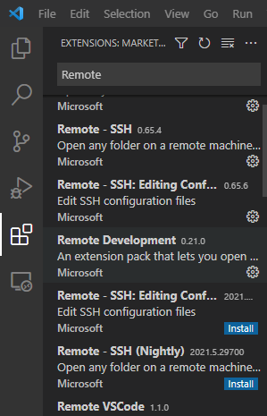

- **打开TERMINAL：** 界面顶端工具栏Terminal->New Terminal(或者通过快捷键Ctrl+Shift+`),即可打开TERMINAL，但此时是powershell模型下的，如果想要切换到wsl下，有以下两种方法：

  1.第一种方法：在terminal右侧工具栏，选择添加Ubuntu(WSL),此时即可进入wsl操作终端；

  

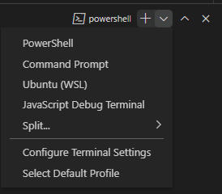

​		操作终端界面如下：

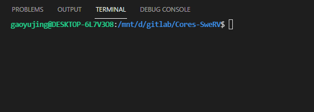

​		2.第二种方法：点击左下角

​		绿色图标，在vscode界面中间出现一下选项，选择Open Folder in WSL,	此时依旧可以出现WSL终端(推荐使用）；	

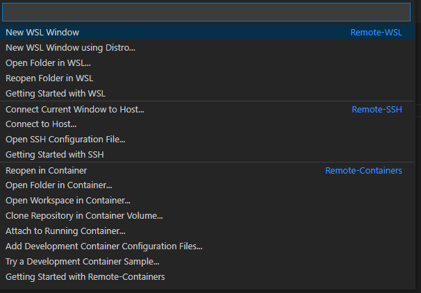


#### 2. Vscode使用 Remote-SSH 链接服务器

windows10自带OpenSSH,不需要再使用Git的SSH,如图：

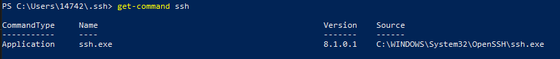

且我们的服务器中已经自带OpenSSH,所以只需要在VScode中配置好各项参数即可实现Vscode与远程服务器的链接。

- 进入VScode,配置Remote-SSH的Extension Settings；

  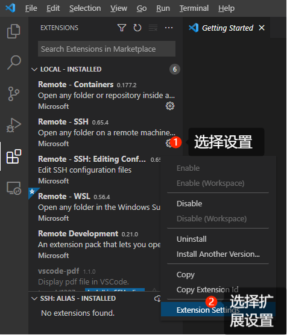

- 勾选以下选项；

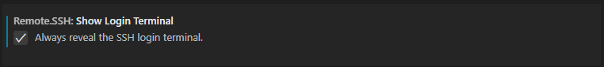

- 配置.ssh\config;

  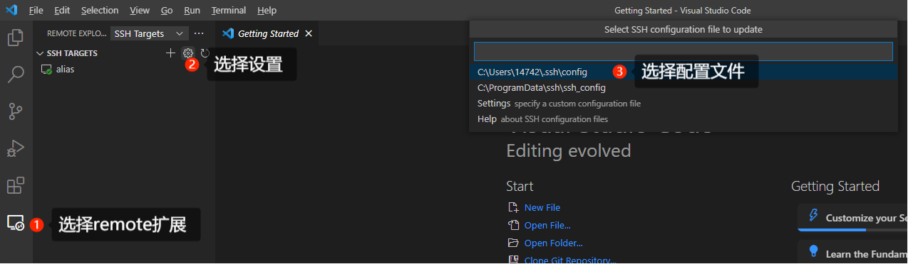

  config文件进行如下配置：

  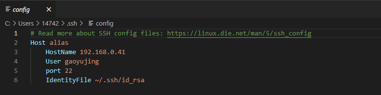

- 使用Remote-SSH链接远程服务器；

  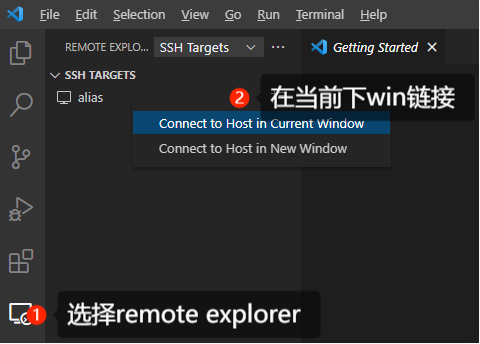

- 在弹出的Terminal中输入登录密码（后续配置免密登录），此时terminal界面出现一系列远程服务器信息，左下角状态显示`SSH:alias`,说明链接成功；

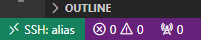

​		open folder出现的目录为远程服务器下的目录结构：

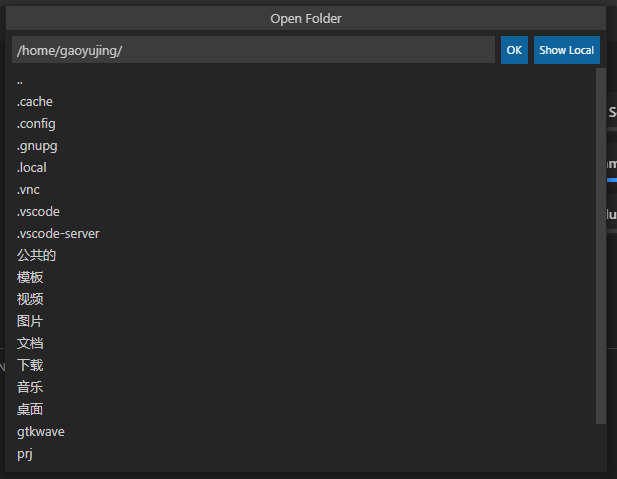

- 添加一个bash终端，方便后续的命令行操作；

  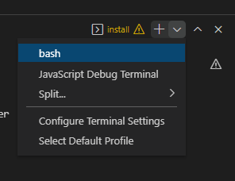

#### 3. 使用code指令添加folder

**注意：只可以在WSL:Ubuntu模式下运行**

code命令使用说明可通过 `code -h`详见；

常用的有 `code -a folder_name  `可在当前的vscode界面下，添加一个新的目录结构，如：


#### 4. 项目移植到远程服务器注意事项

##### 4.1 重新配置相关参数
将项迁移到远程服务器后,需要重新配置一些参数，如下：

```shell
git config --global user.email "1474257100@qq.com"
git config --global user.name "gaoyujing"
```

因为服务器中没有SSL证书，所以之前在WSL中配置的http.sslverify参数需要重新配置：

- 将*.bbwh.loc根证书通过WinSCP导入服务器中，存放在目录 `/usr/sfca/bbwh_loc_bundle.crt`;

- 配置http.sslverify参数，指向SSL证书；

  ```shell
  git config --global http.sslcainfo /usr/sfca/bbwh_loc_bundle.crt
  ```

- 配置credential.helper参数，保存密码，避免重复输入密码；

  ```shell
  git config --global credential.helper store
  ```

- 查看当前git的参数配置；

  ```shell
  gaoyujing@bbwhai1-System-Product-Name:~/prj/Cores-SweRV$ git config --list
  
  user.email=1474257100@qq.com
  user.name=gaoyujing
  http.sslcainfo=/usr/sfca/bbwh_loc_bundle.crt
  credential.helper=store
  core.repositoryformatversion=0
  core.filemode=false
  core.bare=false
  core.logallrefupdates=true
  core.symlinks=false
  core.ignorecase=true
  remote.origin.url=https://gitlab.bbwh.loc/beyondbitwh/ai-ifchip/Cores-SweRV.git
  remote.origin.fetch=+refs/heads/*:refs/remotes/origin/*
  branch.master.remote=origin
  branch.master.merge=refs/heads/master
  branch.dev.remote=origin
  branch.dev.merge=refs/heads/dev
  ```

  配置后即可顺利的完成git操作了。

##### 4.2 WinSCP使用弊端

 使用WinSCP将文件从Windows导入服务器由于前后的环境不同会导致文件的权限发生改变，如果出现这种情况需要进入目录下修改权限：

```shell
chmod -R 755 ./
```

##### 4.3 设置ssh免密登录

打开powershell，输入命令行,生成ssh公钥私钥（一路回车直到显示密钥生成即可，或者会显示密钥已经存在，这时候就不需要再生成了）：

```
ssh-keygen
```

使用WinSCP将生成的公钥和私钥拷贝到远程服务器端你的/home 文件夹下即可。

之后在远程服务器端按顺序进行如下操作：

```shell
mkdir .ssh
mv id_rsa.pub .ssh
cd .ssh
cat id_rsa.pub >> authorized_keys
sudo chmod 600 authorized_keys
service sshd restart
```

可能在最后一条命令要输出你的账号登录密码。
这样远程ssh主机配置免密码登录就完成了。
然后你可以在vscode重复打开远程ssh的步骤，看看是否还需要输入密码了。


#### 5. 插件安装

##### 5.1 makedown插件

**Markdown All in One:**一款专门针对 VSCode 开发的插件，安装后可以在 VSCode 上更丰富和完善的编辑 Markdown 文档，非常实用。


安装后打开一个markdown文件，点击右上角（如下图）的标志，即可阅读

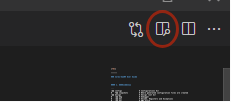


##### 5.2 pdf阅读插件（可选）

为了在vscode中完成“一切操作”，可以加入pdf插件，进行pdf的阅读，但是亲测效果没有其他pdf阅读软件实用，不是很推荐！！

搜索pdf，选择插件vscode_pdf并安装并进入界面左侧工具栏Extension中使能插件，即可使用。

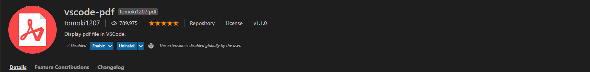

